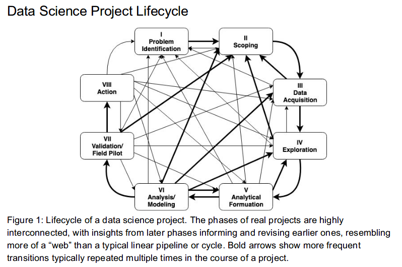
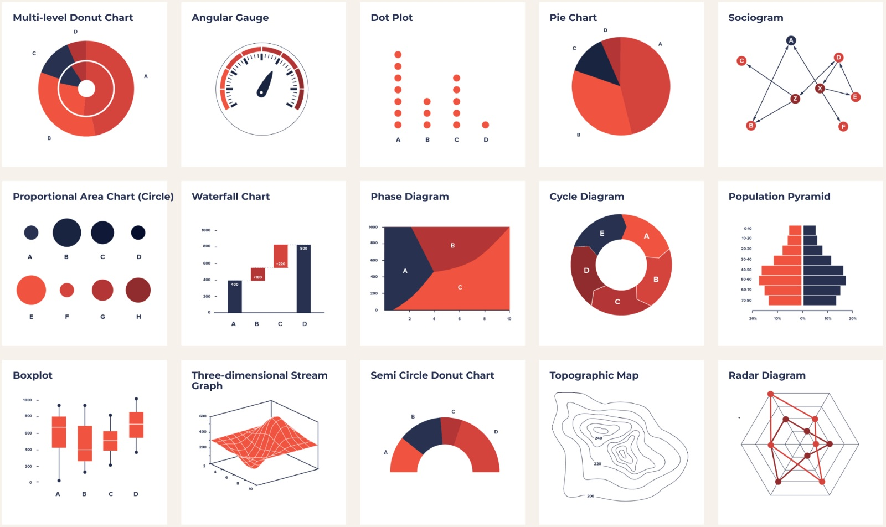

::: watermark

:::

# Conceptos de Ciencia de Datos

## ¿Qué es Ciencia de Datos?

```{r echo=FALSE,fig.align='center', out.width='500pt', out.height='500pt'}
knitr::include_graphics("img/01-intro2ds/01_data-science-applications.jpeg")
```

### Definiendo conceptos: {.unnumbered}

**Estadística** Disciplina que recolecta, organiza, analiza e interpreta datos. Lo hace a través de una población muestral generando estadística descriptiva y estadística inferencial.

-   La [estadística descriptiva](), como su nombre lo indica, se encarga de describir datos y obtener conclusiones. Se utilizan números (media, mediana, moda, mínimo, máximo, etc) para analizar datos y llegar a conclusiones de acuerdo a ellos.

-   La [estadística inferencial]() argumenta o infiere sus resultados a partir de las muestras de una población. Se intenta conseguir información al utilizar un procedimiento ordenado en el manejo de los datos de la muestra.

-   La [estadística predictiva]() busca estimar valores y escenarios futuros más probables de ocurrir a partir de referencias históricas previas. Se suelen ocupar como apoyo características y factores áltamente asociados al fenómeno que se desea predecir.

```{r echo=FALSE,fig.align='center'}
knitr::include_graphics("img/01-intro2ds/02_muestra.jpg")
```

**Business Intelligence**: BI aprovecha el software y los servicios para transformar los datos en conocimientos prácticos que informan las decisiones empresariales estratégicas y tácticas de una organización. Las herramientas de BI acceden y analizan conjuntos de datos y presentan hallazgos analíticos en informes, resúmenes, tableros, gráficos, cuadros, -indicadores- o KPI's y mapas para proporcionar a los usuarios **inteligencia detallada sobre el estado del negocio**. BI esta enfocado en analizar la historia pasada para tomar decisiones hacia el futuro.

¿Qué características tiene un KPI?

-   Específicos
-   Continuos y periódicos
-   Objetivos
-   Cuantificables
-   Medibles
-   Realistas
-   Concisos
-   Coherentes
-   Relevantes

```{r echo=FALSE,fig.align='center'}

```

**Machine Learning**: Machine learning --aprendizaje de máquina-- es una **rama de la inteligencia artificial** que permite que las máquinas aprendan de los patrones existentes en los datos. Se usan métodos computacionales para aprender de datos con el fin de producir reglas para mejorar el desempeño en alguna tarea o toma de decisión. (Está enfocado en la programación de máquinas para aprender de los patrones existentes en datos principalmente estructurados y anticiparse al futuro)

```{r echo=FALSE,fig.align='center', out.width='600pt'}
knitr::include_graphics("img/01-intro2ds/04_ml.png")
```

```{r echo=FALSE,fig.align='center'}
knitr::include_graphics("img/01-intro2ds/05_supervisado_robo.png")
```

**Deep Learning**: El aprendizaje profundo es un subcampo del aprendizaje automático que se ocupa de los algoritmos **inspirados en la estructura y función del cerebro llamados redes neuronales artificiales.**

En *Deep Learning*, un modelo de computadora aprende a realizar tareas de clasificación directamente a partir de imágenes, texto o sonido. Los modelos de aprendizaje profundo pueden lograr una precisión de vanguardia, a veces superando el rendimiento a nivel humano. Los modelos se entrenan mediante el uso de un gran conjunto de datos etiquetados y arquitecturas de redes neuronales que contienen muchas capas. (Está enfocado en la programación de máquinas para el reconocimiento de imágenes y audio (datos no estructurados))

```{r echo=FALSE,fig.align='center'}
knitr::include_graphics("img/01-intro2ds/06_reconocimiento.png")
```

```{r echo=FALSE,fig.align='center'}
knitr::include_graphics("img/01-intro2ds/07_ml1.png")
```

**Big data** se refiere a los grandes y diversos conjuntos de información que crecen a un ritmo cada vez mayor. Abarca el volumen de información, la velocidad a la que se crea y recopila, y la variedad o alcance de los puntos de datos que se cubren. Los macrodatos a menudo provienen de la minería de datos y llegan en múltiples formatos.

```{r echo=FALSE,fig.align='center', out.width='600pt'}
knitr::include_graphics("img/01-intro2ds/08_big-data-8vs.jpg")
```

Es común que se confunda los conceptos de *Big Data* y *Big Compute*, como se mencionó, *Big Data* se refiere al procesamiento de conjuntos de datos que son más voluminosos y complejos que los tradicionales y *Big Compute* a herramientas y enfoques que utilizan una gran cantidad de recursos de CPU y memoria de forma coordinada para resolver problemas que usan algoritmos muy complejos.

```{r echo=FALSE,fig.align='center', out.width='600pt'}
knitr::include_graphics("img/01-intro2ds/09_bigdata.jpg")
```

Curiosidad: [Servidores en líquido para ser enfriados](https://www.xatakawindows.com/actualidad-en-redmond/servidores-liquido-hirviendo-esta-idea-microsoft-para-evitar-calentamiento-sus-equipos#:~:text=Con%20este%20sistema%2C%20el%20dispositivo,fr%C3%ADo%2C%20emplea%20uno%20en%20ebullici%C3%B3n.)

Curiosidad 2: [Centro de datos en el océano](https://www.bbc.com/mundo/noticias/2016/02/160202_microsoft_centro_datos_debajo_agua_mar_subamino_all)

</br> **Entonces, ¿qué NO es ciencia de datos?**

-   No es una tecnología
-   No es una herramienta
-   No es desarrollo de software
-   No es Business Intelligence\*
-   No es Big Data\*
-   No es Inteligencia Artificial\*
-   No es (solo) machine learning
-   No es (solo) deep learning
-   No es (solo) visualización
-   No es (solo) hacer modelos

## Objetivos

-   Los científicos de datos analizan qué preguntas necesitan respuesta y dónde encontrar los datos relacionados. Tienen conocimiento de negocio y habilidades analíticas, así como la capacidad de extraer, limpiar y presentar datos. Las empresas utilizan científicos de datos para obtener, administrar y analizar grandes cantidades de datos no estructurados. Luego, los resultados se sintetizan y comunican a las partes interesadas clave para impulsar la toma de decisiones estratégicas en la organización.

```{r echo=FALSE,fig.align='center', out.height='500pt', out.width='600pt'}
knitr::include_graphics("img/01-intro2ds/10_data_science_vd.png")
```

Fuente: [Blog post de Drew Conway](http://drewconway.com/zia/2013/3/26/the-data-science-venn-diagram)

Más sobre Conway: [Forbes 2016](https://www.forbes.com/sites/joshwolfe/2016/03/03/using-data-science-for-the-physical-world/?sh=614ac5b0150e)

## Requisitos

-   **Background científico:** Conocimientos generales de probabilidad, estadística, álgebra lineal, cálculo, geometría analítica, programación, conocimientos computacionales... etc

-   **Datos relevantes y suficientes:** Es indispensable saber si los datos con los que se trabajará son relevantes y suficientes, debemos evaluar qué preguntas podemos responder con los datos con los que contamos.

    -   **Suficiencia:** Los datos con los que trabajamos tienen que ser representativos de la población en general, necesitamos que las características representadas en la información sean suficientes para aproximar a la población objetivo.

    -   **Relevancia:** De igual manera los datos tienen que tener relevancia para la tarea que queremos resolver, por ejemplo, es probable que información sobre gusto en alimentos sea irrelevante para predecir número de hijos.

```{r echo=FALSE,fig.align='center'}
knitr::include_graphics("img/01-intro2ds/11_relevancia_suficiencia.png")
```

-   **Etiquetas:** Se necesita la intervención humana para etiquetar, clasificar e introducir los datos en el algoritmo.

```{r echo=FALSE,fig.align='center', out.height='400pt', out.width='600pt'}
knitr::include_graphics("img/01-intro2ds/12_etiquetas.png")
```

-   **Software:** Existen distintos lenguajes de programación para realizar ciencia de datos

```{r echo=FALSE,fig.align='center', out.height='300pt', out.width='600pt'}
knitr::include_graphics("img/01-intro2ds/13_lenguajes.png")
```

## Aplicaciones

Dependiendo de la industria en la que se quiera aplicar Machine Learning, podemos pensar en distintos enfoques, en la siguiente imagen se muestran algunos ejemplos:

```{r echo=FALSE, fig.align='center', out.height='600pt', out.width='600pt'}
knitr::include_graphics("img/01-intro2ds/14_aplicaciones.jpg")
```

Podemos pensar en una infinidad de aplicaciones comerciales basadas en el análisis de datos. Con la intención de estructurar las posibles aplicaciones, se ofrece a continuación una categorización que, aunque no es suficiente para englobar todos los posibles casos de uso, sí es sorprendente la cantidad de aplicaciones que abarca.

**1. Aplicaciones centradas en los clientes**

-   Incrementar beneficio al mejorar recomendaciones de productos
-   Up-selling
-   Cross-selling
-   Reducir tasas de cancelación y mejorar tasas de retención
-   Personalizar experiencia de usuario
-   Mejorar el marketing dirigido
-   Análisis de sentimientos
-   Personalización de productos o servicios

**2. Optimización de problemas**

-   Optimización de precios
-   Ubicación de nuevas sucursales
-   Maximización de ganancias mediante producción de materias primas
-   Construcción de portafolios de inversión

**3. Predicción de demanda**

-   Número futuro de clientes
-   Número esperado de viajes en avión / camión / bicis
-   Número de contagios por un virus (demanda médica / medicamentos / etc)
-   Predicción de uso de recursos (luz / agua / gas)

**4. Análisis de detección de fraudes**

-   Detección de robo de identidad
-   Detección de transacciones ilícitas
-   Detección de servicios fraudulentos
-   Detección de zonas geográficas con actividades ilícitas

## Tipos de algoritmos

Los algoritmos de Machine Learning se dividen en tres categorías, siendo las dos primeras las más comunes:

```{r, fig.align='center', echo=F, out.height='500pt', out.width='750pt'}
knitr::include_graphics("img/01-intro2ds/13_tipo_aprendizaje.png")
```

La diferencia entre el análisis supervisado y el no supervisado es la etiqueta, es decir, en el análisis supervisado tenemos una etiqueta "correcta" y el objetivo de los algoritmos es predecir esta etiqueta.

### Aprendizaje supervisado

En el aprendizaje supervisado, la idea principal es **aprender bajo supervisión**, donde la señal de supervisión se nombra como valor objetivo o etiqueta. Estos algoritmos cuentan con un aprendizaje previo basado en un **sistema de etiquetas** asociadas a unos datos que les permiten tomar decisiones o hacer predicciones.

-   Conocemos la respuesta correcta de antemano.

-   Esta respuesta correcta fue "etiquetada" por un humano (la mayoría de las veces, en algunas circunstancias puede ser generada por otro algoritmo).

-   Debido a que conocemos la respuesta correcta, existen muchas métricas de desempeño del modelo para verificar que nuestro algoritmo está haciendo las cosas "bien".

Algunos ejemplos son:

    - Un detector de spam que etiqueta un e-mail como spam o no.

    - Predecir precios de casas

    - Clasificación de imagenes

    - Predecir el clima

    - ¿Quiénes son los clientes descontentos?

#### Tipos de aprendizaje supervisado (Regresión vs clasificación) {.unnumbered}

Existen dos tipos principales de aprendizaje supervisado, esto depende del tipo de la variable respuesta:

#### Clasificación {.unnumbered}

En el aprendizaje supervisado, los algoritmos de clasificación se usan cuando el resultado es una **etiqueta discreta.** Esto quiere decir que se utilizan cuando la respuesta se fundamenta en conjunto finito de resultados.

#### Regresión {.unnumbered}

El análisis de regresión es un subcampo del aprendizaje automático supervisado cuyo objetivo es **establecer un método para la relación entre un cierto número de características y una variable objetivo continua.**

<br/>

```{r echo=FALSE,fig.align='center', out.height='450pt', out.width='700pt'}
knitr::include_graphics("img/01-intro2ds/13_regresion_clasificacion.png")
```

### Aprendizaje no supervisado

En el aprendizaje no supervisado, **carecemos de etiquetas**. Por lo tanto, necesitamos encontrar nuestro camino sin ninguna supervisión ni guía. Esto simplemente significa que necesitamos descubrir ¿qué es qué? por nosotros mismos.

-   Aquí no tenemos la respuesta correcta de antemano ¿cómo podemos saber que el algoritmo está bien o mal?

-   Estadísticamente podemos verificar que el algoritmo está bien

-   Siempre tenemos que verificar con el cliente si los resultados que estamos obteniendo tienen sentido de negocio. Por ejemplo, número de grupos y características

```{r echo=FALSE,fig.align='center'}
knitr::include_graphics("img/01-intro2ds/14_nosupervisado_robo.png")
```

Algunos ejemplos son:

    - Encontrar segmentos de clientes.

    - Reducir la complejidad de un problema

    - Selección de variables

    - Encontrar grupos

    - Reducción de dimensionalidad

### Aprendizaje por refuerzo

Su objetivo es que un algoritmo aprenda a partir de la propia experiencia. Esto es, que sea capaz de tomar la mejor decisión ante diferentes situaciones de acuerdo a un proceso de prueba y error en el que se recompensan las decisiones correctas.

```{r echo=FALSE,fig.align='center', out.height='350pt', out.width='500pt'}
knitr::include_graphics("img/01-intro2ds/14_reinforcement_robot.png")
```

Algunos ejemplos son:

    - Optimización de campañas de marketing

    - Reconocimiento facial

    - Diagnósticos médicos

    - Clasificar secuencias de ADN

Ejemplo: [Mario Bros](https://www.youtube.com/watch?v=qv6UVOQ0F44&t=283s)


## Ciclo de un proyecto

```{r, fig.align='center', out.height='600pt', out.width='800pt', echo=F}

```

1.  **Identificación del problema**

    -   Debemos conocer si el problema es significativo, si el problema se puede resolver con ciencia de datos, y si habrá un compromiso real del lado de cliente/usuario/partner para implementar la solución con todas sus implicaciones: recursos físicos y humanos.

```{r echo=FALSE,fig.align='center', out.width='200pt', out.height='200pt'}
knitr::include_graphics("img/01-intro2ds-ciclo/02-identificacion.jpg")
```

2.  **Scoping**

    -   El objetivo es definir el alcance del proyecto y por lo tanto definir claramente los objetivos.

    -   Conocer las acciones que se llevarán a cabo para cada objetivo. Estas definirán las soluciones analíticas a hacer.

    -   Queremos saber si los datos con los que contamos son relevantes y suficientes.

    -   Hacer visible los posibles conflictos éticos que se pueden tener en esta fase.

    -   Debemos definir el cómo evaluaremos que el análisis de esos datos será balanceada entre eficiencia, efectividad y equidad.

```{r echo=FALSE,fig.align='center', out.width='200pt', out.height='200pt'}
knitr::include_graphics("img/01-intro2ds-ciclo/03-alcance.png")
```

3.  **Adquisición de datos**

    -   Adquisición, almacenamiento, entendimiento y preparación de los datos para después poder hacer analítica sober ellos.

    -   Asegurar que en la transferencia estamos cumpliendo con el manejo adecuado de datos sensibles y privados.

```{r echo=FALSE,fig.align='center', out.width='200pt', out.height='300pt'}

```

4.  **EDA**

    -   El objetivo en esta fase es conocer los datos con los que contamos y contexto de negocio explicado a través de los mismos.

    -   Identificamos datos faltantes, sugerimos cómo imputarlos.

    -   Altamente apoyado de visualización y procesos de adquisición y limpieza de datos.

```{r echo=FALSE,fig.align='center', out.width='600pt', out.height='350pt'}

```

5.  **Formulación analítica**

    -   Esta fase incluye empezar a formular nuestro problema como uno de ciencia de datos, el conocimiento adquirido en la fase de exploración nos permite conocer a mayor detalle del problema y por lo tanto de la solución adecuada.

```{r echo=FALSE,fig.align='center', out.width='450pt', out.height='300pt'}
knitr::include_graphics("img/01-intro2ds-ciclo/05-analytical-thinking.jpg")
```

6.  **Modelado**

    -   Proceso iterativo para desarrollar diferentes "experimentos".

        -   Mismo algoritmo/método diferentes hiperparámetros (grid search).
        -   Diferentes algortimos.

    -   Selección de un muy pequeño conjunto de modelos tomando en cuenta un balance entre interpretabilidad, complejidad, desempeño, fairness.

    -   Correcta interpretación de los resultados de desempeño de cada modelo.

```{r echo=FALSE,fig.align='center'}
knitr::include_graphics("img/01-intro2ds-ciclo/06-formulacion.jpg")
```

7.  **Validación**

    -   Es muy importante poner a prueba el/los modelo/modelos seleccionados en la fase anterior. Esta prueba es en campo con datos reales, le llamamos prueba piloto.

    -   Debemos medir el impacto causal que nuestro modelo tuvo en un ambiente real.

```{r echo=FALSE,fig.align='center', out.width='200pt', out.height='200pt'}
knitr::include_graphics("img/01-intro2ds-ciclo/07-validacion.jpg")
```

8.  **Acciones a realizar**

    -   Finalmente esta etapa corresponde a compartir con los tomadores de decisiones/stakeholders/creadores de política pública los resultados obtenidos y la recomendación de acciones a llevar a cabo -menú de opciones-.

    -   Las implicaciones éticas de esta fase consisten en hacer conciente el impacto social de nuestro trabajo.

```{r echo=FALSE,fig.align='center', out.width='200pt', out.height='200pt'}
knitr::include_graphics("img/01-intro2ds-ciclo/08-action.jpg")
```
