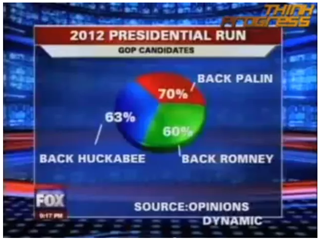

::: watermark

:::

# Visualización

"El análisis exploratorio de datos se refiere al **proceso de realizar investigaciones iniciales sobre los datos** para descubrir patrones, detectar anomalías, probar hipótesis y verificar suposiciones con la ayuda de estadísticas resumidas y representaciones gráficas." [Towards](https://towardsdatascience.com/exploratory-data-analysis-8fc1cb20fd15)

```{r echo=FALSE,fig.align='center'}
  knitr::include_graphics("img/05-ggplot/investigadora.png")
```

## EDA: Análisis Exploratorio de Datos

Un análisis exploratorio de datos tiene principalmente 5 objetivos:

1.  Maximizar el conocimiento de un conjunto de datos
2.  Descubrir la estructura subyacente de los datos
3.  Extraer variables importantes
4.  Detectar valores atípicos y anomalías
5.  Probar los supuestos subyacentes

**EDA no es idéntico a los gráficos estadísticos** aunque los dos términos se utilizan casi indistintamente. Los gráficos estadísticos son una colección de técnicas, todas basadas en gráficos y todas centradas en un aspecto de caracterización de datos. EDA abarca un lugar más grande. EDA es una filosofía sobre cómo diseccionar un conjunto de datos; lo que buscamos; cómo nos vemos; y cómo interpretamos.

Los científicos de datos pueden utilizar el análisis exploratorio para garantizar que los resultados que producen sean válidos y aplicables a los resultados y objetivos comerciales deseados.

EDA se utiliza principalmente para ver qué datos pueden revelar más allá del modelado formal o la tarea de prueba de hipótesis y proporciona una mejor comprensión de las variables del conjunto de datos y las relaciones entre ellas. También puede ayudar a determinar si las técnicas estadísticas que está considerando para el análisis de datos son apropiadas.

```{r echo=FALSE,fig.align='center', out.width = "500pt"}
  knitr::include_graphics("img/05-ggplot/meme-iniciar.jpg")
```

Dependiendo del tipo de variable queremos obtener la siguiente información:

-   **Variables numéricas:**

    -   Tipo de dato: float, integer
    -   Número de observaciones
    -   Mean
    -   Desviación estándar
    -   Cuartiles: 25%, 50%, 75%
    -   Valor máximo
    -   Valor mínimo
    -   Número de observaciones únicos
    -   Top 5 observaciones repetidas
    -   Número de observaciones con valores faltantes
    -   ¿Hay redondeos?

-   **Variables categóricas**

    -   Número de categorías
    -   Valor de las categorías
    -   Moda
    -   Valores faltantes
    -   Número de observaciones con valores faltantes
    -   Proporción de observaciones por categoría
    -   Top 1, top 2, top 3 (moda 1, moda 2, moda 3)
    -   Faltas de ortografía ?

-   **Fechas**

    -   Fecha inicio
    -   Fecha fin
    -   Huecos en las fechas: sólo tenemos datos entre semana, etc.
    -   Formatos de fecha (YYYY-MM-DD)
    -   Tipo de dato: date, time, timestamp
    -   Número de faltantes (NA)
    -   Número de observaciones

-   **Texto**

    -   Longitud promedio de cada observación
    -   Identificar el lenguaje, si es posible
    -   Longitud mínima de cada observación
    -   Longitud máxima de cada observación
    -   Cuartiles de longitud: 25%, 50%, 75%

-   **Coordenadas geoespaciales**

    -   Primero se pone la latitud y luego la longitud
    -   Primer decimal: 111 kms
    -   Segundo decimal: 11.1 kms
    -   Tercer decimal: 1.1 kms
    -   Cuarto decimal: 11 mts
    -   Quinto decimal: 1.1 mt
    -   Sexto decimal: 0.11 mts
    -   Valores que están cercanos al 100 representan la longitud
    -   El símbolo en cada coordenada representa si estamos al norte (positivo) o sur (negativo) -en la latitud-, al este (positivo) o al - oeste (negativo) -en la longitud-.

## GEDA: Análisis Exploratorio de Datos Gráficos

Como complemento al EDA podemos realizar un GEDA, que es un análisis exploratorio de los datos apoyándonos de visualizaciones, la visualización de datos no trata de hacer gráficas "bonitas" o "divertidas", ni de simplificar lo complejo. Más bien, trata de aprovechar nuestra gran capacidad de procesamiento visual para exhibir de manera clara aspectos importantes de los datos.

### Lo que no se debe hacer...

```{r echo=FALSE,fig.align='center', out.width = "500pt"}
  knitr::include_graphics("img/05-ggplot/meme-tecnicamente.png")
```

Fuentes: [WTF Visualizations](https://viz.wtf/) [Flowingdata](https://flowingdata.com/2010/05/14/wait-something-isnt-right-here/)

```{r echo=FALSE,fig.align='center', out.width = "600pt"}
  knitr::include_graphics("img/05-ggplot/bad_viz1.png")
```

```{r echo=FALSE,fig.align='center', out.width = "700pt"}
  knitr::include_graphics("img/05-ggplot/bad_viz2.png")
```

```{r echo=FALSE,fig.align='center', out.width = "700pt"}
knitr::include_graphics("img/05-ggplot/bad_viz3.png")
```

```{r echo=FALSE,fig.align='center', out.width = "700pt"}
  knitr::include_graphics("img/05-ggplot/bad_viz4.jpg")
```

```{r echo=FALSE,fig.align='center', out.width = "700pt"}
  
```

```{r echo=FALSE,fig.align='center', out.width = "700pt"}
  knitr::include_graphics("img/05-ggplot/bad_viz6.jpg")
```

### Principios de visualización

-   El objetivo de una visualización es sintetizar información relevante al análisis presentada de manera sencilla y sin ambigüedad. **Lo usamos de apoyo para explicar a una audiencia más amplia que puede no ser tan técnica.**

-   Una gráfica debe reportar el resultado de un análisis detallado, nunca lo reemplaza.

-   No hacer gráficas porque se vean "cool"

-   Antes de hacer una gráfica, debe pensarse en lo que se quiere expresar o representar

-   Existen "reglas" o mejores gráficas para representar cierto tipo de información de acuerdo a los tipos de datos que se tienen o al objetivo se quiere lograr con la visualización. [From Data to Viz](https://www.data-to-viz.com/caveats.html)

-   No utilizar pie charts


## Ggplot

En Ggplot todo funciona a través de capas. Las capas se añaden una sobre otra eligiendo y personalizando las estéticas visuales. En todo momento es posible especificar los colores, grosor, transparencia, formas, etc que cada uno de los gráficos va tomando para formar la imagen general.

### Estéticas

En ggplot2, *aestetics* significa "algo que puedes ver".

Algunos ejemplos son:

-   **Posición** (por ejemplo, los ejes x e y)
-   **Color** (color "externo")
-   **Fill** (color de relleno)
-   **Shape** (forma de puntos)
-   **Linetype** (tipo de linea)
-   **Size** (tamaño)
-   **Alpha** (para la transparencia: los valores más altos tendrían formas opacas y los más bajos, casi transparentes).

Hay que advertir que no todas las estéticas tienen la misma potencia en un gráfico. El ojo humano percibe fácilmente longitudes distintas. Pero tiene problemas para comparar áreas (que es lo que regula la estética size) o intensidades de color. Se recomienda usar las estéticas más potentes para representar las variables más importantes.

Cada tipo de objeto geométrico (geom) solo acepta un subconjunto de todos los aestéticos. Puedes consultar la pagina de ayuda de geom() para ver que aestéticos acepta. El mapeo aestético se hace con la función aes().

### Objetos geométricos o capas

Los objetos geométricos son las formas que puede tomar un gráfico. Algunos ejemplos son:

-   Barras (geom_bar(), para las variables univariados discretos o nominales)
-   Histogramas (geom_hist() para aquellas variables univariadas continuas)
-   Puntos (geom_point() para scatter plots, gráficos de puntos, etc...)
-   Lineas (geom_line() para series temporales, lineas de tendencia, etc...)
-   Cajas (geom_boxplot() para gráficos de cajas)
-   Un gráfico debe tener al menos un geom, pero no hay limite. Puedes añadir más *geom* usando el signo +.

Una vez añadida una capa al gráfico a este pueden agregarse nuevas capas

```{r, warning=FALSE, message=FALSE, echo=FALSE}
library(ggplot2)

ggplot(iris, aes(x = Petal.Length, y = Petal.Width, colour = Species)) + 
  geom_point()
```

```{r, warning=FALSE, message=FALSE, echo=FALSE}
ggplot(iris, aes(x = Petal.Length, y = Petal.Width, colour = Species)) + 
  geom_point()+ 
  geom_smooth()
```

### Facetas

Muchos de los gráficos que pueden generarse con los elementos anteriores pueden reproducirse usando los gráficos tradicionales de R, pero no los que usan facetas, que pueden permitirnos explorar las variables de diferente forma, por ejemplo:

```{r, warning=FALSE, message=FALSE, echo=FALSE}
ggplot(iris, aes(x = Petal.Length, y = Petal.Width)) + 
  geom_point() + geom_smooth() + 
  facet_grid(~ Species)
```

crea tres gráficos dispuestos horizontalmente que comparan la relación entre la anchura y la longitud del pétalo de las tres especies de iris. Una característica de estos gráficos, que es crítica para poder hacer comparaciones adecuadas, es que comparten ejes.

### Más sobre estéticas

Para los ejercicios en clase utilizaremos el set de datos: Diamonds:

```{r, warning=FALSE, message= F}
library(dplyr)
library(ggplot2)
library(reshape2)

data("diamonds")
```

**Descripción** Un conjunto de datos que contiene los precios y otros atributos de casi 54.000 diamantes. Las variables son las siguientes:

-   **price**: precio en dólares estadounidenses ( \$ 326 -  \$ 18,823)
-   **carat**: peso del diamante (0.2--5.01)
-   **cut**: calidad del corte (Regular, Bueno, Muy Bueno, Premium, Ideal)
-   **color**: color del diamante, de D (mejor) a J (peor)
-   **clarity**: una medida de la claridad del diamante (I1 (peor), SI2, SI1, VS2, VS1, VVS2, VVS1, IF (mejor))
-   **x**: longitud en mm (0-10,74)
-   **y**: ancho en mm (0--58,9) width in mm (0--58.9)
-   **z**: profundidad en mm (0--31,8)
-   **depth** porcentaje de profundidad total = z / media (x, y) = 2 \* z / (x + y) (43--79)
-   **table**: ancho de la parte superior del diamante en relación con el punto más ancho (43--95)

Ejemplo práctico:

```{r, warning=FALSE, message= F, echo = FALSE, eval=T}

# diamonds %>%
#         ggplot(aes(x = cut_number(carat, 5), y = price, color = cut)) +
#         geom_boxplot() +
#         labs(title = "Distribución de precio por categoría de corte") +
#         labs (caption = "Data source:Diamont set") +
#         labs(x = "Peso del diamante") +
#         labs(y = "Precio")+
#         guides(color=guide_legend(title="Calidad del corte")) +
#         ylim(0, 20000) +
#         scale_y_continuous(labels = scales::dollar_format(),
#                            breaks = seq(0, 20000,2500 ),
#                            limits = c(0, 20000))
# 

library(codehover)
library(htmltools)

result <- ch_int(type = "incremental") %>% 
  ch_row(text = "diamonds %>% ggplot() + ",
         img = "./img/05-ggplot/diamonds-0.png") %>% 
  ch_row(text = " <tab1> aes(x = cut_number(carat, 5), y = price) + </tab1>",
         img = "./img/05-ggplot/diamonds-1.png") %>% 
  ch_row(text = " <tab1> geom_boxplot() + </tab1>",
         img = "./img/05-ggplot/diamonds-2.png") %>%   
  ch_row(text = " <tab1> aes(color = cut) + </tab1>",
         img = "./img/05-ggplot/diamonds-3.png") %>% 
  ch_row(text = " <tab1> labs(title = 'Distribución de precio por categoría de corte') + </tab1>",
         img = "./img/05-ggplot/diamonds-4.png") %>%   
  ch_row(text = " <tab1> labs(caption = 'Data source:Diamont set') + </tab1>",
         img = "./img/05-ggplot/diamonds-5.png") %>% 
  ch_row(text = " <tab1> labs(x = 'Peso del diamante') + </tab1> ",
         img = "./img/05-ggplot/diamonds-6.png") %>%
  ch_row(text = " <tab1> labs(y = 'Precio') + </tab1>",
         img = "./img/05-ggplot/diamonds-7.png") %>% 
  ch_row(text = " <tab1> guides(color = guide_legend(title = 'Calidad del corte')) + </tab1>",
         img = "./img/05-ggplot/diamonds-8.png") %>% 
  ch_row(text = " <tab1> ylim(0, 20000) + </tab1>",
         img = "./img/05-ggplot/diamonds-9.png") %>% 
  ch_row(text = " <tab1> scale_y_continuous( </tab1>
                 <br> <tab1> labels = scales::dollar_format(), </tab1>
                 <br> <tab1> breaks = seq(0, 20000,2500 ), </tab1>
                 <br> <tab1> limits = c(0, 20000) </tab1>
                 <br> <tab1> ) </tab1> ",
         img = "./img/05-ggplot/diamonds-10.png") %>% 
  ch_out(img = "./img/05-ggplot/diamonds-10.png")

htmltools::HTML(result)
```

### Quick View

```{r, warning=FALSE, message=FALSE}
library(DataExplorer)

plot_intro(diamonds)
```

```{r, warning=FALSE, message=FALSE}
plot_missing(diamonds)
```

## Análisis univariado

El análisis univariado tiene como objetivo conocer la calidad y distribución de los datos. Se busca conocer medidas de tendencia central, variación promedio, cantidad de valores perdidos, etc. Es vital conocer los datos y su calidad antes de usarlos.

### Variables numéricas

Los **histogramas** son gráficas de barras que se obtienen a partir de tablas de frecuencias, donde cada barra se escala según la frecuencia relativa entre el ancho del intervalo de clase correspondiente.

Un **histograma** muestra la acumulación ó tendencia, la variabilidad o dispersión y la forma de la distribución.

El **Diagrama de Caja** y bigotes un tipo de gráfico que muestra un resumen de una gran cantidad de datos en cinco medidas descriptivas, además de intuir su morfología y simetría.

Este tipo de gráficos nos permite identificar valores atípicos y comparar distribuciones. Además de conocer de una forma cómoda y rápida como el 50% de los valores centrales se distribuyen.

Se puede detectar rápidamente los siguientes valores:

-   Primer cuartil: el 25% de los valores son menores o igual a este valor (punto 2 en el gráfico anterior).

-   Mediana o Segundo Cuartil: Divide en dos partes iguales la distribución. De forma que el 50% de los valores son menores o igual a este valor (punto 3 en el gráfico siguiente).

-   Tercer cuartil: el 75% de los valores son menores o igual a este valor (punto 4 en el gráfico siguiente).

-   Rango Intercuartílico (RIC): Diferencia entre el valor del tercer cuartil y el primer cuartil.

**Tip:** *El segmento que divide la caja en dos partes es la mediana (punto 3 del gráfico), que facilitará la comprensión de si la distribución es simétrica o asimétrica, si la mediana se sitúa en el centro de la caja entonces la distribución es simétrica y tanto la media, mediana y moda coinciden.*

**Precio**

```{r, warning=FALSE, message=FALSE}
diamonds %>% 
  ggplot( aes( x = price)) + 
  geom_histogram(color= "purple", fill= "pink", bins = 30) +
  scale_x_continuous(labels = scales::dollar_format()) +
  scale_y_continuous(labels = scales::comma_format()) +
  ggtitle("Distribución de precio")
```

```{r, warning=FALSE, message=FALSE}
diamonds %>% 
  ggplot( aes( x = price)) + 
  geom_histogram(
    aes(y = ..density..),
    color= "Blue", fill= "White", bins = 30
    ) +
  stat_density(geom = "line", colour = "black", size = 1)+
  scale_x_continuous(labels = scales::dollar_format()) +
  scale_y_continuous(labels = scales::comma_format()) +
  stat_density(geom = "line", colour = "black", size = 1) +
  ggtitle("Distribución de precio")
  
```

```{r, warning=FALSE, message=FALSE}
diamonds %>% 
  ggplot( aes( x = price)) + 
  geom_boxplot(binwidth = 1000, color= "Blue", fill= "lightblue") +
  scale_x_continuous(labels = scales::dollar_format()) +
  scale_y_continuous(labels = scales::comma_format()) +
  ggtitle("Distribución de precio")
```

```{r}
diamonds %>% 
  ggplot( aes( x = carat)) + 
  geom_boxplot(color= "purple", fill= "pink", alpha= 0.3) +
  scale_x_continuous(labels = scales::comma_format()) +
  ggtitle("Distribución de peso de los diamantes") +
  theme_bw() +
  coord_flip()
```

**Peso del diamante**

```{r, warning=FALSE, message=FALSE}
diamonds %>% 
  ggplot( aes( x = carat)) + 
  geom_histogram(binwidth = .03, color= "purple", fill= "pink", alpha= 0.3) +
  scale_y_continuous(labels = scales::comma_format()) +
  ggtitle("Distribución de peso de los diamantes") +
  theme_bw()
  
```

```{r, warning=FALSE, message=FALSE}

diamonds %>% 
  ggplot( aes( x = carat)) + 
  geom_boxplot(color= "purple", fill= "pink", alpha= 0.3) +
  scale_x_continuous(labels = scales::comma_format()) +
  ggtitle("Distribución de peso de los diamantes") +
  theme_bw()
  

```

### Variables nominales/categóricas

**Calidad de corte**

```{r, warning=FALSE, message=FALSE}

diamonds %>% 
  ggplot( aes( x = cut)) + 
  geom_bar( color= "darkblue", fill= "cyan", alpha= 0.7) +
  scale_y_continuous(labels = scales::comma_format()) +
  ggtitle("Distribución de calidad de corte") +
  theme_dark()

```

```{r, warning=FALSE, message=FALSE}
df_pie <- diamonds %>%
  group_by(cut) %>% 
  summarise(freq = n(), .groups='drop')


df_pie %>% 
  ggplot( aes( x = "", y=freq,  fill = factor(cut)))  +
  geom_bar(width = 1, stat = "identity")  +
  coord_polar(theta = "y", start=0)
```

```{r, warning=FALSE, message=FALSE}
ggplot(data = diamonds)+
  geom_bar( mapping = aes(x = cut, fill = cut), show.legend = F, width = 1)+
  theme(aspect.ratio = 1)+
  labs(x= NULL, y = NULL)+
  coord_polar()
```

**Claridad**

```{r, warning=FALSE, message=FALSE}
diamonds %>% 
  ggplot( aes( y = clarity)) + 
  geom_bar( color= "darkblue", fill= "black", alpha= 0.7) +
  geom_text(aes(label = scales::comma(..count..)), stat = "count", 
            vjust = 1, hjust = 1.1,colour = "white") +
  scale_x_continuous(labels = scales::comma_format()) +
  ggtitle("Distribución claridad") +
  theme_get()
```

```{r}
diamonds %>% 
  ggplot( aes( y = clarity)) + 
  geom_bar( color= "darkblue", fill= "black", alpha= 0.7) +
  geom_text(aes(label = scales::percent(..count../sum(..count..) ) ), 
            stat = "count", vjust = -0.25, colour = "darkblue") +
  scale_x_continuous(labels = scales::comma_format()) +
  ggtitle("Distribución claridad") +
  coord_flip()
```

## Análisis multivariado

Un buen análisis de datos, requiere del análisis conjunto de variables. Una sola variable es importante de analizar en cuanto a su distribución y calidad, no obstante, no dice mucho al analizarse por sí sola. Es por ello, que es indispensable analizar la covariabilidad y dependencia entre los distintos atributos de la información.

En el análisis multivariado, se busca comparar la información haciendo contrastes de colores, formas, tamaños, paneles, etc.

**Precio vs Calidad del corte**

```{r, warning=FALSE, message=FALSE}
diamonds %>% 
  ggplot(aes(y= price,x=cut,color=cut))  + 
  geom_jitter(size=1.2, alpha= 0.5)
```

```{r, warning=FALSE, message=FALSE}
diamonds %>% 
  ggplot(aes(y= price,x=cut,color=cut))  + 
  geom_boxplot(size=1.2, alpha= 0.5)
```

```{r, warning=FALSE, message=FALSE}
diamonds %>% 
  ggplot(aes(x= price ,fill=cut))  + 
  geom_histogram(position = 'identity',
                 alpha = 0.5)
```

```{r, warning=FALSE, message=FALSE}
diamonds %>% 
  ggplot(aes(x= price ,fill=cut))  + 
  geom_histogram(position = 'identity',
                 alpha = 0.5) +
  facet_wrap(~cut, ncol = 1)
```

```{r, warning=FALSE, message=FALSE}
diamonds %>% 
  ggplot( aes(x = carat ,y=price)) +
  geom_point(aes(col = clarity) ) +
  geom_smooth()
```

```{r, warning=FALSE, message=FALSE}
diamonds %>% 
  ggplot( aes(x = carat ,y=price)) +
  geom_point(aes(col = clarity) ) +
  facet_wrap(~clarity)+
  geom_smooth()
```

## Visualización interactiva

A través de la librería **plotly** es posible crear interactividad entre las gráficas creadas con gglot2. Es posible tanto usar las funciones existentes como crear funciones que enriquezcan las estéticas comunes. A continuación se hace uso de una combinación de nuevas estéticas con la interactividad añadida.

```{r, warning=FALSE, message=FALSE}
library(stringr)

fun_mean <- function(x){
  
  mean <- data.frame(
    y = mean(x),
    label = mean(x, na.rm = T)
    )
  
  return(mean)
  }

means <- diamonds %>% 
  group_by(clarity) %>% 
  summarise(price = round(mean(price), 1))

plot <- diamonds %>% 
  ggplot(aes(x = clarity, y = price)) +
  geom_boxplot(aes(fill = clarity)) +
  stat_summary(
    fun = mean, 
    geom = "point", 
    colour = "darkred", 
    shape = 18,
    size = 2
    ) +
  geom_text(
    data = means, 
    aes(label = str_c("$",price), y = price + 600)
    ) +
  ggtitle("Precio vs Claridad de diamantes") +
  xlab("Claridad") +
  ylab("Precio")

plotly::ggplotly(plot)
```

Como puede apreciarse, este nuevo gráfico permite hacer uso de zoom, filtros, etiquetas, snapshots, etc. El contenido es creado como HTML, por lo que puede integrarse a documentos web como bookdown, shiny, xaringan, markdown, etc.

### ¡ Warning ! {.unnumbered}

Nunca se debe olvidar que debemos de analizar los datos de manera objetiva, nuestro criterio sobre un problema o negocio no debe de tener sesgos sobre lo que "nos gustaría encontrar en los datos" o lo "que creemos que debe pasar"....

```{r echo=FALSE,fig.align='center', out.width = "500pt"}
  knitr::include_graphics("img/05-ggplot/datosgato.jpeg")
```

## Reporte interactivos

Es posible automatizar reportes de análisis de datos. Los reportes pueden realizarse tanto en formato estático (.docx y .pdf) como en formato interactivo (.html).

Existen diversos manuales sumamente amplios que permiten conocer las múltiples funcionalidades de las librerías que hacen posible la creación de documentos.

Para el caso de documentos, existe la librería *Rmarkdown*, la cual crea un documento estático o interactivo, mientras que para reportes en presentaciones existe la librería *Xaringan*, la cual sustituye a las presentaciones de *power point*.

Es importante tomar en cuenta el balance entre complejidad y funcionalidad. Si bien es cierto que a través de esta herramienta pueden automatizarse reportes que consideren los resultados salientes de *R*, es importante considerar que las personas que puedan editar tal presentación serán limitadas.

A continuación se enlistan los links de tutoriales para crear los documentos mencionados:

-   [Rmarkdown](https://bookdown.org/yihui/rmarkdown/)

-   [Xaringan](https://bookdown.org/yihui/rmarkdown/xaringan.html)

-   [Otros lenguajes](https://bookdown.org/yihui/rmarkdown/language-engines.html)

-   [Tablas estáticas](https://cran.r-project.org/web/packages/kableExtra/vignettes/awesome_table_in_html.html)

-   [Tablas interactivas](https://rstudio.github.io/DT/)

