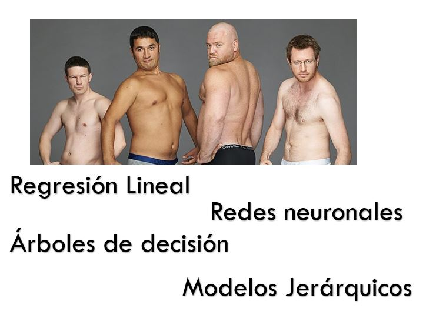
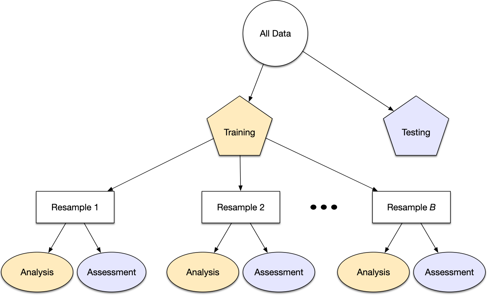

::: watermark

:::

# (PART\*) Parte 2: Machine Learning {.unnumbered}

# Introducción a Machine Learning

Como se había mencionado, el Machine Learning es una disciplina del campo de la
Inteligencia Artificial que, a través de algoritmos, dota a los ordenadores de
la capacidad de identificar patrones en datos para hacer predicciones. Este
aprendizaje permite a los computadores realizar tareas específicas de forma
autónoma.

El término se utilizó por primera vez en 1959. Sin embargo, ha ganado relevancia
en los últimos años debido al aumento de la capacidad de computación y al *BOOM*
de los datos.

Un algoritmo para computadoras puede ser pensado como una receta. Describe
exactamente qué pasos se realizan uno tras otro. Los ordenadores no entienden
las recetas de cocina, sino los lenguajes de programación: En ellos, el
algoritmo se descompone en pasos formales (comandos) que el ordenador puede
entender.

```{r, fig.align='center', out.width = "400pt", eval = T, echo=FALSE}
knitr::include_graphics("img/06-ml/WebQuest.gif")
```

La cuestión no es solo saber para qué sirve el Machine Learning, sino que saber
cómo funciona y cómo poder implementarlo en la industria para aprovecharse de
sus beneficios. Hay ciertos pasos que usualmente se siguen para crear un modelo
de Machine Learning. Estos son típicamente realizados por científicos de los
datos que trabajan en estrecha colaboración con los profesionales de los
negocios para los que se está desarrollando el modelo.

-   **Seleccionar y preparar un conjunto de datos de entrenamiento**

Los **datos de entrenamiento** son un conjunto de datos representativos de los
datos que el modelo de Machine Learning ingerirá para resolver el problema que
está diseñado para resolver.

Los datos de entrenamiento deben prepararse adecuadamente: aleatorizados y
comprobados en busca de desequilibrios o sesgos que puedan afectar al
entrenamiento. También deben dividirse en dos subconjuntos: el **subconjunto de
entrenamiento**, que se utilizará para entrenar el algoritmo, y el **subconjunto
de validación**, que se utilizará para probarlo y perfeccionarlo.

```{r, echo=FALSE, out.width = "600pt", fig.align='center'}
knitr::include_graphics("img/06-ml/train-and-test.png")
```

-   **Elegir un algoritmo para ejecutarlo en el conjunto de datos de
    entrenamiento**

Este es uno de los pasos más importantes, ya que se debe elegir qué algoritmo
utilizar, siendo este un conjunto de pasos de procesamiento estadístico. El tipo
de algoritmo depende del tipo (supervisado o no supervisado), la cantidad de
datos del conjunto de datos de entrenamiento y del tipo de problema que se debe
resolver.

```{r, echo=FALSE, out.width = "600pt", fig.align='center'}
#
```

```{r, eval = TRUE, echo=FALSE, out.width = "600pt", fig.align='center'}

```

-   **Entrenamiento del algoritmo para crear el modelo**

El entrenamiento del algoritmo es un proceso iterativo: implica ejecutar las
variables a través del algoritmo, comparar el resultado con los resultados que
debería haber producido, ajustar los pesos y los sesgos dentro del algoritmo que
podrían dar un resultado más exacto, y ejecutar las variables de nuevo hasta que
el algoritmo devuelva el resultado correcto la mayoría de las veces. El
algoritmo resultante, entrenado y preciso, es el modelo de Machine Learning.

```{r, echo=FALSE, out.width = "600pt", fig.align='center'}

```

-   **Usar y mejorar el modelo**

El paso final es utilizar el modelo con nuevos datos y, en el mejor de los
casos, para que mejore en precisión y eficacia con el tiempo. De dónde procedan
los nuevos datos dependerá del problema que se resuelva. Por ejemplo, un modelo
de Machine Learning diseñado para identificar el spam ingerirá mensajes de
correo electrónico, mientras que un modelo de Machine Learning que maneja una
aspiradora robot ingerirá datos que resulten de la interacción en el mundo real
con muebles movidos o nuevos objetos en la habitación.

```{r, echo=FALSE, out.width = "600pt", fig.align='center'}

```

## Análisis Supervisado vs No supervisado

Los algoritmos de Machine Learning se dividen en tres categorías, siendo las dos
primeras las más comunes:

```{r, fig.align='center', echo=F, out.height='500pt', out.width='750pt'}
knitr::include_graphics("img/06-ml/ml2.png")
```

-   **Aprendizaje supervisado**: estos algoritmos cuentan con un aprendizaje
    previo basado en un sistema de etiquetas asociadas a unos datos que les
    permiten tomar decisiones o hacer predicciones.

Algunos ejemplos son:

    - Un detector de spam que etiqueta un e-mail como spam o no.

    - Predecir precios de casas

    - Clasificación de imagenes

    - Predecir el clima

    - ¿Quiénes son los clientes descontentos?

-   **Aprendizaje no supervisado:** en el aprendizaje supervisado, la idea
    principal es aprender bajo supervisión, donde la señal de supervisión se
    nombra como valor objetivo o etiqueta. En el aprendizaje no supervisado,
    carecemos de este tipo de etiqueta. Por lo tanto, necesitamos encontrar
    nuestro camino sin ninguna supervisión ni guía. Esto simplemente significa
    que necesitamos descubrir qué es qué por nosotros mismos.

Algunos ejemplos son:

    - Encontrar segmentos de clientes.

    - Reducir la complejidad de un problema

    - Selección de variables

    - Encontrar grupos

    - Reducción de dimensionalidad

-   **Aprendizaje por refuerzo:** su objetivo es que un algoritmo aprenda a
    partir de la propia experiencia. Esto es, que sea capaz de tomar la mejor
    decisión ante diferentes situaciones de acuerdo a un proceso de prueba y
    error en el que se recompensan las decisiones correctas.

Algunos ejemplos son:

    - Reconocimiento facial

    - Diagnósticos médicos

    - Clasificar secuencias de ADN

### Regresión vs clasificación

Existen dos tipos principales de aprendizaje supervisado, esto depende del tipo
de la variable respuesta:

#### Clasificación {.unnumbered}

En el aprendizaje supervisado, los algoritmos de clasificación se usan cuando el
resultado es una etiqueta discreta. Esto quiere decir que se utilizan cuando la
respuesta se fundamenta en conjunto finito de resultados.

#### Regresión {.unnumbered}

El análisis de regresión es un subcampo del aprendizaje automático supervisado
cuyo objetivo es establecer un método para la relación entre un cierto número de
características y una variable objetivo continua.

<br/>

```{r echo=FALSE,fig.align='center', out.height='450pt', out.width='700pt'}
knitr::include_graphics("img/06-ml/regresion_clasificacion.png")
```

## Sesgo vs varianza

En el mundo de Machine Learning cuando desarrollamos un modelo nos esforzamos
para hacer que sea lo más preciso, ajustando los parámetros, pero la realidad es
que no se puede construir un modelo 100% preciso ya que nunca pueden estar
libres de errores.

Comprender cómo las diferentes fuentes de error generan sesgo y varianza nos
ayudará a mejorar el proceso de ajuste de datos, lo que resulta en modelos más
precisos, adicionalmente también evitará el error de sobre-ajuste y falta de
ajuste.


### Balance entre sesgo y varianza o Trade-off

El objetivo de cualquier algoritmo supervisado de Machine Learning es lograr un
sesgo bajo, una baja varianza y a su vez el algoritmo debe lograr un buen
rendimiento de predicción.

```{r echo=FALSE,fig.align='center', out.height='450pt', out.width='650pt'}
knitr::include_graphics("img/06-ml/3-1-3-tradeoff.jpeg")
```

El sesgo frente a la varianza se refiere a la precisión frente a la consistencia
de los modelos entrenados por su algoritmo. Podemos diagnosticarlos de la
siguiente manera:

```{r echo=FALSE,fig.align='center', out.height='350pt', out.width='650pt'}
knitr::include_graphics("img/06-ml/3-1-3-altobias.jpeg")
```

Los algoritmos de baja varianza (alto sesgo) tienden a ser menos complejos, con
una estructura subyacente simple o rígida.

```{r echo=FALSE,fig.align='center', out.height='350pt', out.width='650pt'}
knitr::include_graphics("img/06-ml/3-1-3-bajobias.jpeg")
```

Los algoritmos de bajo sesgo (alta varianza) tienden a ser más complejos, con
una estructura subyacente flexible.

No hay escapatoria a la relación entre el sesgo y la varianza en Machine
Learning, aumentar el sesgo disminuirá la varianza, aumentar la varianza
disminuirá el sesgo.

### Error total

Comprender el sesgo y la varianza es fundamental para comprender el
comportamiento de los modelos de predicción, pero en general lo que realmente
importa es el error general, no la descomposición específica. El punto ideal
para cualquier modelo es el nivel de complejidad en el que el aumento en el
sesgo es equivalente a la reducción en la varianza.

Para construir un buen modelo, necesitamos encontrar un buen equilibrio entre el
sesgo y la varianza de manera que minimice el error total.

```{r echo=FALSE,fig.align='center', out.height='350pt', out.width='650pt'}
knitr::include_graphics("img/06-ml/3-1-3-biasvar.png")
```

### Overfitting

-   El modelo es muy particular.

-   Error debido a la varianza

-   Durante el entrenamiento tiene un desempeño muy bueno, pero al pasar nuevos
    datos su desempeño es malo.

### Underfitting

-   El modelo es demasiado general.

-   Error debido al sesgo.

-   Durante el entrenamiento no tiene un buen desempeño.

```{r, fig.align='center', echo=F, out.height='350pt', out.width='600pt'}
knitr::include_graphics("img/06-ml/over-under.jpg")
```

### Error irreducible

El error irreducible no se puede reducir, independientemente de qué algoritmo se
usa. También se le conoce como ruido y, por lo general, proviene por factores
como variables desconocidas que influyen en el mapeo de las variables de entrada
a la variable de salida, un conjunto de características incompleto o un problema
mal enmarcado. Acá es importante comprender que no importa cuán bueno hagamos
nuestro modelo, nuestros datos tendrán cierta cantidad de ruido o un error
irreductible que no se puede eliminar.

## Orden y estructura de proyecto

Resulta elemental contar con una adecuada **estructura de carpetas que permitan
al analista mantener orden y control a lo largo de todo el proyecto**. Gran
parte del caos en los problemas de analítica de datos nace desde el momento en
que no se sabe en donde ubicar cada uno de los archivos necesarios para el
proyecto.

### Plantilla de estructura proyecto

En esta sección, se presenta una introducción a la librería
[**ProjectTemplate**](http://projecttemplate.net/), la cual facilita una
estructura predeterminada que ayudará como punto de partida para mantener orden
y control en cada momento del proyecto.

```{r, eval=FALSE, message=FALSE, warning=FALSE}
library(ProjectTemplate)

create.project(project.name = 'intro2dsml', rstudio.project = T)
```

**create.project()** creará toda la estructura de carpetas para un nuevo
proyecto. Configurará todos los directorios relevantes y sus contenidos
iniciales. Para aquellos que solo desean la funcionalidad mínima, el argumento
de *template* se puede establecer en *minimal* para crear un subconjunto de
directorios predeterminados de ProjectTemplate.

```{r echo=FALSE,fig.align='center', out.width="600px", out.height="300px"}
knitr::include_graphics("img/06-ml/18_folder_structure.png")
```

-   **cache:** En esta carpeta se almacenarán los datos que desear cargarse
    automáticamente cuando se cargue la sesión del proyecto.

-   **config:** Se realiza la configuración de *R* y su sesión, la cual será
    establecida cada que se abra el proyecto.

-   **data:** Se almacenan las fuentes de información crudas necesarias en el
    proyecto. En caso de encontrarse codificadas en algún formato de archivo
    soportado por la librería, automáticamente serán cargadas a la sesión con la
    función `load.project()`

-   **diagnostics:** En este folder puedes almacenar cualquier script usado para
    realizar diagnósticos sobre los datos. Es particularmente útil para al
    análisis de elementos corruptos o problemáticos dentro del conjunto de
    datos.

-   **doc:** En este folder puede almacenarse cualquier documentación que haya
    escrito sobre el análisis. También se puede usar como directorio raíz para
    las páginas de [**GitHub**](https://github.com/) para crear un sitio web de
    proyecto.

-   **graphs:** Sirve para almacenar las gráficas producidas por el análisis

-   **lib:** Aquí se almacenarán todos los archivos que proporcionen una
    funcionalidad útil para su trabajo, pero que no constituyan un análisis
    estadístico per se. Específicamente, debe usar el script lib/helpers.R para
    organizar cualquier función que use en su proyecto que no sea lo
    suficientemente general como para pertenecer a un paquete. Si tiene una
    configuración específica del proyecto que le gustaría almacenar en el objeto
    de configuración, puede especificarla en lib/globals.R.

-   **logs:** Aquí puede almacenarse un archivo de registro de cualquier trabajo
    que haya realizado en este proyecto. Si va a registrar su trabajo, se
    recomienda utilizar el paquete *log4r*, que *ProjectTemplate* cargará
    automáticamente si activa la opción de configuración de registro. El nivel
    de registro se puede establecer a través de la configuración *logging_level*
    en la configuración, el valor predeterminado es "INFO".

-   **munge:** En este *folder* puede almacenarse cualquier código de
    pre-procesamiento o manipulación de datos para el proyecto. Por ejemplo, si
    necesita agregar columnas en tiempo de ejecución, fusionar conjuntos de
    datos normalizados o censurar globalmente cualquier punto de datos, ese
    código debe almacenarse en el directorio *munge.* Los scripts de
    pre-procesamiento almacenados en munge se ejecutarán en orden alfabético
    cuando se llame a la función *load.project()*, por lo que debe anteponerse
    números a los nombres de archivo para indicar su orden secuencial.

-   **profiling:** Aquí puede almacenar cualquier script que use para comparar y
    cronometrar su código.

-   **reports:** Aquí puede almacenar cualquier informe de salida, como
    versiones de tablas HTML o LaTeX, que produzca. Los documentos de sweave o
    brew también deben ir en el directorio de informes.

-   **src:** Aquí se almacenarán los **scripts de análisis estadístico**
    finales. Debe agregar el siguiente fragmento de código al comienzo de cada
    secuencia de comandos de análisis:
    `library('ProjectTemplate); load.project()`. También debe hacer todo lo
    posible para asegurarse de que cualquier código compartido entre los
    análisis en src se mueva al directorio munge; si lo hace, puede ejecutar
    todos los análisis en el directorio src **en paralelo**. Una versión futura
    de ProjectTemplate proporcionará herramientas para ejecutar automáticamente
    cada análisis individual de src en paralelo.

-   **tests:** Aquí puede almacenarse cualquier caso de prueba para las
    funciones que ha escrito. Los archivos de prueba deben usar pruebas de
    estilo *testthat* para que pueda llamar a la función `test.project()` para
    ejecutar automáticamente todo su código de prueba.

-   *README:* En este archivo, debe escribir algunas notas para ayudar a
    orientar a los recién llegados a su proyecto.

-   *TODO:* En este archivo, debe escribir una lista de futuras mejoras y
    correcciones de errores que planea realizar en sus análisis.

Si algunas o todas estas carpetas resultan innecesarias, puede comenzarse con
una versión simplificada a través del comando:

```{r, eval=FALSE}
create.project(project.name = 'intro2dsml', template='minimal')
```

```{r echo=FALSE,fig.align='center', out.width="600px", out.height="300px"}
knitr::include_graphics("img/06-ml/19_create_project_minimal.png")
```


## Partición de datos

```{r, fig.align='left', out.height='150pt', out.width='150pt', echo=F, include=TRUE}
knitr::include_graphics("img/06-ml/3-5-particion-datos.jpg")
```

Cuando hay una gran cantidad de datos disponibles, una estrategia inteligente es
asignar subconjuntos específicos de datos para diferentes tareas, en lugar de
asignar la mayor cantidad posible solo a la estimación de los parámetros del
modelo.

Si el conjunto inicial de datos no es lo suficientemente grande, habrá cierta
superposición de cómo y cuándo se asignan nuestros datos, y es importante contar
con una metodología sólida para la partición de datos.

### Métodos comunes para particionar datos

El enfoque principal para la validación del modelo es dividir el conjunto de
datos existente en dos conjuntos distintos:

-   **Entrenamiento:** Este conjunto suele contener la mayoría de los datos, los
    cuales sirven para la construcción de modelos donde se pueden ajustar
    diferentes modelos, se investigan estrategias de ingeniería de
    características, etc.

    La mayor parte del proceso de modelado se utiliza este conjunto.

-   **Prueba:** La otra parte de las observaciones se coloca en este conjunto.
    Estos datos se mantienen en reserva hasta que se elijan uno o dos modelos
    como los de mejor rendimiento.

    El conjunto de prueba se utiliza como árbitro final para determinar la
    eficiencia del modelo, por lo que es fundamental mirar el conjunto de prueba
    una sola vez.

Supongamos que asignamos el $80\%$ de los datos al conjunto de entrenamiento y
el $20\%$ restante a las pruebas. El método más común es utilizar un muestreo
aleatorio simple. El paquete *rsample* tiene herramientas para realizar
divisiones de datos como esta; la función `initial_split()` fue creada para este
propósito.

```{r}
library(tidymodels)

tidymodels_prefer()

# Fijar un número aleatorio con para que los resultados puedan ser reproducibles 
set.seed(123)

# Partición 80/20 de los datos
ames_split <- initial_split(ames, prop = 0.80)
ames_split
```

La información impresa denota la cantidad de datos en el conjunto de
entrenamiento $(n = 2,344)$, la cantidad en el conjunto de prueba $(n = 586)$ y
el tamaño del grupo original de muestras $(n = 2,930)$.

El objeto `ames_split` es un objeto *rsplit* y solo contiene la información de
partición; para obtener los conjuntos de datos resultantes, aplicamos dos
funciones más:

```{r}
ames_train <- training(ames_split)
ames_test  <-  testing(ames_split)

dim(ames_train)
```

El muestreo aleatorio simple es apropiado en muchos casos, pero hay excepciones.

Cuando hay un desbalance de clases en los problemas de clasificación, el uso de
una muestra aleatoria simple puede asignar al azar estas muestras poco
frecuentes de manera desproporcionada al conjunto de entrenamiento o prueba.

Para evitar esto, se puede utilizar un muestreo estratificado. La división de
entrenamiento/prueba se lleva a cabo por separado dentro de cada clase y luego
estas submuestras se combinan en el conjunto general de entrenamiento y prueba.

Para los problemas de regresión, los datos de los resultados se pueden agrupar
artificialmente en cuartiles y luego realizar un muestreo estratificado cuatro
veces por separado. Este es un método eficaz para mantener similares las
distribuciones del resultado entre el conjunto de entrenamiento y prueba.

```{r, echo=FALSE}
a <- quantile(log(ames$Sale_Price), prob = 0.2)
b <- quantile(log(ames$Sale_Price), prob = 0.5)
c <- quantile(log(ames$Sale_Price), prob = 0.8)


ggplot(ames, aes(x = log(Sale_Price)))+
  geom_density(alpha = .2)+
  geom_vline(aes(xintercept = a), linetype ="longdash", size = .5)+
  geom_vline(aes(xintercept = b), linetype ="longdash", size = .5)+
  geom_vline(aes(xintercept = c), linetype ="longdash", size = .5)+
  ylab('y')+
  theme_minimal()

```

Observamos que la distribución del precio de venta está sesgada a la derecha.
Las casas más caras no estarían bien representadas en el conjunto de
entrenamiento con una simple partición; esto aumentaría el riesgo de que nuestro
modelo sea ineficaz para predecir el precio de dichas propiedades.

Las líneas verticales punteadas indican los cuatro cuartiles para estos datos.
Una muestra aleatoria estratificada llevaría a cabo la división 80/20 dentro de
cada uno de estos subconjuntos de datos y luego combinaría los resultados. En
*rsample*, esto se logra usando el argumento de estratos:

```{r}
set.seed(123)
ames_split <- initial_split(ames, prop = 0.80, strata = Sale_Price)
ames_train <- training(ames_split)
ames_test  <-  testing(ames_split)
```

**Hay muy pocas desventajas en el uso de muestreo estratificado.**

Un caso es cuando los datos tienen un componente de tiempo, como los datos de
series de tiempo. Aquí, es más común utilizar los datos más recientes como
conjunto de prueba.

El paquete *rsample* contiene una función llamada `initial_time_split()` que es
muy similar a `initial_split()`. En lugar de usar un muestreo aleatorio, el
argumento `prop` denota qué proporción de la primera parte de los datos debe
usarse como conjunto de entrenamiento; la función asume que los datos se han
clasificado previamente en un orden apropiado.

#### ¿Qué proporción debería ser usada? {.unnumbered}

No hay un porcentaje de división óptimo para el conjunto de entrenamiento y
prueba. Muy pocos datos en el conjunto de entrenamiento obstaculizan la
capacidad del modelo para encontrar estimaciones de parámetros adecuadas y muy
pocos datos en el conjunto de prueba reducen la calidad de las estimaciones de
rendimiento.

Se debe elegir un porcentaje que cumpla con los objetivos de nuestro proyecto
con consideraciones que incluyen:

-   Costo computacional en el entrenamiento del modelo.
-   Costo computacional en la evaluación del modelo.
-   Representatividad del conjunto de formación.
-   Representatividad del conjunto de pruebas.

Los porcentajes de división más comunes comunes son:

-   Entrenamiento: $80\%$, Prueba: $20\%$
-   Entrenamiento: $67\%$, Prueba: $33\%$
-   Entrenamiento: $50\%$, Prueba: $50\%$

### Conjunto de validación

El conjunto de validación se definió originalmente cuando los investigadores se
dieron cuenta de que medir el rendimiento del conjunto de entrenamiento conducía
a resultados que eran demasiado optimistas.

Esto llevó a modelos que se sobre-ajustaban, lo que significa que se
desempeñaron muy bien en el conjunto de entrenamiento pero mal en el conjunto de
prueba.

Para combatir este problema, se retuvo un pequeño conjunto de datos de
*validación* y se utilizó para medir el rendimiento del modelo mientras este
está siendo entrenado. Una vez que la tasa de error del conjunto de validación
comenzara a aumentar, la capacitación se detendría.

En otras palabras, el conjunto de validación es un medio para tener una idea
aproximada de qué tan bien se desempeñó el modelo antes del conjunto de prueba.

```{r, fig.align='center', out.height='250pt', out.width='500pt', echo=F, include=TRUE}
knitr::include_graphics("img/06-ml/3-5-3-conjunto-validacion.png")
```

Los conjuntos de validación se utilizan a menudo cuando el conjunto de datos
original es muy grande. En este caso, una sola partición grande puede ser
adecuada para caracterizar el rendimiento del modelo sin tener que realizar
múltiples iteraciones de remuestreo.

Con *rsample*, un conjunto de validación es como cualquier otro objeto de
remuestreo; este tipo es diferente solo en que tiene una sola iteración

```{r, fig.align='center', out.height='350pt', out.width='500pt', echo=F, include=TRUE}
knitr::include_graphics("img/06-ml/3-5-3-conjunto-validacion-2.png")
```

```{r}
set.seed(12)
val_set <- validation_split(ames_train, prop = 3/4, strata = NULL)
val_set #val_set contiene el conjunto de entrenamiento y validación.
```

Esta función regresa una columna para los objetos de división de datos y una
columna llamada id que tiene una cadena de caracteres con el identificador de
remuestreo.

El argumento de estratos hace que el muestreo aleatorio se lleve a cabo dentro
de la variable de estratificación. Esto puede ayudar a garantizar que el número
de datos en los datos del análisis sea equivalente a las proporciones del
conjunto de datos original. (Los estratos inferiores al 10% del total se
agrupan).

Otra opción de muestreo bastante común es la realizada mediante múltiples
submuestras de los datos originales.

```{r, fig.align='center', out.height='350pt', out.width='500pt', echo=F, include=TRUE}

```

Diversos métodos se revisarán a lo largo del curso.

### Leave-one-out cross-validation

La validación cruzada es una manera de predecir el ajuste de un modelo a un
hipotético conjunto de datos de prueba cuando no disponemos del conjunto
explícito de datos de prueba.

El método *LOOCV* en un método iterativo que se inicia empleando como conjunto
de entrenamiento todas las observaciones disponibles excepto una, que se excluye
para emplearla como validación.

Si se emplea una única observación para calcular el error, este varía mucho
dependiendo de qué observación se haya seleccionado. Para evitarlo, el proceso
se repite tantas veces como observaciones disponibles se tengan, excluyendo en
cada iteración una observación distinta, ajustando el modelo con el resto y
calculando el error con dicha observación.

Finalmente, el error estimado por el es el promedio de todos lo $i$ errores
calculados.

La principal desventaja de este método es su costo computacional. El proceso
requiere que el modelo sea reajustado y validado tantas veces como observaciones
disponibles se tengan lo que en algunos casos puede ser muy complicado.

*rsample* contiene la función `loo_cv()`.

```{r}
set.seed(55)
ames_loo <- loo_cv(ames_train)
ames_loo
```

#### Cálculo del error

En la validación cruzada dejando uno fuera se realizan tantas iteraciones como
muestras $(N)$ tenga el conjunto de datos. De forma que para cada una de las $N$
iteraciones se realiza un cálculo de error.

El resultado final se obtiene realizando la media de los $N$ errores obtenidos,
según la fórmula:

$$E = \frac{1}{N}\sum_{i = 1}^N E_i$$

### V Fold Cross Validation

En la validación cruzada de V iteraciones (V Fold Cross Validation) los datos de
muestra se dividen en V subconjuntos. Uno de los subconjuntos se utiliza como
datos de prueba y el resto $(V-1)$ como datos de entrenamiento. El proceso de
validación cruzada es repetido durante $v$ iteraciones, con cada uno de los
posibles subconjuntos de datos de prueba.

Finalmente se obtiene el promedio de los rendimientos de cada iteración para
obtener un único resultado. Lo más común es utilizar la validación cruzada de 10
iteraciones.

```{r, fig.align='center', out.height='250pt', out.width='550pt', echo=F, include=TRUE}
knitr::include_graphics("img/06-ml/3-5-4-VFCV.jpg")
```

Este método de validación cruzada se utiliza principalmente para:

-   Estimar el error cuando nuestro conjunto de prueba es muy pequeño. Es decir,
    se tiene la misma configuración de parámetros y solamente cambia el conjunto
    de prueba y validación.

-   Encontrar lo mejores hiperparámetros que ajusten mejor el modelo. Es decir,
    en cada bloque se tiene una configuración de hiperparámetros distinto y se
    seleccionará aquellos hiperparámetros que hayan producido el error más
    pequeño.

```{r, fig.align='center', out.height='250pt', out.width='550pt', echo=F, include=TRUE}
knitr::include_graphics("img/06-ml/3-5-4-VFCV-tune.png")
```

En la función `vfold_cv()` la entrada principal es el conjunto de entrenamiento,
así como el número de bloques:

```{r}
set.seed(55)
ames_folds <- vfold_cv(ames_train, v = 10)
ames_folds
```

La columna denominada `splits` contiene la información sobre cómo dividir los
datos (similar al objeto utilizado para crear la partición inicial de
entrenamiento / prueba).

Si bien cada fila de divisiones tiene una copia incrustada de todo el conjunto
de entrenamiento, *R* es lo suficientemente inteligente como para no hacer
copias de los datos en la memoria.

El método de impresión dentro del tibble muestra la frecuencia de cada uno: [2K
/ 230] indica que aproximadamente dos mil muestras están en el conjunto de
análisis y 230 están en ese conjunto de evaluación en particular.

Estos objetos *rsample* también contienen siempre una columna de caracteres
llamada *id* que etiqueta la partición. Algunos métodos de remuestreo requieren
varios campos de identificación.

Para recuperar manualmente los datos particionados, las funciones de
`analysis()` y `assessment()` devuelven los de datos de análisis y evaluación
respectivamente.

```{r}
# Primer bloque
ames_folds$splits[[1]] %>%
  analysis() %>% # O assessment()
  head(7)
```

### Medidas de ajuste

Las medidas de ajuste obtenidas pueden ser utilizadas para estimar cualquier
medida cuantitativa de ajuste apropiada para los datos y el modelo.

En un modelo basado en clasificación binaria, para resumir el ajuste del modelo
se pueden usar las medidas:

-   Tasa de error de clasificación (Accuracy)
-   Precisión
-   Sensibilidad o cobertura (Recall)
-   Especificidad

Cuando el valor a predecir se distribuye de forma continua se puede calcular el
error utilizando medidas como:

-   Error porcentual absoluto medio (MAPE)
-   Error absoluto medio (MAE)
-   Error cuadrático medio (MSE)
-   Raíz del error cuadrático medio (RMSE)
-   Raíz del error logarítmico cuadrático medio (RMLSE)
-   $R^2$ (Coeficiente de determinación)
-   $R^2_a$ (Coeficiente de determinación ajustado)

#### Cálculo del error

En cada una de las $v$ iteraciones de este tipo de validación se realiza un
cálculo de error. El resultado final lo obtenemos a partir de realizar la media
de los $V$ valores de errores obtenidos, según la fórmula:

$$E = \frac{1}{V}\sum_{i = 1}^vE_i$$

### Validación cruzada para series de tiempo

En este procedimiento, hay una serie de conjuntos de prueba, cada uno de los
cuales consta de una única observación. El conjunto de entrenamiento
correspondiente consta solo de observaciones que ocurrieron antes de la
observación que forma el conjunto de prueba. Por lo tanto, no se pueden utilizar
observaciones futuras para construir el pronóstico.

El siguiente diagrama ilustra la serie de conjuntos de entrenamiento y prueba,
donde las observaciones azules forman los conjuntos de entrenamiento y las
observaciones rojas forman los conjuntos de prueba.

```{r, fig.align='center', out.height='300pt', out.width='550pt', echo=F, include=TRUE}
knitr::include_graphics("img/06-ml/3-5-6-validacion-cruzada-series-tiempo.png")
```

La precisión del pronóstico se calcula promediando los conjuntos de prueba. Este
procedimiento a veces se conoce como "evaluación en un origen de pronóstico
continuo" porque el "origen" en el que se basa el pronóstico avanza en el
tiempo.

Con los pronósticos de series de tiempo, los pronósticos de un paso pueden no
ser tan relevantes como los pronósticos de varios pasos. En este caso, el
procedimiento de validación cruzada basado en un origen de pronóstico continuo
se puede modificar para permitir el uso de errores de varios pasos.

Suponga que estamos interesados en modelos que producen buenos pronósticos de 4
pasos por delante. Entonces el diagrama correspondiente se muestra a
continuación.

```{r, fig.align='center', out.height='300pt', out.width='550pt', echo=F, include=TRUE}
knitr::include_graphics("img/06-ml/3-5-6-validacion-cruzada-series-tiempo-2.png")
```

La validación cruzada de series de tiempo se implementa con la función `tsCV()`
del paquete *forecast*.

## Pre-procesamiento de datos

```{r, include=FALSE}
library(tidyverse)
library(tidymodels) 
library(recipes)
library(ggplot2)
library(kableExtra)
```

Hay varios pasos que se deben de seguir para crear un modelo útil:

-   Recopilación de datos.
-   Limpieza de datos.
-   Creación de nuevas variables.
-   Estimación de parámetros.
-   Selección y ajuste del modelo.
-   Evaluación del rendimiento.

Al comienzo de un proyecto, generalmente hay un conjunto finito de datos
disponibles para todas estas tareas.

**OJO:** A medida que los datos se reutilizan para múltiples tareas, aumentan
los riesgos de agregar sesgos o grandes efectos de errores metodológicos.

```{r, fig.align='center', out.height='200pt', out.width='800pt', echo=F, include=TRUE}

# Ponerla al principio de pre-procesamiento 

knitr::include_graphics("img/06-ml/3-2-1-preprocesamiento.png")
```

Como punto de partida para nuestro flujo de trabajo de aprendizaje automático,
necesitaremos datos de entrada. En la mayoría de los casos, estos datos se
cargarán y almacenarán en forma de *data frames* o *tibbles* en R. Incluirán una
o varias variables predictivas y, en caso de aprendizaje supervisado, también
incluirán un resultado conocido.

Sin embargo, no todos los modelos pueden lidiar con diferentes problemas de
datos y, a menudo, necesitamos transformar los datos para obtener el mejor
rendimiento posible del modelo. Este proceso se denomina pre-procesamiento y
puede incluir una amplia gama de pasos, como:

-   **Dicotomización de variables:** Variables cualitativas que solo pueden
    tomar el valor $0$ o $1$ para indicar la ausencia o presencia de una
    condición específica. Estas variables se utilizan para clasificar los datos
    en categorías mutuamente excluyentes o para activar comandos de encendido /
    apagado

```{r, fig.align='center', out.height='200pt', out.width='400pt', echo=F, include=TRUE}

knitr::include_graphics("img/06-ml/hombre-mujer.jpg")


```

-   **Near Zero Value (nzv) o Varianza Cero:** En algunas situaciones, el
    mecanismo de generación de datos puede crear predictores que solo tienen un
    valor único (es decir, un "predictor de varianza cercando a cero"). Para
    muchos modelos (excluidos los modelos basados en árboles), esto puede hacer
    que el modelo se bloquee o que el ajuste sea inestable.

De manera similar, los predictores pueden tener solo una pequeña cantidad de
valores únicos que ocurren con frecuencias muy bajas.

```{r, fig.align='center', out.width='500pt', echo=F, include=TRUE}

knitr::include_graphics("img/06-ml/hombres.jpg")

```

-   **Imputaciones:** Si faltan algunos predictores, ¿deberían estimarse
    mediante imputación?

```{r, fig.align='center', out.width='400pt', echo=F, include=TRUE}


```

-   **Des-correlacionar:** Si hay predictores correlacionados, ¿debería
    mitigarse esta correlación? Esto podría significar filtrar predictores, usar
    análisis de componentes principales o una técnica basada en modelos (por
    ejemplo, regularización).

```{r, fig.align='center', out.width='400pt', echo=F, include=TRUE}
knitr::include_graphics("img/06-ml/descorrelaciones.jpg")
```

-   **Normalizar:** ¿Deben centrarse y escalar los predictores?

```{r, fig.align='center', out.width='800pt', echo=F, include=TRUE}
knitr::include_graphics("img/06-ml/estandarizar-reescalar.jpg")
```

-   **Transformar:** ¿Es útil transformar los predictores para que sean más
    simétricos? (por ejemplo, escala logarítmica).

Dependiendo del caso de uso, algunos pasos de pre-procesamiento pueden ser
indispensables para pasos posteriores, mientras que otros solo son opcionales.
Sin embargo, dependiendo de los pasos de pre-procesamiento elegidos, el
rendimiento del modelo puede cambiar significativamente en pasos posteriores.
Por lo tanto, es muy común probar varias configuraciones.

## Ingeniería de datos

La ingeniería de datos abarca actividades que dan formato a los valores de los
predictores para que se puedan utilizar de manera eficaz para nuestro modelo.
Esto incluye transformaciones y codificaciones de los datos para representar
mejor sus características importantes.

Por ejemplo:

> **1.-** Supongamos que un conjunto de datos tiene dos predictores que se
> pueden representar de manera más eficaz en nuestro modelo como una proporción,
> así, tendríamos un nuevo predictor a partir de la proporción de los dos
> predictores originales.

```{r, echo=F}

prop <-  c(691, 639, 969, 955, 508)
total <- sum(prop)
props <- tibble(x = prop, x_prop = prop/total) 

props %>%
  kbl(col.names = c("X", "Proporción (X)")) %>%
  kable_classic_2(full_width = F)
  #kable_minimal(full_width = F, html_font = "Cambria")
```

> **2.-** Al elegir cómo codificar nuestros datos en el modelado, podríamos
> elegir una opción que creemos que está más asociada con el resultado. El
> formato original de los datos, por ejemplo numérico (edad) versus categórico
> (grupo).

```{r, echo=F}
edades <- tibble(
 'Edad' = c(7, 78, 17, 25, 90), 
 'Grupo' = c('Niños', 'Adultos mayores', 'Adolescentes', 'Adultos', 'Adultos mayores')
 )

edades %>% 
 kbl() %>%
  kable_classic_2(full_width = F)
  #kable_minimal(full_width = F, html_font = "Cambria")
```

La ingeniería y el pre-procesamiento de datos también pueden implicar el cambio
de formato requerido por el modelo. Algunos modelos utilizan métricas de
distancia geométrica y, en consecuencia, los predictores numéricos deben
centrarse y escalar para que estén todos en las mismas unidades. De lo
contrario, los valores de distancia estarían sesgados por la escala de cada
columna.

## Recetas

```{r, fig.align='left', out.height='150pt', out.width='150pt', echo=F, include=TRUE}
knitr::include_graphics("img/06-ml/3-2-3-recetas.png")
```

Una receta es una **serie de pasos o instrucciones para el procesamiento de
datos.** A diferencia del método de fórmula dentro de una función de modelado,
**la receta define los pasos sin ejecutarlos** inmediatamente; es sólo una
especificación de lo que se debe hacer. La estructura de una receta sigue los
siguientes pasos:

1.  Inicialización

2.  Transformación

3.  Preparación

4.  Aplicación

La siguiente sección explica la estructura y flujo de transformaciones:

```{r, eval=FALSE}
receta <- recipe(response ~ X1 + X2 + X3 + ... + Xn, data = dataset ) %>% 
  transformation_1(...) %>% 
  transformation_2(...) %>% 
  transformation_3(...) %>% 
  ...
  final_transformation(...) %>% 
  prep()

bake(receta, new_data = new_dataset)
```

A continuación se muestran distintos ejemplos de transformaciones realizadas
comúnmente en el pre-procesamiento de modelos predictivos. Como ejemplo,
utilizaremos el subconjunto de predictores disponibles en los datos de vivienda:
`Ames`

-   Vecindario (29 vecindarios)

-   Superficie habitable bruta sobre el nivel del suelo

-   Año de constricción

-   Tipo de edificio

**ANTERIORMENTE...** Un modelo de regresión lineal ordinario se ajustaba a los
datos con la función estándar `lm()` de la siguiente manera:

```{r, echo=FALSE}
data("ames")
```

```{r, echo=TRUE, eval=FALSE}
lm(Sale_Price ~ Neighborhood + log10(Gr_Liv_Area) + Year_Built + Bldg_Type, data = ames)
```

Cuando se ejecuta esta función, los datos se convierten en a una matriz de
diseño numérico (también llamada matriz de modelo) y luego se utiliza el método
de mínimos cuadrados para estimar los parámetros. Lo que hace **la fórmula
anterior se puede descomponer en una serie de pasos:**

> **1.-** El precio de venta se define como el resultado, mientras que las
> variables de vecindario, superficie habitable bruta, año de construcción y
> tipo de edificio se definen como predictores.

> **2.-** Se aplica una transformación logarítmica al predictor de superficie
> habitable bruta.

> **3.-** Las columnas de vecindad y tipo de edificio se convierten de un
> formato no numérico a un formato numérico (dado que los mínimos cuadrados
> requieren predictores numéricos).

La siguiente receta es equivalente a la fórmula anterior:

```{r}
simple_ames <- recipe(
  Sale_Price ~ Neighborhood + Gr_Liv_Area + Year_Built + Bldg_Type,
  data = ames) %>%
  step_log(Gr_Liv_Area, base = 10) %>% 
  step_dummy(all_nominal_predictors())

simple_ames

```

**Ventajas de usar una receta:**

-   **Los cálculos se pueden reciclar entre modelos** ya que no están
    estrechamente acoplados a la función de modelado.

-   Una receta permite un **conjunto más amplio de opciones de procesamiento**
    de datos que las que pueden ofrecer las fórmulas.

-   La **sintaxis puede ser muy compacta**. Por ejemplo,
    `all_nominal_predictors()` se puede usar para capturar muchas variables para
    tipos específicos de procesamiento, mientras que una fórmula requeriría que
    cada una se enumere explícitamente.

-   Todo el procesamiento de datos se puede capturar en un solo objeto en lugar
    de tener *scripts* que se repiten o incluso se distribuyen en diferentes
    archivos.

### Pasos y estructura de recetas

Como se mostró anteriormente, existen 4 pasos fundamentales para el
procesamiento y transformación de conjuntos de datos. Estos pasos se describen
de la siguiente manera:

-   **Receta:** Inicializa una receta y define los roles de las variables

-   **Transformaciones:** Mutaciones a los renglones y columnas hasta desear el
    resultado

-   **Preparación:** Se realizan las estimaciones estadísticas con los datos

La función **`prep()`** estima las cantidades requeridas y las estadísticas
necesarias para cualquier paso declarado en la receta.

```{r}
prep <- prep(simple_ames) 
prep
```

-   **Aplicación** Se llevan a cabo las transformaciones especificadas en la
    receta preparada a un conjunto de datos.

Finalmente, la función **`bake()`** lleva a cabo la transformación de un
conjunto de datos a través de las estimaciones indicadas en una receta y
**aplica las operaciones a un conjunto de datos para crear una matriz de
diseño**. La función `bake(object, new_data = NULL)` devolverá los datos con los
que se entrenó la receta.

**Nota:** La función **`juice()`** devolverá los resultados de una receta en la
que se hayan aplicado todos los pasos a los datos. Similar a la función `bake()`
con el comando `new_data = NULL`.

```{r}
simple_ames %>% 
  prep() %>% 
  bake(new_data = NULL) %>% 
  glimpse()
```

En cuanto a las transformaciones posibles, existe una gran cantidad de funciones
que soportan este proceso. En esta sección se muestran algunas de las
transformación más comunes, entre ellas:

-   Normalización
-   Dicotomización
-   Creación de nuevas columnas
-   Datos faltantes
-   Imputaciones
-   Interacciones
-   Etc.

#### Normalizar columnas numéricas

Quizá la transformación numérica más usada en todos los modelos es la
estandarización o normalización de variables numéricas. **Este proceso se
realiza para homologar la escala de las variables numéricas**, de modo que no
predomine una sobre otra debido a la diferencia de magnitudes o escalas. Este
proceso se tiene de fondo el siguiente proceso estadístico:

$$Z=\frac{X-\hat{\mu}_x}{\hat{\sigma}_x}$$

**Donde:**

-   X = Es una variable o columna numérica

-   $\hat{\mu}_x$ = Es la estimación de la media de la variable *X*

-   $\hat{\sigma}_x$ = Es la estimación de la desviación estándar de la variable
    *X*

La librería *recipes* nos permite realizar este proceso ágilmente mediante la
función: `step_normalize()`.

```{r}
ames %>% select(Sale_Price, Neighborhood, Gr_Liv_Area, Year_Built, Bldg_Type) %>% 
  head(5)

simple_ames <- recipe(Sale_Price ~ ., data = ames) %>%
  step_normalize(all_numeric_predictors())

simple_ames

simple_ames %>% 
  prep() %>% 
  bake(new_data = NULL) %>% 
  select(Sale_Price, Neighborhood, Gr_Liv_Area, Year_Built, Bldg_Type) %>% 
  head(5)

```

#### Dicotomización de categorías

Otra transformación necesaria en la mayoría de los modelos predictivos en la
creación de las variables *dummy*. Se mencionó anteriormente que los modelos
requieren de una matriz numérica de características explicativas que permita
calcular patrones estadísticos para predecir la variable de respuesta. El
proceso de dicotomización consiste en **crear una variable dicotómica por cada
categoría de una columna con valores nominales**.

```{r}
ames %>% select(Sale_Price, Bldg_Type) %>% head(5)

ames %>% select(Bldg_Type) %>% distinct() %>% pull()

simple_ames <- recipe(Sale_Price ~ Bldg_Type, data = ames) %>%
  step_dummy(all_nominal_predictors()) %>% 
  prep()

simple_ames

simple_ames %>% bake(new_data = NULL) %>% head(5)
```

El proceso de dicotomización demanda que únicamente `(n-1)` categorías sean
expresadas, mientras que la restante será considerada la **categoría default o
basal**. Esta última categoría es la usada en el modelo cuando todas las demás
se encuentran ausentes.

#### Codificación de datos cualitativos nuevos o faltantes

Una de las tareas de ingeniería de datos más comunes es el tratamiento de datos
faltantes, datos no antes vistos y datos con poca frecuencia. **El problema
principal con estos casos es que los modelos no saben cómo relacionar estos
eventos con futuras predicciones**. Es conveniente realizar las transformaciones
necesarias de tratamiento de estos datos antes de pasar a la etapa de modelado.

Por ejemplo:

-   `step_unknown()` cambia los valores perdidos en un nivel de factor
    "desconocido".

-   `step_other()` analiza las frecuencias de los niveles de los factores en el
    conjunto de datos y convierte los valores que ocurren con poca frecuencia a
    un nivel general de "otro", con un umbral que se puede especificar.

-   `step_novel()` puede asignar un nuevo nivel si anticipamos que se puede
    encontrar un nuevo factor en datos futuros.

Un buen ejemplo es el predictor de **vecindad** en nuestros datos. Aquí hay dos
vecindarios que tienen menos de cinco propiedades.

```{r}
ggplot(data = ames, aes(y = Neighborhood)) + 
  geom_bar() + 
  labs(y = NULL)
```

Para algunos modelos, puede resultar problemático tener variables dummy con una
sola entrada distinta de cero en la columna. Como mínimo, es muy improbable que
estas características sean importantes para un modelo.

Si agregamos `step_other (Neighborhood, threshold = 0.01)` a nuestra receta, el
último $1\%$ de los vecindarios se agrupará en un nuevo nivel llamado "otro",
esto atrapará a 8 vecindarios.

```{r}
simple_ames <- recipe(
  Sale_Price ~ Neighborhood + Gr_Liv_Area + Year_Built + Bldg_Type,
  data = ames) %>%
  step_other(Neighborhood, threshold = 0.01) %>% 
  prep()

ejemplo <- juice(simple_ames)

ggplot(ejemplo, aes(y = Neighborhood)) + 
  geom_bar() + 
  labs(y = NULL)
```

### Imputaciones

La función `step_unknown` crea una categoría nombrada `unknown`, la cual sirve
como reemplazo de datos categóricos faltantes, sin embargo, para imputar datos
numéricos se requiere de otra estrategia. Las imputaciones o sustituciones más
comunes son realizadas a través de medidas de tendencia central tales como la
media y mediana. A continuación se muestra un ejemplo:

```{r}
ames_na <- ames
ames_na[sample(nrow(ames), 5), c("Gr_Liv_Area", "Lot_Area")] <- NA

ames_na %>% filter(is.na(Gr_Liv_Area) | is.na(Lot_Area)) %>% 
  select(Sale_Price, Gr_Liv_Area, Lot_Area)

simple_ames <- recipe(Sale_Price ~ Gr_Liv_Area + Lot_Area, data = ames_na) %>%
  step_impute_mean(Gr_Liv_Area) %>% 
  step_impute_median(Lot_Area) %>% 
  prep()

bake(simple_ames, new_data = ames_na) %>% 
  filter(is.na(Gr_Liv_Area) | is.na(Lot_Area))
```

Forzamos algunos renglones a que sean omitidos aleatoriamente. Posteriormente,
estos valores son imputados mediante su media y mediana.

### Agregar o modificar columnas

Quizá la transformación más usada sea la agregación o mutación de columnas
existentes. Similar a la función `mutate()` de *dplyr*, la función
`step_mutate()` se encarga de realizar esta tarea dentro de un *pipeline* o
receta.

```{r}
ejemplo <- recipe(
  Sale_Price ~ Neighborhood + Gr_Liv_Area + Year_Built + Bldg_Type + Year_Remod_Add,
  data = ames) %>%
  step_mutate(
    Sale_Price_Peso = Sale_Price * 19.87,
    Last_Inversion = Year_Remod_Add - Year_Built
    ) %>% 
  step_arrange(desc(Last_Inversion)) %>% 
  prep()

ejemplo

ejemplo %>% bake(new_data = NULL) %>% 
  select(Sale_Price, Sale_Price_Peso, Year_Remod_Add, Year_Built, Last_Inversion)
```

En este ejemplo se realiza la creación de una nueva variable y la modificación
de una ya existente.

### Interacciones

Los efectos de interacción involucran dos o más predictores. Tal efecto **ocurre
cuando un predictor tiene un efecto sobre el resultado que depende de uno o más
predictores.**

Numéricamente, un término de interacción entre predictores se codifica como su
producto. Las interacciones solo se definen en términos de su efecto sobre el
resultado y pueden ser combinaciones de diferentes tipos de datos (por ejemplo,
numéricos, categóricos, etc.).

Después de explorar el conjunto de datos de Ames, podríamos encontrar que las
pendientes de regresión para el área habitable bruta difieren para los
diferentes tipos de edificios:

```{r}
ggplot(ames, aes(x = Gr_Liv_Area, y = Sale_Price)) + 
  geom_point(alpha = .2) +
  facet_wrap(~ Bldg_Type) + 
  geom_smooth(method = lm, formula = y ~ x, se = FALSE, col = "red") + 
  scale_x_log10() + 
  scale_y_log10() + 
  labs(x = "Gross Living Area", y = "Sale Price (USD)")
```

Con la receta actual, `step_dummy()` ya ha creado variables ficticias. ¿Cómo
combinaríamos estos para una interacción? El paso adicional se vería como
`step_interact(~ términos de interacción)` donde los términos en el lado derecho
de la tilde son las interacciones. Estos pueden incluir selectores, por lo que
sería apropiado usar:

```{r}
simple_ames <- recipe(Sale_Price ~ Neighborhood + Gr_Liv_Area + Year_Built + Bldg_Type,
         data = ames) %>%
  step_other(Neighborhood, threshold = 0.05) %>% 
  step_dummy(all_nominal_predictors()) %>% 
  step_interact( ~ Gr_Liv_Area:starts_with("Bldg_Type_") ) %>% 
  prep()

simple_ames %>% bake(new_data = NULL) %>% glimpse()
```

Se pueden especificar interacciones adicionales en esta fórmula separándolas con
el signo $*$.

### Transformaciones generales

Reflejando las operaciones originales de dplyr, los siguientes pasos se pueden
usar para realizar una variedad de operaciones básicas a los datos.

-   `step_select()`: Selecciona un subconjunto de variables específicas en el
    conjunto de datos.

-   `step_mutate()`: Crea una nueva variable o modifica una existente usando
    `dplyr::mutate()`.

-   `step_mutate_at()`: Lee una especificación de un paso de receta que
    modificará las variables seleccionadas usando una función común a través de
    `dplyr::mutate_at()`.

-   `step_filter()`: Crea una especificación de un paso de receta que eliminará
    filas usando `dplyr::filter()`.

-   `step_arrange()`: Ordena el conjunto de datos de acuerdo con una o más
    variables.

-   `step_rm()`: Crea una especificación de un paso de receta que eliminará las
    variables según su nombre, tipo o función.

-   `step_nzv()`: Realiza una selección de variables eliminando todas aquellas
    cuya varianza se encuentre cercana a cero.

-   `step_naomit()`: Elimina todos los renglones que tengan alguna variable con
    valores perdidos.

-   `step_normalize()`: Centra y escala las variables numéricas especificadas,
    generando una transformación a una distribución normal estándar.

-   `step_range()`: Transforma el rango de un conjunto de variables numéricas al
    especificado.

-   `step_interact()`: Crea un nuevo conjunto de variables basadas en la
    interacción entre dos variables.

-   `step_ratio()`: Crea una nueva variable a partir del cociente entre dos
    variables.

-   `all_predictors()`: Selecciona a todos los predictores del conjunto de
    entrenamiento para aplicarles alguna de las funciones mencionadas.

-   `all_numeric_predictors()`: Selecciona a todos los predictores numéricos del
    conjunto de entrenamiento para aplicarles alguna de las funciones
    mencionadas.

-   `all_nominal_predictors()`: Selecciona a todos los predictores nominales del
    conjunto de entrenamiento para aplicarles alguna de las funciones
    mencionadas.

La guía completa de las familia de funciones **step** puede consultarse en la
[documentación oficial](https://recipes.tidymodels.org/reference/index.html)

## Datos y tipos de modelos

En este curso se realizarán ejemplos tanto de regresión como de clasificación. Cada uno de los modelos a estudiar se implementarán tanto para respuestas continuas como variables categóricas

#### Regresión: Preparación de datos {-}

En esta sección, prepararemos datos para ajustar modelos de regresión y de clasificación, usando la paquetería *recipes*. Primero ajustaremos la receta, después obtendremos la receta actualizada con las estimaciones y al final el conjunto de datos listo para el modelo.

**Datos de regresión: Ames Housing Data**

Los datos que usaremos son los de *Ames Housing Data*, el conjunto de datos contiene información de la *Ames Assessor’s Office* utilizada para calcular valuaciones para propiedades residenciales individuales vendidas en Ames, IA, de 2006 a 2010. Podemos encontrar más información en el siguiente link [*Ames Housing Data*](http://jse.amstat.org/v19n3/decock/DataDocumentation.txt).

```{r, warning=FALSE, message=FALSE}
library(tidymodels)
library(stringr)
library(tidyverse)

data(ames)
glimpse(ames)

```


### Separación de los datos

El primer paso para crear un modelo de regresión es dividir nuestros datos originales en un conjunto de entrenamiento y prueba.

No hay que olvidar usar siempre una semilla con la función *set.seed()* para que sus resultados sean reproducibles.

Primero usaremos la función **initial_split()** de *rsample* para dividir los datos *ames* en conjuntos de entrenamiento y prueba. Usamos el parámetro *prop* para indicar la proporción de los conjuntos *train* y *test*.

```{r}
set.seed(4595)
ames_split <- initial_split(ames, prop = 0.75)
```

El objeto *ames_split* es un objeto *rsplit* y solo contiene la información de partición, para obtener los conjuntos de datos resultantes, aplicamos dos funciones adicionales, **training** y **testing**.

```{r}
ames_train <- training(ames_split)
ames_test  <- testing(ames_split)
```

Estos objetos son *data frames* con las mismas columnas que los datos originales, pero solo las filas apropiadas para cada conjunto.

También existe la función **vfold_cv** que se usa para crear _**v**_ particiones del conjunto de entrenamiento.

```{r}
set.seed(2453)
ames_folds<- vfold_cv(ames_train, v = 10)
```

Ya con los conjuntos de entrenamiento y prueba definidos, iniciaremos con *feature engineering* sobre el conjunto de entrenamiento.

### Definición de la receta

Ahora usaremos la función vista en la sección anterior, *recipe()*, para definir los pasos de preprocesamiento antes de usar los datos para modelado.

```{r}
receta_casas <- recipe(Sale_Price ~ . , data = ames_train) %>%
  step_unknown(Alley) %>%
  step_rename(Year_Remod = Year_Remod_Add) %>% 
  step_rename(ThirdSsn_Porch = Three_season_porch) %>% 
  step_ratio(Bedroom_AbvGr, denom = denom_vars(Gr_Liv_Area)) %>% 
  step_mutate(
    Age_House = Year_Sold - Year_Remod,
    TotalSF   = Gr_Liv_Area + Total_Bsmt_SF,
    AvgRoomSF   = Gr_Liv_Area / TotRms_AbvGrd,
    Pool = if_else(Pool_Area > 0, 1, 0),
    Exter_Cond = forcats::fct_collapse(Exter_Cond, Good = c("Typical", "Good", "Excellent"))) %>% 
  step_relevel(Exter_Cond, ref_level = "Good") %>% 
  step_normalize(all_predictors(), -all_nominal()) %>%
  step_dummy(all_nominal()) %>% 
  step_interact(~ Second_Flr_SF:First_Flr_SF) %>% 
  step_interact(~ matches("Bsmt_Cond"):TotRms_AbvGrd) %>% 
  step_rm(
    First_Flr_SF, Second_Flr_SF, Year_Remod,
    Bsmt_Full_Bath, Bsmt_Half_Bath, 
    Kitchen_AbvGr, BsmtFin_Type_1_Unf, 
    Total_Bsmt_SF, Kitchen_AbvGr, Pool_Area, 
    Gr_Liv_Area, Sale_Type_Oth, Sale_Type_VWD
  ) %>% 
  prep()
```

- Usamos la función _**step_mutate()**_ para generar nuevas variables dentro de la receta.

- La función _**step_interact()**_ nos ayuda a crear nuevas variables que son interacciones entre las variables especificadas.

- Con la función _**step_ratio()**_ creamos proporciones con las variables especificadas.

- _**forcats::fct_collapse()**_ se usa para recategorizar variables, colapsando categorías de la variable.

- _**step_relevel**_ nos ayuda a asignar la categoria deseada de una variable como referencia.

- _**step_normalize()**_ es de gran utilidad ya que sirve para normalizar las variables que se le indiquen.

- _**step_dummy()**_ Nos ayuda a crear variables *One Hot Encoding*.

- Por último usamos la función _**step_rm()**_ para eliminar variables que no son de utilidad para el modelo.

Ahora crearemos algunas variables auxiliares que podrían ser de utilidad para el ajuste de un modelo de regresión. Recordemos que la función **recipe()** solo son los pasos a seguir, necesitamos usar la función **prep()** que nos devuelve una receta actualizada con las estimaciones y la función **juice()** que nos devuelve la matriz de diseño.

```{r}
casa_juiced <- juice(receta_casas)
casa_juiced

casa_test_bake <- bake(receta_casas, new_data = ames_test)
glimpse(casa_test_bake)
```  


#### Clasificación: Preparación de Datos {-}

Ahora prepararemos los datos para un ejemplo de *churn*, es decir, la **tasa de cancelación de clientes**. Usaremos datos de [Telco](https://www.kaggle.com/blastchar/telco-customer-churn).

En este conjunto de datos, la variable a predecir será la cancelación por parte del cliente de los servicios de telecomunicaciones contratados.

```{r,warning=FALSE,message=FALSE}
telco <- read_csv("data/Churn.csv")
glimpse(telco)
```

### Separación de los datos

Como en el ejemplo de regresión, primero crearemos los conjuntos de entrenamiento y de prueba.

```{r}
set.seed(1234)
telco_split <- initial_split(telco, prop = .7)

telco_train <- training(telco_split)
telco_test  <- testing(telco_split)
```

### Definición de la receta

A continuación, se presenta el desarrollo de una receta para el conjunto de datos de *Telco*:

```{r}
telco_rec <- recipe(Churn ~ ., data = telco_train) %>% 
  update_role(customerID, new_role = "id variable") %>% 
  step_normalize(all_numeric_predictors()) %>% 
  step_dummy(all_nominal_predictors()) %>% 
  step_impute_median(all_numeric_predictors()) %>% 
  step_rm(customerID, skip=T) %>% 
  prep()
```

Ahora recuperamos la matriz de diseño con las funciones *prep()* y *juice()*.

```{r}
telco_juiced <- juice(telco_rec)
glimpse(telco_juiced)

telco_test_bake <-  bake(telco_rec, new_data = telco_test)
glimpse(telco_test_bake)
```

Estos fueron dos ejemplos aplicados de la paquetería *recipies*, existen distintas funciones *step* que pueden implementarse en recetas para usarse con *tidymodels*, en las secciones siguientes les daremos su uso para ajustar un modelo completo.

