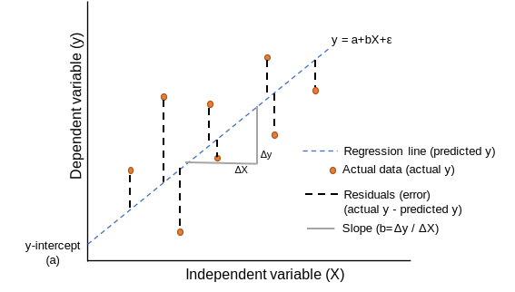

::: watermark

:::

# Regresión Lineal

En esta sección aprenderemos sobre _**regresión lineal simple y múltiple**_, como se ajusta un modelo de regresión en *R*, las métricas de desempeño para problemas de regresión y como podemos comparar modelos con estas métricas. Existen dos tipos de modelos de regresión lineal: 

* **Regresión lineal simple:** En la regresión lineal simple se utiliza **una variable independiente o explicativa "X"** (numérica o categórica) para estimar una variable dependiente o de respuesta numérica _**"Y"**_ mediante el ajuste de una recta permita conocer la relación existente entre ambas variables. Dicha relación entre variables se expresa como:

$$Y = \beta_0 + \beta_1X_1 + \epsilon \approx b + mx$$
**Donde:**

> $\epsilon \sim Norm(0,\sigma^2)$ (error aleatorio)
>
> $\beta_0$ = Coeficiente de regresión 0 (Ordenada al origen o intercepto)
>
> $\beta_1$ = Coeficiente de regresión 1 (Pendiente o regresor de variable $X_1$)
>
> $X_1$ = Variable explicativa observada
>
> $Y$ = Respuesta numérica

Debido a que los valores reales de $\beta_0$ y $\beta_1$ son desconocidos, procedemos a estimarlos estadísticamente:

$$\hat{Y} = \hat{\beta}_0 + \hat{\beta}_1X_1$$
Con $\hat{\beta}_0$ el estimado de la ordenada al origen y $\hat{\beta}_1$ el estimado de la pendiente.

```{r, echo=FALSE, warning=FALSE, message=F}
library(plotly)

airq <- airquality %>% 
  filter(!is.na(Ozone))

fit <- lm(Ozone ~ Wind, data = airq)

airq %>% 
  plot_ly(x = ~Wind) %>% 
  add_markers(y = ~Ozone) %>% 
  add_lines(x = ~Wind, y = fitted(fit))
```

* **Regresión lineal múltiple:** Cuando se utiliza **más de una** variable independiente, el proceso se denomina regresión lineal múltiple. En este escenario no es una recta sino un hiper-plano lo que se ajusta a partir de las covariables explicativas $\{X_1, X_2, X_3, ...,X_n\}$

El objetivo de un modelo de regresión múltiple es tratar de explicar la relación que existe entre una
variable dependiente (variable respuesta) $"Y"$ un conjunto de variables independientes (variables
explicativas) $\{X1,..., Xm\}$, el modelo es de la forma:

$$Y = \beta_0 + \beta_1X_1 + \cdot \cdot \cdot + \beta_mX_m + \epsilon$$

* **Donde:**

- $Y$ como variable respuesta.

- $X_1,X_2,...,X_m$ como las variables explicativas, independientes o regresoras.

- $\beta_1, \beta_2,...,\beta_m$ Se conocen como coeficientes parciales de regresión. Cada una de ellas puede interpretarse como el efecto promedio que tiene el incremento de una unidad de la variable predictora $X_i$ sobre la variable dependiente $Y$, manteniéndose constantes el resto de variables.

```{r, warning=FALSE,message=FALSE, echo=FALSE}
library(reshape2)


my_df <- iris
petal_lm <- lm(Petal.Length ~ 0 + Sepal.Length + Sepal.Width,data = my_df)
graph_reso <- 0.05

#Setup Axis
axis_x <- seq(min(my_df$Sepal.Length), max(my_df$Sepal.Length), by = graph_reso)
axis_y <- seq(min(my_df$Sepal.Width), max(my_df$Sepal.Width), by = graph_reso)

#Sample points
petal_lm_surface <- expand.grid(Sepal.Length = axis_x,Sepal.Width = axis_y,KEEP.OUT.ATTRS = F)
petal_lm_surface$Petal.Length <- predict.lm(petal_lm, newdata = petal_lm_surface)
petal_lm_surface <- acast(petal_lm_surface, Sepal.Width ~ Sepal.Length, value.var = "Petal.Length") #y ~ x

hcolors=c("red","blue","green")[my_df$Species]
iris_plot <- plot_ly(my_df, 
                     x = ~Sepal.Length, 
                     y = ~Sepal.Width, 
                     z = ~Petal.Length,
                     text = ~Species, # EDIT: ~ added
                     type = "scatter3d", 
                     mode = "markers",
                     size = 1,
                     marker = list(color = hcolors))
iris_plot <- add_trace(p = iris_plot,
                       z = petal_lm_surface,
                       x = axis_x,
                       y = axis_y,
                       type = "surface")

iris_plot
```


## Ajuste de modelo

### Estimación de parámetros: Regresión lineal simple

En la gran mayoría de casos, los valores $\beta_0$ y $\beta_1$ poblacionales son desconocidos, por lo que, a partir de una muestra, se obtienen sus estimaciones $\hat{\beta_0}$ y $\hat{\beta_1}$. Estas estimaciones se conocen como coeficientes de regresión o *least square coefficient estimates*, ya que toman aquellos valores que minimizan la suma de cuadrados residuales, dando lugar a la recta que pasa más cerca de todos los puntos.

```{r, fig.align='center', out.height='250pt', out.width='500pt', echo=F, include=TRUE}

```

En términos analíticos, la expresión matemática a optimizar y solución están dadas por:

$$min(\epsilon) \Rightarrow min(y-\hat{y}) = min\{y -(\hat{\beta}_0 + \hat{\beta}_1x)\}$$

\begin{aligned}

\hat{\beta}_0 &= \overline{y} - \hat{\beta}_1\overline{x} \\

\hat{\beta}_1 &= \frac{\sum^n_{i=1}(x_i - \overline{x})(y_i - \overline{y})}{\sum^n_{i=1}(x_i - \overline{x})^2} =\frac{S_{xy}}{S^2_x}

\end{aligned}


**Donde:**

> - $S_{xy}$ es la covarianza entre $x$ y $y$. 
>
> - $S_{x}^{2}$ es la varianza de $x$. 
>
> - $\hat{\beta}_0$ es el valor esperado la variable $Y$ cuando $X = 0$, es decir, la intersección de la recta con el eje y.


### Estimación de parámetros: Regresión lineal múltiple

En el caso de múltiples parámetros, la notación se vuelve más sencilla al expresar el modelo mediante una combinación lineal dada por la multiplicación de matrices (álgebra lineal).

$$Y = X\beta + \epsilon$$

**Donde:** 

$$Y = \begin{pmatrix}y_1\\y_2\\.\\.\\.\\y_n\end{pmatrix} \quad \beta = \begin{pmatrix}\beta_0\\\beta_1\\.\\.\\.\\\beta_m\end{pmatrix} \quad \epsilon = \begin{pmatrix}\epsilon_1\\\epsilon_2\\.\\.\\.\\\epsilon_n\end{pmatrix} \quad \quad X = \begin{pmatrix}1 & x_{11} & x_{12} & ... & x_{1m}\\1 & x_{21} & x_{22} & ... & x_{2m}\\\vdots & \vdots & \vdots & \ddots & \vdots\\ 1 & x_{n1} & x_{n2} & ... & x_{nm}\end{pmatrix}\\$$

El estimador por mínimos cuadrados está dado por:

$$\hat{\beta} = (X^TX)^{-1}X^TY$$

---

**IMPORTANTE:** Es necesario entender que para cada uno de los coeficientes de regresión se realiza una prueba de hipótesis. Una vez calculado el valor estimado, se procede a determinar si este valor es significativamente distinto de cero, por lo que la hipótesis de cada coeficiente se plantea de la siguiente manera:

$$H_0:\beta_i=0 \quad Vs \quad H_1:\beta_i\neq0$$
El software *R* nos devuelve el p-value asociado a cada coeficiente de regresión. Recordemos que valores pequeños de *p* sugieren que al rechazar $H_0$, la probabilidad de equivocarnos es baja, por lo que procedemos a rechazar la hipótesis nula.

## Residuos del modelo

El residuo de una estimación se define como la diferencia entre el valor observado y el valor esperado acorde al modelo. 

$$\epsilon_i= y_i -\hat{y}_i$$

A la hora de contemplar el conjunto de residuos hay dos posibilidades:

- La suma del valor absoluto de cada residuo.

$$RAS=\sum_{i=1}^{n}{|e_i|}=\sum_{i=1}^{n}{|y_i-\hat{y}_i|}$$

- La suma del cuadrado de cada residuo (RSS). Esta es la aproximación más empleada (mínimos cuadrados) ya que magnifica las desviaciones más extremas.

$$RSS=\sum_{i=1}^{n}{e_i^2}=\sum_{i=1}^{n}{(y_i-\hat{y}_i)^2}$$

Los residuos son muy importantes puesto que en ellos se basan las diferentes métricas de desempeño del modelo.

```{r, echo=FALSE}
library(ggplot2)
library(ggimage)

set.seed(123)
iris2 <- iris[sample(1:nrow(iris), 30),]
model <- lm(Petal.Length ~ Sepal.Length, data=iris2)
iris2$fitted <- predict(model)

ggplot(iris2, aes(x = Sepal.Length, y = Petal.Length)) +
  geom_linerange(aes(ymin = fitted, ymax = Petal.Length),
                 colour = "purple") +
  geom_abline(intercept = model$coefficients[1],
              slope = model$coefficients[2]) +
    geom_emoji(aes(image = ifelse(abs(Petal.Length-fitted) > 0.5, '1f622', '1f600')))
```


### Condiciones para el ajuste de una regresión lineal: {-}


Existen ciertas condiciones o supuestos que deben ser validados para el correcto ajuste de un modelo de regresión lineal, los cuales se enlistan a continuación: 

- **Linealidad**: La relación entre ambas variables debe ser lineal.

- **Distribución normal de los residuos**: Los residuos se tiene que distribuir de forma normal, con media igual a 0.

- **Varianza de residuos constante (homocedasticidad)**: La varianza de los residuos tiene que ser aproximadamente constante.

- **Independencia**: Las observaciones deben ser independientes unas de otras.

Dado que las condiciones se verifican a partir de los residuos, primero se suele generar el modelo y después se valida. 


## Métricas de desempeño

Dado que nuestra variable a predecir es numérica, podemos medir qué tan cerca o lejos estuvimos del número esperado dada una predicción.

Las métricas de desempeño asociadas a los problemas de regresión ocupan esa distancia cómo cuantificación del desempeño o de los errores cometidos por el modelo.

Las métricas más utilizadas son:

* MEA: Mean Absolute Error
* MAPE: Mean Absolute Percentual Error $\quad \Rightarrow \quad$ más usada para reportar resultados
* RMSE: Root Mean Squared Error $\quad \quad \quad \Rightarrow \quad$ más usada para entrenar modelos
* $R^2$ : R cuadrada
* $R^2$ : $R^2$ ajustada

---

**MAE**: *Mean Absolute Error*

$$MAE = \frac{1}{N}\sum_{i=1}^{N}{|y_{i}-\hat{y}_{i}|}$$
**Donde:**

- $N:$ Número de observaciones predichas.
- $y_{i}:$ Valor real.
- $\hat{y}_{i}:$ Valor de la predicción.

<br>


Esta métrica suma los errores absolutos de cada predicción y los divide entre el número de observaciones, para obtener el promedio absoluto del error del modelo.

**Ventajas Vs Desventajas:**

**Todos los errores pesan lo mismo sin importar qué tan pequeños o qué tan grandes sean**, es muy sensible a valores atípicos, y dado que obtiene el promedio puede ser que un solo error en la predicción que sea muy grande afecte al valor de todo el modelo, aún y cuando el modelo no tuvo errores tan malos para el resto de las observaciones.

Se recomienda utilizar esta métrica cuando los errores importan lo mismo, es decir, importa lo mismo si se equivocó muy poco o se equivocó mucho.

---

**MAPE**: *Mean Absolute Percentage Error*

$$MAPE = \frac{1}{N}\sum_{i=1}^{N}\frac{{|y_{i}-\hat{y}_{i}|}}{|y_{i}|}$$
**Donde:**

$N:$ Número de observaciones predichas.

$y_{i}:$ Valor real.

$\hat{y}_{i}:$ Valor de la predicción.

<br>


Esta métrica es la métrica MAE expresada en porcentaje, por lo que mide el error del modelo en términos de porcentaje, al igual que con MAE, no hay errores negativos por el valor absoluto, y mientras más pequeño el error es mejor.

**Ventajas Vs Desventajas:**

Cuando existe un valor real de 0 esta métrica no se puede calcular, por otro lado, una de las ventajas sobre MAE es que no es sensible a valores atípicos.

Se recomienda utilizar esta métrica cuando en tu problema no haya valores a predecir que puedan ser 0, por ejemplo, en ventas puedes llegar a tener 0 ventas, en este caso no podemos ocupar esta métrica.

En general a las personas de negocio les gusta esta métrica pues es fácil de comprender.

---

**RMSE**: *Root Mean Squared Error*

$$RMSE = \sqrt{\frac{1}{N}\sum_{i=1}^{N}{(y_{i}-\hat{y}_{i})^2}}$$
**Donde:**

- $N:$ Número de observaciones predichas.
- $y_{i}:$ Valor real.
- $\hat{y}_{i}:$ Valor de la predicción.

<br>

Esta métrica es muy parecida a MAE, solo que en lugar de sacar el valor absoluto de la diferencia entre el valor real y el valor predicho, para evitar valores negativos eleva esta diferencia al cuadrado, y saca el promedio de esa diferencia, al final, para dejar el valor en la escala inicial saca la raíz cuadrada.

Esta es la métrica más utilizada en problemas de regresión, debido a que es más fácil de optimizar que el MAE.

**Ventajas Vs Desventaja:**

Todos los errores pesan lo mismo sin importar qué tan pequeños o qué tan grandes sean, es más sensible a valores atípicos que MAE pues eleva al cuadrado diferencias, y dado que obtiene el promedio puede ser que un solo error en la predicción que sea muy grande afecte al valor de todo el modelo, aún y cuando el modelo no tuvo errores tan malos para el resto de las observaciones.

Se recomienda utilizar esta métrica cuando en el problema que queremos resolver es muy costoso tener equivocaciones grandes, podemos tener varios errores pequeños, pero no grandes.

---

**$R^2$**: *R cuadrada*

$$R^{2} = \frac{\sum_{i=1}^{N}{(\hat{y}_{i}-\bar{y}_{i})^2}}{\sum_{i=1}^{N}{(y_{i}-\bar{y}_{i})^2}}$$
**Donde:**

- $N:$ Número de observaciones predichas.
- $y_{i}:$ Valor real.
- $\hat{y}_{i}:$ Valor de la predicción.
- $\bar{y}_{i}:$ Valor promedio de la variable *y*.

<br>

El coeficiente de determinación  es la proporción de la varianza total de la variable explicada por la regresión. El coeficiente de determinación, también llamado R cuadrado, **refleja la bondad del ajuste** de un modelo a la variable que pretender explicar.

Es importante saber que el resultado del coeficiente de determinación oscila entre 0 y 1. Cuanto más cerca de 1 se sitúe su valor, mayor será el ajuste del modelo a la variable que estamos intentando explicar. De forma inversa, cuanto más cerca de cero, menos ajustado estará el modelo y, por tanto, menos fiable será.

**Ventajas Vs Desventaja:**

El problema del coeficiente de determinación, y razón por el cual surge el coeficiente de determinación ajustado, radica en que no penaliza la inclusión de variables explicativas no significativas, es decir, el valor de $R^2$ siempre será más grande cuantas más variables sean incluidas en el modelo, aún cuando estas no sean significativas en la predicción.

---

**$\bar{R}^2$**: *$R^2$ ajustada*

$$\bar{R}^2=1-\frac{N-1}{N-k-1}[1-R^2]$$
**Donde:**

- $\bar{R}²:$ Es el valor de R² ajustado
- $R²:$ Es el valor de R² original
- $N:$ Es el total de observaciones en el ajuste
- $k:$ Es el número de variables usadas en el modelo

<br>

El coeficiente de determinación ajustado (R cuadrado ajustado) es la medida que define el porcentaje explicado por la varianza de la regresión en relación con la varianza de la variable explicada. Es decir, lo mismo que el R cuadrado, pero con una diferencia: El coeficiente de determinación ajustado penaliza la inclusión de variables.

En la fórmula, N es el tamaño de la muestra y k el número de variables explicativas.


## Implementación en R

Usaremos las recetas antes implementadas para ajustar tanto el modelo de regresión como el de clasificación. Ajustaremos un modelo de regresión usando la receta antes vista.

```{r, warning=FALSE,message=FALSE}
library(tidymodels)

data(ames)

set.seed(4595)
ames_split <- initial_split(ames, prop = 0.75)
ames_train <- training(ames_split)
ames_test  <- testing(ames_split)

```

```{r, warning=FALSE,message=FALSE}
receta_casas <- recipe(
 Sale_Price ~ Gr_Liv_Area + TotRms_AbvGrd + Exter_Cond + Bsmt_Cond +
  Year_Sold + Year_Remod_Add, 
 data = ames_train) %>%
  step_mutate(
    Age_House = Year_Sold - Year_Remod_Add,
    Exter_Cond = forcats::fct_collapse(Exter_Cond, Good = c("Typical", "Good", "Excellent"))) %>% 
  step_relevel(Exter_Cond, ref_level = "Good") %>% 
  step_normalize(all_numeric_predictors()) %>%
  step_dummy(all_nominal_predictors()) %>% 
  step_interact(~ matches("Bsmt_Cond"):TotRms_AbvGrd) %>% 
  prep()

receta_casas

casa_juiced <- juice(receta_casas)
casa_test_bake <- bake(receta_casas, new_data = ames_test)
```

```{r, warning=FALSE,message=FALSE}
modelo1 <-  linear_reg() %>%
  set_mode("regression") %>%
  set_engine("lm")
```


```{r, warning=FALSE,message=FALSE}
lm_fit1 <- fit(modelo1, Sale_Price ~ ., casa_juiced)

p_test <- predict(lm_fit1, casa_test_bake) %>%
  bind_cols(ames_test) %>%
  select(.pred, Sale_Price) %>% 
  mutate(error = Sale_Price - .pred) %>% 
  filter(.pred > 0)

p_test
```

### Coeficientes del modelo

Podemos recuperar los coeficientes de nuestro modelo con la función *tidy()* y observar cuales variables explicativas son las más significativas de acuerdo con el _p-value_. 

```{r}
lm_fit1 %>% tidy() %>% arrange(p.value)

lm_fit1 %>% tidy() %>% arrange(desc(p.value))
```


### Métricas de desempeño

Ahora para calcular las métricas de desempeño usaremos la paquetería *MLmetrics* y las funciones de *dplyr* para resumir y estructurar los resultados.

```{r, warning=FALSE, message=FALSE}
library(MLmetrics)

p_test %>% 
  summarise(
    MAE = MLmetrics::MAE(.pred, Sale_Price),
    MAPE = MLmetrics::MAPE(.pred, Sale_Price),
    RMSE = MLmetrics::RMSE(.pred, Sale_Price),
    R2 = MLmetrics::R2_Score(.pred, Sale_Price)
  ) 
```


### Gráfica de ajuste

```{r, warning=FALSE, message=FALSE}
library(patchwork)

pred_obs_plot <- p_test %>% 
  ggplot(aes(x = .pred, y = Sale_Price)) +
  geom_point(alpha = 0.2) + geom_abline(color = "red") +
  xlab("Predicciones") + ylab("Observaciones") +
  ggtitle("Predicción vs Observación")

error_line <- p_test %>% 
  ggplot(aes(x = Sale_Price, y = error)) +
  geom_line() + geom_hline(yintercept = 0, color = "red") +
  xlab("Observaciones") + ylab("Errores") +
  ggtitle("Varianza de errores")

pred_obs_plot + error_line
```


```{r, warning=FALSE, message=FALSE}
error_dist <- p_test %>% 
  ggplot(aes(x = error)) +
  geom_histogram(color = "white", fill = "black") +
  geom_vline(xintercept = 0, color = "red") +
  ylab("Conteos de clase") + xlab("Errores") +
  ggtitle("Distribución de error")

error_qqplot <- p_test %>% 
  ggplot(aes(sample = error)) +
  geom_qq(alpha = 0.3) + stat_qq_line(color = "red") +
  xlab("Distribución normal") + ylab("Distribución de errores") +
  ggtitle("QQ-Plot")

error_dist + error_qqplot
```


## Métodos se selección de variables

Una de las preguntas clave a responder es: ¿Cómo selecciono las variables a usar en un modelo?. Existen muchas técnicas para ello. Incluso, existen modelos que se encargan de realizar esta tarea de modo automático. Analizaremos diferentes técnicas a lo largo del curso.

### Forward selection (selección hacia adelante)

Comienza sin predictores en el modelo, agrega iterativamente los predictores más contribuyentes y se detiene cuando la mejora del modelo ya no es estadísticamente significativa.

```{r, fig.align='center', out.height='400pt', out.width='350pt', echo=F, include=TRUE}

```


### Backward selection (selección hacia atrás)

Comienza con todos los predictores en el modelo (modelo completo), y elimina iterativamente los 
predictores menos contribuyentes y se detiene cuando tiene un modelo en el que 
todos los predictores son estadísticamente significativos.

```{r, fig.align='center', out.height='400pt', out.width='350pt', echo=F, include=TRUE}
knitr::include_graphics("img/06-ml-lineal/5-2-7-2-backward-selection.png")
```


