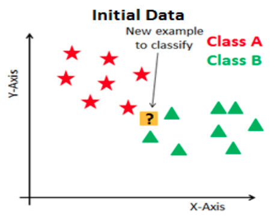
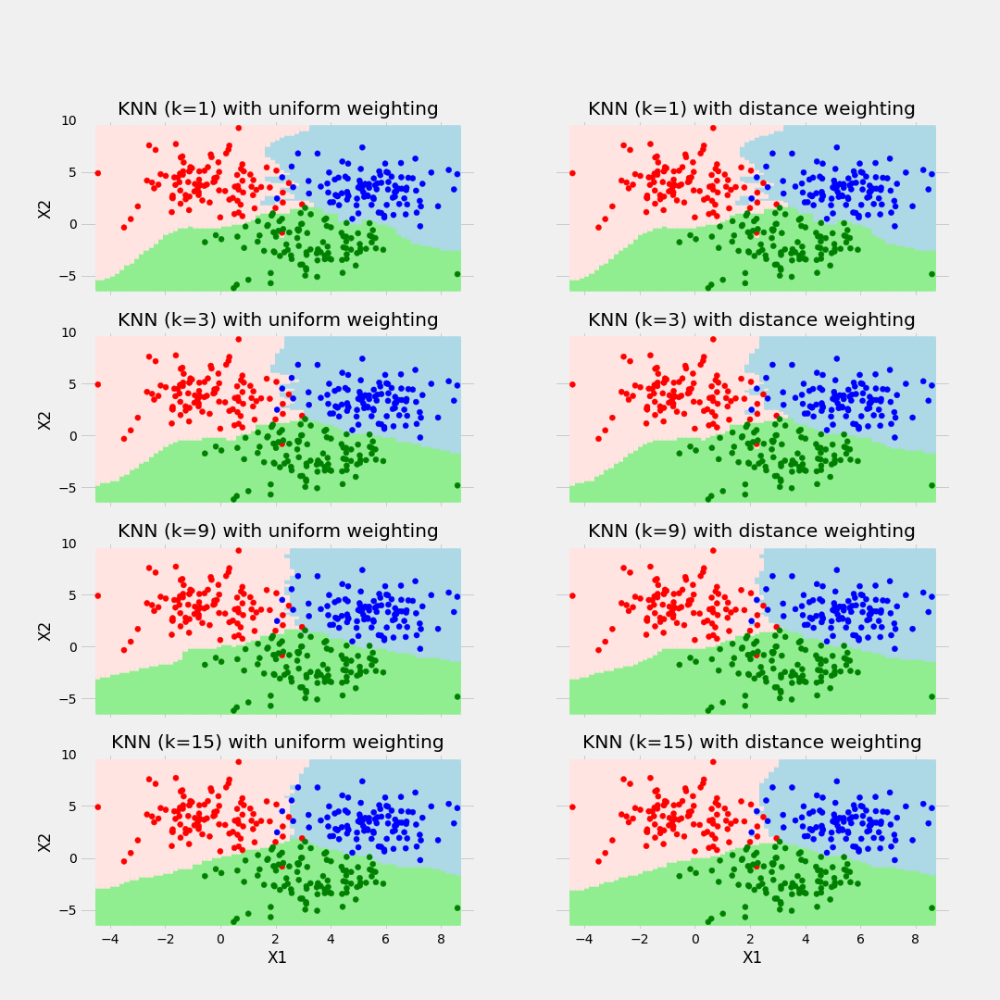
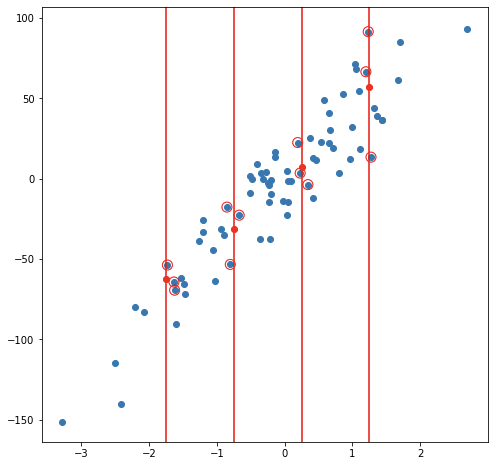

::: watermark

:::


# K-Nearest-Neighbor

KNN es un algoritmo de aprendizaje supervisado que podemos usar tanto para regresión como clasificación. Es un algoritmo fácil de interpretar y que permite ser flexible en el balance entre sesgo y varianza (dependiendo de los hiper-parámetros seleccionados).

El algoritmo de K vecinos más cercanos realiza comparaciones entre un nuevo elemento y las observaciones anteriores que ya cuentan con etiqueta. La esencia de este algoritmo está en **etiquetar a un nuevo elemento de manera similar a como están etiquetados aquellos _K_ elementos que más se le parecen**. Veremos este proceso para cada uno de los posibles casos:


## Clasificación

La idea detrás del algoritmo es sencilla, etiqueta una nueva observación en la categoría que tenga mas elementos de las *k* observaciones más cercanas, es decir:

1. Seleccionamos el hiper-parámetro *K* como el número elegido de vecinos.

2. Se calculará la similitud (distancia) de esta nueva observación a cada observación existente.

3. Ordenaremos estas distancias de menor a mayor.

4. Tomamos las *K* primeras entradas de la lista ordenada.

5. La nueva observación será asignada al grupo que tenga mayor número de observaciones en estas *k* primeras distancias (asignación por moda)


A continuación se ejemplifica este proceso:

```{r, fig.align='center', out.height='400pt', out.width='500pt', echo=F}
knitr::include_graphics("img/08-ml-knn/3-10-1-knn-clasificacion.png")
```

```{r, out.height='300pt', out.width='250pt', echo=F}

knitr::include_graphics("img/08-ml-knn/20_2_classification_knn.png")

```

**Ejemplo:**

```{r, fig.align='center', out.height='500pt', out.width='700pt', echo=F}

```

> Otro método que permite tener mayor control sobre las clasificaciones es asignar la probabilidad de pertenencia a cada clase de acuerdo con la proporción existente de cada una de las mismas. A partir de dichas probabilidades, el usuario puede determinar el punto de corte que sea más conveniente para el problema a resolver.

## Regresión

En el caso de regresión, la etiqueta de una nueva observación se realiza a través del promedio del valor en las *k* observaciones más cercanas, es decir:

1. Seleccionamos el hiper-parámetro *K* como el número elegido de vecinos.

2. Se calculará la similitud (distancia) de esta nueva observación a cada observación existente

3. Ordenaremos estas distancias de menor a mayor

4. Tomamos las *K* primeras entradas de la lista ordenada.

5. La nueva observación será etiquetada mediante el promedio del valor de las observaciones en estas *k* primeras distancias.

Considerando un modelo de 3 vecinos más cercanos, las siguientes imágenes muestran el proceso de ajuste y predicción de nuevas observaciones.

```{r, out.height='280pt', out.width='250pt', echo=F}
knitr::include_graphics("img/08-ml-knn/3-10-1-regression1.png")

knitr::include_graphics("img/08-ml-knn/3-10-1-regression3.png")
```

**Ejemplo de balance de sesgo y varianza**

```{r, fig.align='center', out.height='500pt', out.width='700pt', echo=F}
knitr::include_graphics("img/08-ml-knn/3-10-1-knn-regresion2.png")
```

## Ajuste del modelo

En contraste con otros algoritmos de aprendizaje supervisado, K-NN no genera un modelo del aprendizaje con datos de entrenamiento, sino que el aprendizaje sucede en el mismo momento en el que se prueban los datos de prueba. A este tipo de algoritmos se les llama *lazy learning methods* porque no aprende del conjunto de entrenamiento inmediatamente, sino que almacena el conjunto de datos y, en el momento de la clasificación, realiza una acción en el conjunto de datos.

El algoritmo *KNN* en la fase de entrenamiento simplemente almacena el conjunto de datos y cuando obtiene nuevos datos, clasifica esos datos en una categoría que es muy similar a los nuevos datos.

### Selección de Hiper-parámetro K

Al configurar un modelo KNN, sólo hay algunos parámetros que deben elegirse/ajustarse para mejorar el rendimiento, uno de estos parámetros es el valor de la K.

No existe una forma particular de determinar el mejor valor para "K", por lo que debemos probar algunos valores para encontrar "el mejor" de ellos. 

Para los modelos de clasificación, especialmente si solo hay dos clases, generalmente se elige un número impar para k. Esto es para que el algoritmo nunca llegue a un "empate"

Una opción para seleccionar la K adecuada es ejecutar el algoritmo KNN varias veces con diferentes valores de K y elegimos la K que reduce la cantidad de errores mientras se mantiene la capacidad del algoritmo para hacer predicciones con precisión.

Observemos lo siguiente:

```{r, fig.align='center', out.height='300pt', out.width='500pt', echo=F}
knitr::include_graphics("img/08-ml-knn/3-10-1-kerror2.png")
```

Estas gráficas se conoce como "gráfica de codo" y generalmente se usan para determinar el valor K.

- A medida que disminuimos el valor de K a 1, nuestras predicciones se vuelven menos estables. Imaginemos que tomamos K = 1 y tenemos un punto de consulta rodeado por varios rojos y uno verde, pero el verde es el vecino más cercano. Razonablemente, pensaríamos que el punto de consulta es probablemente rojo, pero como K = 1, KNN predice incorrectamente que el punto de consulta es verde.

- Inversamente, a medida que aumentamos el valor de K, nuestras predicciones se vuelven más estables debido a que tenemos más observaciones con quienes comparar, por lo tanto, es más probable que hagan predicciones más precisas. Eventualmente, comenzamos a presenciar un número creciente de errores, es en este punto que sabemos que hemos llevado el valor de K demasiado lejos.


### Métodos de cálculo de la distancia entre observaciones

Otro parámetro que podemos ajustar para el modelo es la distancia usada, existen diferentes formas de medir qué tan "cerca" están dos puntos entre sí, y las diferencias entre estos métodos pueden volverse significativas en dimensiones superiores. 

- La más utilizada es la distancia euclidiana, el tipo estándar de distancia.

$$d(X,Y) = \sqrt{\sum_{i=1}^{n} (x_i-y_i)^2}$$

- Otra métrica es la llamada distancia de Manhattan, que mide la distancia tomada en cada dirección cardinal, en lugar de a lo largo de la diagonal.

$$d(X,Y) = \sum_{i=1}^{n} |x_i - y_i|$$

- De manera más general, las anteriores son casos particulares de la distancia de Minkowski, cuya fórmula es:

$$d(X,Y) = (\sum_{i=1}^{n} |x_i-y_i|^p)^{\frac{1}{p}}$$

- La distancia de coseno es ampliamente en análisis de texto, sistemas de recomendación

$$d(X,Y)= 1 - \frac{\sum_{i=1}^{n}{X_iY_i}}{\sqrt{\sum_{i=1}^{n}{X_i^2}}\sqrt{\sum_{i=1}^{n}{Y_i^2}}}$$

```{r, fig.align='center', out.height='700pt', out.width='700pt', echo=F}
knitr::include_graphics("img/08-ml-knn/similitudes.png")
```


* [Un link interesante](https://towardsdatascience.com/17-types-of-similarity-and-dissimilarity-measures-used-in-data-science-3eb914d2681)

* [Otro link interesante](https://www.maartengrootendorst.com/blog/distances/)


## Implementación en R 

Usaremos las recetas antes implementadas para ajustar tanto el modelo de regresión como el de clasificación. Exploraremos un conjunto de hiperparámetros para elegir el mejor modelo.

Para determinar cuáles son los hiper-parámetros que funcionan mejor, es necesario realizar experimentos mediante **ensayo-error** hasta determinar la mejor solución. En cada partición del método de muestreo *KFCV* se implementan las distintas configuraciones y se calculan predicciones. Con las predicciones hechas en cada *fold*, se obtienen intervalos de confianza para conocer la variación asociada al modelo a través de los hiper-parámetros implementados.

Usaremos las recetas antes implementadas para ajustar tanto el modelo de regresión como el de clasificación. Exploraremos un conjunto de hiperparámetros para elegir el mejor modelo, sin embargo, para realizar este proceso de forma ágil, se inicializará un flujo de trabajo que se encargue de realizar todos los experimentos deseados y elegir el modelo adecuado. Los pasos a seguir, son los siguientes:

1. Separación inicial de datos (*test, train, KFCV*).
2. Pre-procesamiento e ingeniería de variables.
3. Selección de tipo de modelo con hiperparámetros iniciales.
4. Inicialización de *workflow o pipeline.*
5. Creación de *grid search*.
6. Entrenamiento de modelos con hiperparámetros definidos (salvar los modelos entrenados).
7. Análisis de métricas de error e hiperparámetros (Vuelve al paso 3, si es necesario).
8. Selección de modelo a usar.
9. Ajuste de modelo final con todos los datos (Vuelve al paso 2, si es necesario).
10. Validar poder predictivo con datos de prueba.


### Regresión


**Paso 1: Separación inicial de datos ( test, train <KFCV> )**
```{r}
library(tidymodels)

data(ames)

set.seed(4595)
ames_split <- initial_split(ames, prop = 0.75)
ames_train <- training(ames_split)
ames_test  <- testing(ames_split)
ames_folds <- vfold_cv(ames_train)
```

Contando con datos de entrenamiento, procedemos a realizar el feature engineering para extraer las mejores características que permitirán realizar las estimaciones en el modelo.

**Paso 2: Pre-procesamiento e ingeniería de variables**

```{r, warning=FALSE,message=FALSE}

receta_casas <- recipe(
 Sale_Price ~ Gr_Liv_Area + TotRms_AbvGrd + Exter_Cond + Bsmt_Cond +
  Year_Sold + Year_Remod_Add, 
 data = ames_train) %>%
  step_mutate(
    Age_House = Year_Sold - Year_Remod_Add,
    Exter_Cond = forcats::fct_collapse(Exter_Cond, Good = c("Typical", "Good", "Excellent"))) %>% 
  step_relevel(Exter_Cond, ref_level = "Good") %>% 
  step_normalize(all_numeric_predictors()) %>%
  step_dummy(all_nominal_predictors()) %>% 
  step_interact(~ matches("Bsmt_Cond"):TotRms_AbvGrd) %>% 
  prep()

receta_casas
```

Recordemos que la función **recipe()** solo son los pasos a seguir, necesitamos usar la función **prep()** que nos devuelve una receta actualizada con las estimaciones y la función **juice()** que nos devuelve la matriz de diseño.

Una vez que la receta de transformación de datos está lista, procedemos a implementar el pipeline del modelo de interés.

**Paso 3: Selección de tipo de modelo con hiperparámetros iniciales**

```{r, warning=FALSE,message=FALSE, eval=TRUE}
# install.packages("kknn")

knn_model <- nearest_neighbor(
  mode = "regression",
  neighbors = tune("K"),
  weight_func = tune()) %>% 
  set_engine("kknn")
```

**Paso 4: Inicialización de workflow o pipeline**

```{r, warning=FALSE,message=FALSE, eval=TRUE}
knn_workflow <- workflow() %>% 
  add_recipe(receta_casas) %>% 
  add_model(knn_model)
```

**Paso 5: Creación de grid search**

```{r, warning=FALSE,message=FALSE, eval=TRUE}
knn_parameters_set <- extract_parameter_set_dials(knn_workflow) %>% 
 update(
  K = dials::neighbors(c(10,80)),
  weight_func = weight_func(values = c("rectangular", "triangular", "inv", "gaussian", "cos"))
  )

set.seed(123)
knn_grid <- knn_parameters_set %>% 
  grid_max_entropy(size = 50)

ctrl_grid <- control_grid(save_pred = T, verbose = T)
```

**Paso 6: Entrenamiento de modelos con hiperparámetros definidos**

```{r, warning=FALSE,message=FALSE, eval=FALSE}
library(doParallel)

UseCores <- detectCores() - 1
cluster <- makeCluster(UseCores)
registerDoParallel(cluster)

knnt1 <- Sys.time()
knn_tune_result <- tune_grid(
  knn_workflow,
  resamples = ames_folds,
  grid = knn_grid,
  metrics = metric_set(rmse, mae, mape, rsq),
  control = ctrl_grid
)
knnt2 <- Sys.time(); knnt2 - knnt1

stopCluster(cluster)

knn_tune_result %>% saveRDS("models/knn_model_reg.rds")
```

Podemos obtener las métricas de cada *fold* con el siguiente código:

```{r}
knn_tune_result <- readRDS("models/knn_model_reg.rds")
```

**Paso 7: Análisis de métricas de error e hiperparámetros (Vuelve al paso 3, si es necesario)**

```{r}
collect_metrics(knn_tune_result)
```

En la siguiente gráfica observamos las distintas métricas de error asociados a los hiperparámetros elegidos:

```{r}
knn_tune_result %>% autoplot()
```

En la siguiente gráfica observamos el error cuadrático medio de las distintas métricas con distintos números de vecinos.

En los argumentos de la función, se puede seleccionar el kernel, esto es las opciones posibles para ponderar el promedio respecto a la distancia seleccionada.  "Rectangular" (que es knn estándar no ponderado), "triangular", "cos", "inv", "gaussiano", "rango" y "óptimo".


Para conocer más a cerca de las distintas métricas de distancia pueden consultar: 
[Measures](https://towardsdatascience.com/9-distance-measures-in-data-science-918109d069fa) y [KNN function](https://rdrr.io/cran/kknn/man/kknn.html)


```{r}
knn_tune_result %>% 
  autoplot(metric = "rmse")
```

En la siguiente gráfica observamos el error absoluto promedio de las distintas métricas con distintos números de vecinos.


```{r}
knn_tune_result %>% 
  autoplot(metric = "mae")
```


**Paso 8: Selección de modelo a usar**

Con el siguiente código obtenemos los mejores 10 modelos respecto al *rmse*.

```{r}
show_best(knn_tune_result, n = 10, metric = "rmse")
```


```{r}
knn_tune_result %>% show_best(n = 10, metric = "mape")
```

Ahora obtendremos el modelo que mejor desempeño tiene tomando en cuenta el *rmse* y haremos las predicciones del conjunto de prueba con este modelo.

```{r}
best_knn_model_reg <- knn_tune_result %>% select_best(metric = "rmse")

best_knn_model_reg
```

```{r}
knn_regression_best_1se_model <- knn_tune_result %>% 
  select_by_one_std_err(metric = "mape", "mape")

knn_regression_best_1se_model
```

**Paso 9: Ajuste de modelo final con todos los datos (Vuelve al paso 2, si es necesario)**

```{r}
final_knn_model_reg <- knn_workflow %>% 
  finalize_workflow(best_knn_model_reg) %>% 
  parsnip::fit(data = ames_train)
```

Este último objeto es el modelo final entrenado, el cual contiene toda la información del pre-procesamiento de datos, por lo que en caso de ponerse en producción el modelo, sólo se necesita de este último elemento para poder realizar nuevas predicciones. 

Antes de pasar al siguiente paso, es importante validar que hayamos hecho un uso correcto de las variables predictivas. En este momento es posible detectar variables que no estén aportando valor o variables que no debiéramos estar usando debido a que cometeríamos [data leakage](https://towardsdatascience.com/data-leakage-in-machine-learning-6161c167e8ba). Para enfrentar esto, ayuda estimar y ordenar el valor de importancia de cada variable en el modelo.

```{r, eval=FALSE}
# install.packages("kernlab")

library(vip)

ames_importance <- final_knn_model_reg %>% 
  extract_fit_parsnip() %>% 
  vi(
    method = "permute",
    nsim = 30,
    target = "Sale_Price",
    metric = "rmse",
    pred_wrapper = kernlab::predict, 
    train = juice(receta_casas)
  )

ames_importance %>% saveRDS("models/vip_ames_knn.rds")
```

```{r}
ames_importance <- readRDS("models/vip_ames_knn.rds")

ames_importance

ames_importance %>%
  mutate(Variable = forcats::fct_reorder(Variable, Importance)) %>%
  slice_max(Importance, n = 20) %>%
  ggplot(aes(Importance, Variable, color = Variable)) +
  geom_errorbar(aes(xmin = Importance - StDev, xmax = Importance + StDev),
    alpha = 0.5, size = 1) +
  geom_point(size = 2) +
  theme(legend.position = "none") +
  ggtitle("Variable Importance Measure")
```

**Paso 10: Validar poder predictivo con datos de prueba**

Imaginemos por un momento que pasa un mes de tiempo desde que hicimos nuestro modelo, es hora de ponerlo a prueba prediciendo valores de nuevos elementos:

```{r}
results_reg <- predict(final_knn_model_reg, ames_test) %>% 
  dplyr::bind_cols(Sale_Price = ames_test$Sale_Price, .) %>% 
  dplyr::rename(pred_knn_reg = .pred)

results_reg
```

**Métricas de desempeño**

Ahora para calcular las métricas de desempeño usaremos la paquetería *MLmetrics*. Es posible definir nuestro propio conjunto de métricas que deseamos reportar creando el objeto *metric_set*:

```{r}
library(MLmetrics)

multi_metric <- metric_set(mae, mape, rmse, rsq, ccc)
multi_metric(results_reg, truth = Sale_Price, estimate = pred_knn_reg) %>% 
  mutate(.estimate = round(.estimate, 2)) %>% 
  select(-.estimator)
```

```{r}
results_reg %>% 
  ggplot(aes(x = pred_knn_reg, y = Sale_Price)) +
  geom_point() +
  geom_abline(color = "red") +
  xlab("Prediction") +
  ylab("Observation") +
  ggtitle("Comparisson")
```


### Clasificación

Es turno de revisar la implementación de SVM con nuestro bien conocido problema de predicción de cancelación de servicios de telecomunicaciones. 

Los pasos para implementar en *R* este modelo predictivo son los mismos, cambiando únicamente las especificaciones del tipo de modelo, pre-procesamiento e hiper-parámetros.

```{r, warning=FALSE, message=FALSE}
library(readr)
library(tidyverse)
library(tidymodels)

tidymodels_prefer()

telco <- read_csv("data/Churn.csv")
glimpse(telco)
```

**Paso 1: Separación inicial de datos ( test, train <KFCV> )**

```{r}
set.seed(1234)
telco_split <- initial_split(telco, prop = .70)

telco_train <- training(telco_split)
telco_test  <- testing(telco_split)
telco_folds <- vfold_cv(telco_train)

telco_folds
```

**Paso 2: Pre-procesamiento e ingeniería de variables**

```{r}
telco_rec <- recipe(
  Churn ~ customerID + TotalCharges + MonthlyCharges + SeniorCitizen + Contract, 
  data = telco_train) %>% 
  update_role(customerID, new_role = "id variable") %>% 
  step_mutate(Contract = as.factor(Contract)) %>% 
  step_impute_median(all_numeric_predictors()) %>% 
  step_normalize(all_numeric_predictors()) %>% 
  step_dummy(all_nominal_predictors()) %>% 
  prep()

telco_rec
```

**Paso 3: Selección de tipo de modelo con hiperparámetros iniciales**


```{r, warning=FALSE,message=FALSE, eval=TRUE}
knn_model <- nearest_neighbor(
  mode = "classification",
  neighbors = tune("K"),
  weight_func = tune()) %>% 
  set_engine("kknn")

knn_model
```

**Paso 4: Inicialización de workflow o pipeline**

```{r, warning=FALSE,message=FALSE, eval=TRUE}
knn_workflow <- workflow() %>% 
  add_recipe(telco_rec) %>% 
  add_model(knn_model)

knn_workflow
```

**Paso 5: Creación de grid search**

```{r, warning=FALSE,message=FALSE, eval=TRUE}
knn_parameters_set <- extract_parameter_set_dials(knn_workflow) %>% 
  update(K = dials::neighbors(c(10,80)),
         weight_func = weight_func(values = c("rectangular", "inv", "gaussian", "cos"))
         )

set.seed(123)
knn_grid <- knn_parameters_set %>% 
  grid_max_entropy(size = 50)

ctrl_grid <- control_grid(save_pred = T, verbose = T)
```

**Paso 6: Entrenamiento de modelos con hiperparámetros definidos**
```{r, warning=FALSE,message=FALSE, eval=FALSE}
library(doParallel)

UseCores <- detectCores() - 1
cluster <- makeCluster(UseCores)
registerDoParallel(cluster)

knnt1 <- Sys.time()
knn_tune_result <- tune_grid(
  knn_workflow,
  resamples = telco_folds,
  grid = knn_grid,
  metrics = metric_set(roc_auc, pr_auc),
  control = ctrl_grid
)
knnt2 <- Sys.time(); knnt2 - knnt1

stopCluster(cluster)

knn_tune_result %>% saveRDS("models/knn_model_cla.rds")
```

```{r}
knn_tune_result <- readRDS("models/knn_model_cla.rds")
```

**Paso 7: Análisis de métricas de error e hiperparámetros (Vuelve al paso 3, si es necesario)**

```{r}
collect_metrics(knn_tune_result)
```

En la siguiente gráfica observamos las distintas métricas de error asociados a los hiperparámetros elegidos.

```{r}
autoplot(knn_tune_result, metric = "pr_auc")
```

```{r}
autoplot(knn_tune_result, metric = "roc_auc")
```

```{r}
show_best(knn_tune_result, n = 10, metric = "pr_auc")
```

**Paso 8: Selección de modelo a usar**
```{r}
best_knn_model_cla <- select_best(knn_tune_result, metric = "pr_auc")
best_knn_model_cla

knn_classification_best_1se_model <- knn_tune_result %>% 
  select_by_one_std_err(metric = "roc_auc", "roc_auc")
knn_classification_best_1se_model
```

**Paso 9: Ajuste de modelo final con todos los datos (Vuelve al paso 2, si es necesario)**
```{r}
final_knn_model_cla <- knn_workflow %>% 
  finalize_workflow(best_knn_model_cla) %>% 
  parsnip::fit(data = telco_train)
```

Este último objeto es el modelo final entrenado, el cual contiene toda la información del pre-procesamiento de datos, por lo que en caso de ponerse en producción el modelo, sólo se necesita de este último elemento para poder realizar nuevas predicciones. 

Antes de pasar al siguiente paso, es importante validar que hayamos hecho un uso correcto de las variables predictivas. En este momento es posible detectar variables que no estén aportando valor o variables que no debiéramos estar usando debido a que cometeríamos [data leakage](https://towardsdatascience.com/data-leakage-in-machine-learning-6161c167e8ba). Para enfrentar esto, ayuda estimar y ordenar el valor de importancia del modelo.

```{r, eval=FALSE}
churn_importance <- final_knn_model_cla %>% 
  extract_fit_parsnip() %>% 
  vi(
    method = "permute",
    nsim = 30,
    target = "Churn",
    metric = "auc",
    reference_class = "Yes",
    pred_wrapper = kernlab::predict, 
    train = juice(telco_rec)
  )

churn_importance %>% saveRDS("models/vip_telco_knn.rds")
```

```{r}
churn_importance <- readRDS("models/vip_telco_knn.rds")

churn_importance

churn_importance %>%
  mutate(Variable = forcats::fct_reorder(Variable, Importance)) %>%
  ggplot(aes(Importance, Variable, color = Variable)) +
  geom_errorbar(aes(xmin = Importance - StDev, xmax = Importance + StDev),
    alpha = 0.5, size = 1) +
  geom_point(size = 2) +
  theme(legend.position = "none") +
  ggtitle("Variable Importance Measure")
```

**Paso 10: Validar poder predictivo con datos de prueba**

Imaginemos por un momento que pasa un mes de tiempo desde que hicimos nuestro modelo, es hora de ponerlo a prueba prediciendo valores de nuevos elementos:

```{r}
results_cla <- predict(final_knn_model_cla, telco_test, type = 'prob') %>% 
  dplyr::bind_cols(Churn = telco_test$Churn, .) %>% 
  mutate(Churn = factor(Churn, levels = c('Yes', 'No'), labels = c('Yes', 'No')))

results_cla

bind_rows(
  roc_auc(results_cla, truth = Churn, estimate = .pred_Yes),
  pr_auc(results_cla, truth = Churn, estimate = .pred_Yes)
)
```


```{r, eval=TRUE}
pr_curve_data <- pr_curve(
  results_cla, 
  truth = Churn, 
  estimate = .pred_Yes
  )
pr_curve_data

roc_curve_data <- roc_curve(
  results_cla, 
  truth = Churn, 
  estimate = .pred_Yes
  )
roc_curve_data
```

```{r, message=FALSE}
pr_curve_plot <- pr_curve_data %>% 
  ggplot(aes(x = recall, y = precision)) +
  geom_abline(slope = -1, intercept = 1) +
  geom_path(size = 1, colour = 'lightblue') +
  ylim(0, 1) +
  coord_equal() +
  ggtitle("Precision vs Recall")+
  theme_minimal()

pr_curve_plot

roc_curve_plot <- roc_curve_data %>% 
  ggplot(aes(x = 1 - specificity, y = sensitivity)) +
  geom_path(size = 1, colour = 'lightblue') +
  geom_abline() +
  coord_equal() +
  ggtitle("ROC Curve")+
  theme_minimal()

roc_curve_plot
```

Pueden usar la app de [shiny](https://acturio.shinyapps.io/confusion_matrix/?_ga=2.157345976.322506426.1653670259-130075619.1646374742) que nos permite jugar con el threshold de clasificación para tomar la mejor decisión.

