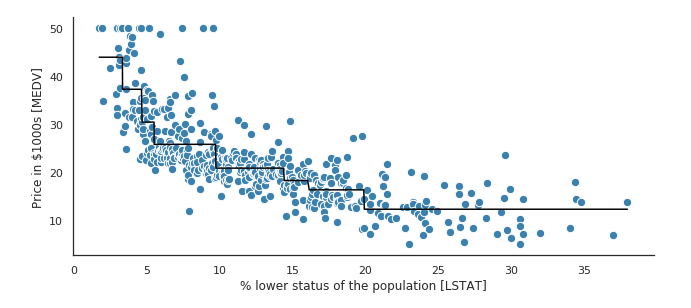
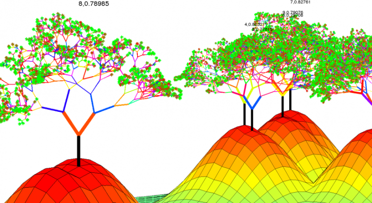

::: watermark

:::


# Árboles de decisión

```{r, fig.align='center', out.height='300pt', out.width='500pt', echo=F}
knitr::include_graphics("img/09-ml-tree/0-arboles.png")
```


Un árbol de decisiones es un algoritmo del aprendizaje supervisado que se puede utilizar tanto para problemas de **clasificación** como de **regresión**. Es un clasificador estructurado en árbol, donde los nodos internos representan las características de un conjunto de datos, las ramas representan las reglas de decisión y cada nodo hoja representa el resultado. La idea básica de los árboles es buscar puntos de cortes en las variables de entrada para hacer predicciones, ir dividiendo la muestra, y encontrar cortes sucesivos para refinar las predicciones.


En un árbol de decisión, hay dos tipos nodos, el nodo de decisión o nodos internos (*Decision Node*) y el nodo hoja o nodo terminal (Leaf node). Los nodos de decisión se utilizan para tomar cualquier decisión y tienen múltiples ramas, mientras que los nodos hoja son el resultado de esas decisiones y no contienen más ramas.

```{r, fig.align='center', out.height='300pt', out.width='500pt', echo=F}
knitr::include_graphics("img/09-ml-tree/1-arboles.png")
```

- **Regresión:** En el caso de la regresión de árboles de decisión, en los nodos finales se calcula el promedio de la variable de respuesta. El promedio será la estimación del modelo.

```{r, fig.align='center', out.height='300pt', out.width='500pt', echo=F}
knitr::include_graphics("img/09-ml-tree/2-arbol-reg-graph.png")
```

```{r, fig.align='center', out.height='300pt', out.width='500pt', echo=F}
knitr::include_graphics("img/09-ml-tree/3-arbol-reg-diagram.png")
```

```{r, fig.align='center', out.height='300pt', out.width='500pt', echo=F}
#knitr::include_graphics("img/09-ml-tree/ejemplocla.jpeg")
```

- **Clasificación:** Por otro lado, en los árboles de clasificación se calcula la proporción de elementos de cada categoría en los nodos finales. De esta manera se calcula la probabilidad de pertenencia a la categoría.

```{r, fig.align='center', out.height='300pt', out.width='500pt', echo=F}
knitr::include_graphics("img/09-ml-tree/4-arbol-cla-graph.png")
```

```{r, fig.align='center', out.height='300pt', out.width='500pt', echo=F}
knitr::include_graphics("img/09-ml-tree/5-arbol-cla-diagram.png")
```


```{r, fig.align='center', out.height='300pt', out.width='500pt', echo=F, eval=F}
#
```


## Ajuste del modelo

En un árbol de decisión, para predecir la clase del conjunto de datos, el algoritmo comienza desde el nodo raíz del árbol. Este algoritmo compara los valores de la variable raíz con la variable de registro y, según la comparación, sigue una rama y salta al siguiente nodo.

Para el siguiente nodo, el algoritmo vuelve a comparar el valor de la siguiente variable con los otros sub-nodos y avanza. Continúa el proceso hasta que se llega a un nodo hoja. El proceso completo se puede comprender mejor con los siguientes pasos: 

1) Comenzamos el árbol con el nodo raíz (llamado S), que contiene el conjunto de entrenamiento completo.

2) Encuentre la mejor variable en el conjunto de datos usando *Attribute Selective Measure* (ASM).

3) Divida la S en subconjuntos que contengan valores posibles para la mejor variable.

4) Genere el nodo del árbol de decisión, que contiene la mejor variable.

5) Cree de forma recursiva nuevos árboles de decisión utilizando los subconjuntos del conjunto de datos creado en el paso 3. Continúe este proceso hasta que se alcance una etapa en la que no pueda particionar más los nodos y este nodo final sera un nodo hoja.

6) Para clasificación nos quedaremos la moda de la variable respuesta del nodo hoja y para regresión usaremos la media de la variable respuesta.

### Attribute Selective Measure (ASM)

Al implementar un árbol de decisión, surge el problema principal de cómo seleccionar la mejor variable para el nodo raíz y para los sub-nodos. Para resolver este problemas existe una técnica que se llama medida de selección de atributos o *ASM*. Mediante esta medición, podemos seleccionar fácilmente la mejor variable para los nodos del árbol. Una de las técnicas más populares para *ASM* es:

- Índice de Gini

La medida del grado de probabilidad de que una variable en particular se clasifique incorrectamente cuando se elige al azar se llama índice de Gini o impureza de Gini. Los datos se distribuyen por igual según el índice de Gini.

$$Gini = \sum_{i=1}^{n}\hat{p_i}(1-\hat{p}_i)$$

Con $p_i$ como la probabilidad de que un objeto se clasifique en una clase particular.

Esta métrica puede analizarse como una métrica de impureza. Cuando todos o la mayoría de elementos dentro de un nodo pertenecen a una misma clase, el índice de Gini toma valores cercanos a cero.

Cuando se utiliza el índice de Gini como criterio seleccionar la variable para el nodo raíz, seleccionaremos la variable con el índice de Gini menor.


## Regularización de árboles

Para asegurarse de que no exista sobre-ajuste en el modelo, es importante considerar algunas regularizaciones a los hiper-parámetros implementados. Posteriormente, se determinará cuál de las posibles combinaciones produce mejores resultados.

### Nivel de profundidad de árbol

Podríamos preguntarnos cuándo dejar de crecer un árbol. Pueden existir problemas que tengan un gran conjunto de variables y esto da como resultado una gran cantidad de divisiones, lo que a su vez genera un árbol de decisión muy grande. Estos árboles son complejos y pueden provocar un sobre-ajuste. Entonces, necesitamos saber cuándo parar.

1) Una forma de hacer esto, es establecer un número mínimo de entradas de entrenamiento para dividir un nodo (min_n). 

2) Otra forma, es establecer la profundidad máxima del modelo. La profundidad máxima se refiere a la longitud del camino más largo desde el nodo raíz hasta un nodo hoja (max_depth).

### Poda de árbol

El rendimiento de un árbol se puede aumentar aún más mediante la poda del árbol. Esto se refiere a eliminar las ramas que hacen uso de variables de poca importancia. De esta manera, reducimos la complejidad del árbol y, por lo tanto, **aumentamos su poder predictivo al reducir el sobre-ajuste.**

```{r, fig.align='center', out.height='300pt', out.width='500pt', echo=F}
knitr::include_graphics("img/09-ml-tree/6-podar.jpg")
```

La poda puede comenzar en la raíz o en las hojas. El método más simple de poda comienza en las hojas y elimina cada nodo con la clase más popular en esa hoja, este cambio se mantiene si no deteriora la precisión.  Se pueden usar métodos de poda más sofisticados, como la poda de complejidad de costos, donde se usa un parámetro de aprendizaje (alfa) para observar si los nodos se pueden eliminar en función del tamaño del sub-árbol. 

<!-- ### Implementación en R -->

<!-- Usaremos las recetas antes implementadas para ajustar tanto el modelo de regresión como el de clasificación. Exploraremos un conjunto de hiperparámetros para elegir el mejor modelo. En esta ocasión usamos la función *grid_random()* donde el parámetro *size* indica el número total de combinaciones a implementar. En caso de que haya duplicados, un número menor de combinaciones a las establecidas será devuelto como resultado. -->

<!-- #### Regresión {-} -->

<!-- **Paso 1: Separación inicial de datos ( test, train, KFCV)** -->
<!-- ```{r} -->
<!-- library(tidymodels) -->

<!-- data(ames) -->

<!-- set.seed(4595) -->
<!-- ames_split <- initial_split(ames, prop = 0.75) -->
<!-- ames_train <- training(ames_split) -->
<!-- ames_test  <- testing(ames_split) -->

<!-- ames_folds <- vfold_cv(ames_train) -->
<!-- ``` -->

<!-- Contando con datos de entrenamiento, procedemos a realizar el feature engineering para extraer las mejores características que permitirán realizar las estimaciones en el modelo. -->

<!-- **Paso 2: Pre-procesamiento e ingeniería de variables** -->

<!-- ```{r, warning=FALSE,message=FALSE} -->
<!-- receta_casas <- recipe( -->
<!--  Sale_Price ~ Gr_Liv_Area + TotRms_AbvGrd + Exter_Cond + Bsmt_Cond + -->
<!--   Year_Sold + Year_Remod_Add,  -->
<!--  data = ames_train) %>% -->
<!--   step_mutate( -->
<!--     Age_House = Year_Sold - Year_Remod_Add, -->
<!--     Exter_Cond = forcats::fct_collapse(Exter_Cond, Good = c("Typical", "Good", "Excellent"))) %>%  -->
<!--   step_relevel(Exter_Cond, ref_level = "Good") %>%  -->
<!--   step_normalize(all_numeric_predictors()) %>% -->
<!--   step_dummy(all_nominal_predictors()) %>%  -->
<!--   step_interact(~ matches("Bsmt_Cond"):TotRms_AbvGrd) %>%  -->
<!--   prep() -->

<!-- receta_casas -->
<!-- ``` -->

<!-- Recordemos que la función **recipe()** solo son los pasos a seguir, necesitamos usar la función **prep()** que nos devuelve una receta actualizada con las estimaciones y la función **juice()** que nos devuelve la matriz de diseño. -->

<!-- Una vez que la receta de transformación de datos está lista, procedemos a implementar el pipeline del modelo de interés. -->

<!-- **Paso 3: Selección de tipo de modelo con hiperparámetros iniciales** -->

<!-- ```{r, warning=FALSE,message=FALSE, eval=TRUE} -->
<!-- # install.packages("rpart") -->

<!-- tree_model <- decision_tree( -->
<!--   mode = "regression", -->
<!--   tree_depth = tune(), -->
<!--   cost_complexity = tune(), -->
<!--   min_n = tune()) %>%  -->
<!--   set_engine("rpart") -->
<!-- ``` -->

<!-- **Paso 4: Inicialización de workflow o pipeline** -->

<!-- ```{r, warning=FALSE,message=FALSE, eval=TRUE} -->
<!-- tree_workflow <- workflow() %>%  -->
<!--   add_recipe(receta_casas) %>%  -->
<!--   add_model(tree_model) -->
<!-- ``` -->

<!-- **Paso 5: Creación de grid search** -->

<!-- ```{r, warning=FALSE,message=FALSE, eval=TRUE} -->
<!-- tree_parameters_set <- extract_parameter_set_dials(tree_workflow) %>%  -->
<!--  update( -->
<!--   min_n = min_n(range = c(2L, 40L)), -->
<!--   tree_depth = tree_depth(range = c(1L, 15L)), -->
<!--   cost_complexity = cost_complexity(range = c(-10, -1), trans = log10_trans()) -->
<!--   ) -->

<!-- set.seed(123) -->
<!-- tree_grid <- tree_parameters_set %>%  -->
<!--  grid_random(size = 100) -->

<!-- ctrl_grid <- control_grid(save_pred = T, verbose = T) -->

<!-- ``` -->

<!-- **Paso 6: Entrenamiento de modelos con hiperparámetros definidos** -->

<!-- ```{r, warning=FALSE,message=FALSE, eval=FALSE} -->
<!-- library(doParallel) -->

<!-- UseCores <- detectCores() - 1 -->
<!-- cluster <- makeCluster(UseCores) -->
<!-- registerDoParallel(cluster) -->

<!-- tree1 <- Sys.time() -->
<!-- tree_tune_result <- tune_grid( -->
<!--   tree_workflow, -->
<!--   resamples = ames_folds, -->
<!--   grid = tree_grid, -->
<!--   metrics = metric_set(rmse, mae, mape, rsq), -->
<!--   control = ctrl_grid -->
<!-- ) -->
<!-- tree2 <- Sys.time(); tree2 - tree1 -->

<!-- stopCluster(cluster) -->

<!-- tree_tune_result %>% saveRDS("models/tree_model_reg.rds") -->

<!-- ``` -->

<!-- ```{r} -->
<!-- tree_tune_result <- readRDS("models/tree_model_reg.rds") -->
<!-- ``` -->

<!-- **Paso 7: Análisis de métricas de error e hiperparámetros (Vuelve al paso 3, si es necesario)** -->

<!-- Podemos obtener las métricas de cada *fold* con el siguiente código: -->

<!-- ```{r} -->
<!-- collect_metrics(tree_tune_result) -->
<!-- ``` -->

<!-- En la siguiente gráfica observamos las distintas métricas de error asociados a los hiperparámetros elegidos: -->

<!-- ```{r} -->
<!-- tree_tune_result %>% autoplot() -->
<!-- ``` -->

<!-- En la siguiente gráfica observamos el error cuadrático medio de las distintas métricas con distintos números de vecinos. -->

<!-- ```{r} -->
<!-- tree_tune_result %>% autoplot(metric = "rmse") -->
<!-- ``` -->

<!-- En la siguiente gráfica observamos el error absoluto promedio de las distintas métricas con distintos números de vecinos. -->


<!-- ```{r} -->
<!-- tree_tune_result %>% autoplot(metric = "mae") -->
<!-- ``` -->


<!-- **Paso 8: Selección de modelo a usar** -->

<!-- Con el siguiente código obtenemos los mejores 10 modelos respecto al *rmse*. -->

<!-- ```{r} -->
<!-- show_best(tree_tune_result, n = 10, metric = "rmse") -->
<!-- ``` -->


<!-- ```{r} -->
<!-- tree_tune_result %>% show_best(n = 10, metric = "mape") -->
<!-- ``` -->

<!-- Ahora obtendremos el modelo que mejor desempeño tiene tomando en cuenta el *rmse* y haremos las predicciones del conjunto de prueba con este modelo. -->

<!-- ```{r} -->
<!-- best_tree_model_reg <- tree_tune_result %>% select_best(metric = "rmse") -->

<!-- best_tree_model_reg -->
<!-- ``` -->

<!-- ```{r} -->
<!-- tree_regression_best_1se_model <- tree_tune_result %>%  -->
<!--   select_by_one_std_err(metric = "rmse", "rmse") -->

<!-- tree_regression_best_1se_model -->
<!-- ``` -->

<!-- **Paso 9: Ajuste de modelo final con todos los datos (Vuelve al paso 2, si es necesario)** -->

<!-- ```{r} -->
<!-- final_tree_model_reg <- tree_workflow %>%  -->
<!--   finalize_workflow(best_tree_model_reg) %>%  -->
<!--   parsnip::fit(data = ames_train) -->
<!-- ``` -->

<!-- Este último objeto es el modelo final entrenado, el cual contiene toda la información del pre-procesamiento de datos, por lo que en caso de ponerse en producción el modelo, sólo se necesita de este último elemento para poder realizar nuevas predicciones.  -->

<!-- El árbol final se ve de la siguiente manera: -->

<!-- ```{r, warning=FALSE, message=FALSE} -->
<!-- library(rpart.plot) -->

<!-- final_tree_model_reg %>% -->
<!--   extract_fit_engine() %>% -->
<!--   rpart.plot(roundint = FALSE) -->
<!-- ``` -->


<!-- Antes de pasar al siguiente paso, es importante validar que hayamos hecho un uso correcto de las variables predictivas. En este momento es posible detectar variables que no estén aportando valor o variables que no debiéramos estar usando debido a que cometeríamos [data leakage](https://towardsdatascience.com/data-leakage-in-machine-learning-6161c167e8ba). Para enfrentar esto, ayuda estimar y ordenar el valor de importancia de cada variable en el modelo. -->

<!-- Podemos obtener la importancia de las variables de manera gráfica: -->

<!-- ```{r, message=F, warning=FALSE} -->
<!-- library(vip) -->

<!-- final_tree_model_reg %>%  -->
<!--  extract_fit_parsnip() %>%  -->
<!--  vip(geom = "col") +  -->
<!--  ggtitle("Importancia de las variables") -->
<!-- ``` -->


<!-- **Paso 10: Validar poder predictivo con datos de prueba** -->

<!-- Imaginemos por un momento que pasa un mes de tiempo desde que hicimos nuestro modelo, es hora de ponerlo a prueba prediciendo valores de nuevos elementos: -->

<!-- ```{r} -->
<!-- results_reg <- predict(final_tree_model_reg, ames_test) %>%  -->
<!--   dplyr::bind_cols(Sale_Price = ames_test$Sale_Price, .) %>%  -->
<!--   dplyr::rename(pred_tree_reg = .pred) -->

<!-- results_reg -->
<!-- ``` -->


<!-- **Métricas de desempeño** -->

<!-- Ahora para calcular las métricas de desempeño usaremos la paquetería *MLmetrics*. Es posible definir nuestro propio conjunto de métricas que deseamos reportar creando el objeto *metric_set*: -->

<!-- ```{r, message=F, warning=FALSE} -->
<!-- library(MLmetrics) -->

<!-- multi_metric <- metric_set(mae, mape, rmse, rsq, ccc) -->
<!-- multi_metric(results_reg, truth = Sale_Price, estimate = pred_tree_reg) %>%  -->
<!--   mutate(.estimate = round(.estimate, 2)) %>%  -->
<!--   select(-.estimator) -->
<!-- ``` -->

<!-- ```{r} -->
<!-- results_reg %>%  -->
<!--   ggplot(aes(x = pred_tree_reg, y = Sale_Price)) + -->
<!--   geom_point() + -->
<!--   geom_abline(color = "red") + -->
<!--   xlab("Prediction") + -->
<!--   ylab("Observation") + -->
<!--   ggtitle("Comparisson") -->
<!-- ``` -->


<!-- #### Clasificación {-} -->

<!-- Es turno de revisar la implementación del árbol de decisión con nuestro bien conocido problema de predicción de cancelación de servicios de telecomunicaciones. Los datos se encuentran disponibles en el siguiente [enlace](https://drive.google.com/drive/folders/1mlDGHvUy-81qfvQi_iB7tqMb9yhy3vyh?usp=sharing): -->

<!-- Los pasos para implementar en *R* este modelo predictivo son los mismos, cambiando únicamente las especificaciones del tipo de modelo, pre-procesamiento e hiper-parámetros. -->

<!-- ```{r, warning=FALSE, message=FALSE} -->
<!-- library(readr) -->
<!-- library(tidyverse) -->
<!-- library(tidymodels) -->

<!-- tidymodels_prefer() -->

<!-- telco <- read_csv("data/Churn.csv") -->
<!-- glimpse(telco) -->
<!-- ``` -->

<!-- **Paso 1: Separación inicial de datos ( test, train <KFCV> )** -->

<!-- ```{r} -->
<!-- set.seed(1234) -->
<!-- telco_split <- initial_split(telco, prop = .70) -->

<!-- telco_train <- training(telco_split) -->
<!-- telco_test  <- testing(telco_split) -->
<!-- telco_folds <- vfold_cv(telco_train) -->

<!-- telco_folds -->
<!-- ``` -->

<!-- **Paso 2: Pre-procesamiento e ingeniería de variables** -->

<!-- ```{r} -->
<!-- telco_rec <- recipe( -->
<!--   Churn ~ customerID + TotalCharges + MonthlyCharges + SeniorCitizen + Contract,  -->
<!--   data = telco_train) %>%  -->
<!--   update_role(customerID, new_role = "id variable") %>%  -->
<!--   step_mutate(Contract = as.factor(Contract)) %>%  -->
<!--   step_impute_median(all_numeric_predictors()) %>%  -->
<!--   step_normalize(all_numeric_predictors()) %>%  -->
<!--   step_dummy(all_nominal_predictors()) %>%  -->
<!--   prep() -->

<!-- telco_rec -->
<!-- ``` -->

<!-- **Paso 3: Selección de tipo de modelo con hiperparámetros iniciales** -->


<!-- ```{r, warning=FALSE,message=FALSE, eval=TRUE} -->
<!-- tree_model <- decision_tree( -->
<!--   mode = "classification", -->
<!--   tree_depth = tune(), -->
<!--   cost_complexity = tune(), -->
<!--   min_n = tune()) %>%  -->
<!--   set_engine("rpart") -->

<!-- tree_model -->

<!-- ``` -->

<!-- **Paso 4: Inicialización de workflow o pipeline** -->

<!-- ```{r, warning=FALSE,message=FALSE, eval=TRUE} -->
<!-- tree_workflow <- workflow() %>%  -->
<!--   add_recipe(telco_rec) %>%  -->
<!--   add_model(tree_model) -->

<!-- tree_workflow -->
<!-- ``` -->

<!-- **Paso 5: Creación de grid search** -->

<!-- ```{r, warning=FALSE,message=FALSE, eval=TRUE} -->
<!-- tree_parameters_set <- extract_parameter_set_dials(tree_workflow) %>%  -->
<!--   update( -->
<!--    min_n = min_n(range = c(4, 50)), -->
<!--    tree_depth = tree_depth(range = c(1L, 15L)), -->
<!--    cost_complexity = cost_complexity(range = c(-10, -1), trans = log10_trans()) -->
<!--  ) -->

<!-- set.seed(123) -->
<!-- tree_grid <- tree_parameters_set %>%  -->
<!--  grid_random(size = 30) -->

<!-- ctrl_grid <- control_grid(save_pred = T, verbose = T) -->
<!-- ``` -->

<!-- **Paso 6: Entrenamiento de modelos con hiperparámetros definidos** -->
<!-- ```{r, warning=FALSE,message=FALSE, eval=FALSE} -->
<!-- library(doParallel) -->

<!-- UseCores <- detectCores() - 1 -->
<!-- cluster <- makeCluster(UseCores) -->
<!-- registerDoParallel(cluster) -->

<!-- tree1 <- Sys.time() -->
<!-- tree_tune_result <- tune_grid( -->
<!--   tree_workflow, -->
<!--   resamples = telco_folds, -->
<!--   grid = tree_grid, -->
<!--   metrics = metric_set(roc_auc, pr_auc), -->
<!--   control = ctrl_grid -->
<!-- ) -->
<!-- tree2 <- Sys.time(); tree2 - tree1 -->

<!-- stopCluster(cluster) -->

<!-- tree_tune_result %>% saveRDS("models/tree_model_cla.rds") -->
<!-- ``` -->

<!-- ```{r} -->
<!-- tree_tune_result <- readRDS("models/tree_model_cla.rds") -->
<!-- ``` -->

<!-- **Paso 7: Análisis de métricas de error e hiperparámetros (Vuelve al paso 3, si es necesario)** -->

<!-- ```{r} -->
<!-- collect_metrics(tree_tune_result) -->
<!-- ``` -->

<!-- En la siguiente gráfica observamos las distintas métricas de error asociados a los hiperparámetros elegidos. -->

<!-- ```{r} -->
<!-- autoplot(tree_tune_result, metric = "pr_auc") -->
<!-- ``` -->

<!-- ```{r} -->
<!-- autoplot(tree_tune_result, metric = "roc_auc") -->
<!-- ``` -->

<!-- ```{r} -->
<!-- show_best(tree_tune_result, n = 10, metric = "pr_auc") -->
<!-- ``` -->

<!-- **Paso 8: Selección de modelo a usar** -->
<!-- ```{r} -->
<!-- best_tree_model_cla <- select_best(tree_tune_result, metric = "pr_auc") -->
<!-- best_tree_model_cla -->

<!-- tree_classification_best_1se_model <- tree_tune_result %>%  -->
<!--   select_by_one_std_err(metric = "roc_auc", "roc_auc") -->
<!-- tree_classification_best_1se_model -->
<!-- ``` -->

<!-- **Paso 9: Ajuste de modelo final con todos los datos (Vuelve al paso 2, si es necesario)** -->
<!-- ```{r} -->
<!-- final_tree_model_cla <- tree_workflow %>%  -->
<!--   finalize_workflow(best_tree_model_cla) %>%  -->
<!--   parsnip::fit(data = telco_train) -->
<!-- ``` -->

<!-- Este último objeto es el modelo final entrenado, el cual contiene toda la información del pre-procesamiento de datos, por lo que en caso de ponerse en producción el modelo, sólo se necesita de este último elemento para poder realizar nuevas predicciones.  -->

<!-- El árbol ajustado con todos los datos de entrenamiento se ve de la siguiente manera: -->

<!-- ```{r, message=FALSE, warning=FALSE} -->
<!-- library(rpart.plot) -->

<!-- final_tree_model_cla %>% -->
<!--   extract_fit_engine() %>% -->
<!--   rpart.plot(roundint = FALSE) -->
<!-- ``` -->

<!-- Antes de pasar al siguiente paso, es importante validar que hayamos hecho un uso correcto de las variables predictivas. En este momento es posible detectar variables que no estén aportando valor o variables que no debiéramos estar usando debido a que cometeríamos [data leakage](https://towardsdatascience.com/data-leakage-in-machine-learning-6161c167e8ba). Para enfrentar esto, ayuda estimar y ordenar el valor de importancia del modelo. -->

<!-- ```{r, eval=FALSE} -->
<!-- library(vip) -->

<!-- final_tree_model_cla %>%  -->
<!--   extract_fit_parsnip() %>%  -->
<!--   vip() + ggtitle("Importancia de las variables") -->

<!-- ``` -->


<!-- **Paso 10: Validar poder predictivo con datos de prueba** -->

<!-- Imaginemos por un momento que pasa un mes de tiempo desde que hicimos nuestro modelo, es hora de ponerlo a prueba prediciendo valores de nuevos elementos: -->

<!-- ```{r} -->
<!-- results_cla <- predict(final_tree_model_cla, telco_test, type = 'prob') %>%  -->
<!--   dplyr::bind_cols(Churn = telco_test$Churn, .) %>%  -->
<!--   mutate(Churn = factor(Churn, levels = c('Yes', 'No'), labels = c('Yes', 'No'))) -->

<!-- results_cla -->

<!-- bind_rows( -->
<!--   roc_auc(results_cla, truth = Churn, estimate = .pred_Yes), -->
<!--   pr_auc(results_cla, truth = Churn, estimate = .pred_Yes) -->
<!-- ) -->
<!-- ``` -->


<!-- ```{r, eval=TRUE} -->
<!-- pr_curve_data <- pr_curve( -->
<!--   results_cla,  -->
<!--   truth = Churn,  -->
<!--   estimate = .pred_Yes -->
<!--   ) -->
<!-- pr_curve_data -->

<!-- roc_curve_data <- roc_curve( -->
<!--   results_cla,  -->
<!--   truth = Churn,  -->
<!--   estimate = .pred_Yes -->
<!--   ) -->
<!-- roc_curve_data -->
<!-- ``` -->

<!-- ```{r, message=FALSE} -->
<!-- pr_curve_plot <- pr_curve_data %>%  -->
<!--   ggplot(aes(x = recall, y = precision)) + -->
<!--   geom_path(size = 1, colour = 'lightblue') + -->
<!--   geom_abline(slope = -1, intercept = 1) + -->
<!--   ylim(0, 1) + -->
<!--   coord_equal() + -->
<!--   ggtitle("Precision vs Recall")+ -->
<!--   theme_minimal() -->

<!-- pr_curve_plot -->

<!-- roc_curve_plot <- roc_curve_data %>%  -->
<!--   ggplot(aes(x = 1 - specificity, y = sensitivity)) + -->
<!--   geom_path(size = 1, colour = 'lightblue') + -->
<!--   geom_abline() + -->
<!--   ylim(0, 1) + -->
<!--   coord_equal() + -->
<!--   ggtitle("ROC Curve")+ -->
<!--   theme_minimal() -->

<!-- roc_curve_plot -->
<!-- ``` -->

<!-- Pueden usar la app de [shiny](https://acturio.shinyapps.io/confusion_matrix/?_ga=2.157345976.322506426.1653670259-130075619.1646374742) que nos permite jugar con el threshold de clasificación para tomar la mejor decisión. -->


## Aprendizaje conjunto

El aprendizaje conjunto da crédito a la idea de la “sabiduría de las multitudes”, lo que sugiere que **la toma de decisiones de un grupo más grande de individuos (modelos) suele ser mejor que la de un individuo.**

El aprendizaje en conjunto **es un grupo (o conjunto) de individuos o modelos, que trabajan colectivamente para lograr una mejor predicción final**. Un solo modelo, también conocido como aprendiz básico puede no funcionar bien individualmente debido a una gran variación o un alto sesgo, sin embargo, cuando se agregan individuos débiles, pueden formar un individuo fuerte, ya que su combinación reduce el sesgo o la varianza, lo que produce un mejor rendimiento del modelo.

```{r echo=FALSE,fig.align='center', out.height='350pt', out.width='600pt'}
knitr::include_graphics("img/09-ml-tree/ramitas.jpg")
```

Los métodos de conjunto se ilustran con frecuencia utilizando árboles de decisión, ya que este algoritmo puede ser propenso a sobre ajustar (alta varianza y bajo sesgo) y también puede prestarse a desajuste (baja varianza y alto sesgo) cuando es muy pequeño, como un árbol de decisión con un nivel. 

**Nota:** Cuando un algoritmo se adapta o no se adapta a su conjunto de entrenamiento, no se puede generalizar bien a nuevos conjuntos de datos, por lo que se utilizan métodos de conjunto para contrarrestar este comportamiento y permitir la generalización del modelo a nuevos conjuntos de datos.


## Bagging

Primero tenemos que definir qué es la **Agregación de Bootstrap o Bagging**. Este es un algoritmo de aprendizaje automático diseñado para mejorar la estabilidad y precisión de algoritmos de ML usados en clasificación estadística y regresión. Además reduce la varianza y ayuda a evitar el sobre-ajuste. Aunque es usualmente aplicado a métodos de árboles de decisión, puede ser usado con cualquier tipo de método. Bagging es un caso especial del promediado de modelos.

```{r, fig.align='center', out.height='450pt', out.width='800pt', echo=F}
knitr::include_graphics("img/09-ml-tree/bootstrap.svg")
```

Los métodos de *bagging* son métodos donde los algoritmos simples son usados en paralelo. El principal objetivo de los métodos en paralelo es el de aprovecharse de la independencia que hay entre los algoritmos simples, ya que el error se puede reducir bastante al promediar las salidas de los modelos simples. Es como si, queriendo resolver un problema entre varias personas independientes unas de otras,  damos por bueno lo que eligiese la mayoría de las personas.

Para obtener la agregación de las salidas de cada modelo simple e independiente, bagging puede usar la votación para los métodos de clasificación y el promedio para los métodos de regresión.

```{r, fig.align='center', out.height='300pt', out.width='500pt', echo=F}
knitr::include_graphics("img/09-ml-tree/7-bag.png")
```

El *bagging o agregación bootstrap*, es un método de aprendizaje por conjuntos que se usa comúnmente para reducir la varianza dentro de un conjunto de datos ruidoso.


## Random Forest

Un bosque aleatorio es un algoritmo de aprendizaje automático supervisado que se construye a partir de algoritmos de árbol de decisión. Este algoritmo se aplica en diversas industrias, como la banca y el comercio electrónico, para predecir el comportamiento y los resultados.

En esta clase se dará una descripción general del algoritmo de bosque aleatorio, cómo funciona y las características del algoritmo.

También se señalan las ventajas y desventajas de este algoritmo.

```{r echo=FALSE,fig.align='center', out.height='500pt', out.width='900pt'}
knitr::include_graphics("img/09-ml-tree/bagging.jpeg")
```

### ¿Qué es?

Un bosque aleatorio es una técnica de aprendizaje automático que se utiliza para resolver problemas de regresión y clasificación. Utiliza el aprendizaje por conjuntos, que es una técnica que combina muchos clasificadores para proporcionar soluciones a problemas complejos.

Este algoritmo consta de muchos árboles de decisión. El "bosque" generado se entrena
mediante **agregación de bootstrap (bagging)**, el cual es es un meta-algoritmo
de conjunto que mejora la precisión de los algoritmos de aprendizaje automático.

El algoritmo establece el resultado en función de las predicciones de los árboles de decisión. Predice tomando el promedio o la media de la salida de varios árboles. El aumento del número de árboles aumenta la precisión del resultado.

Un bosque aleatorio erradica las limitaciones de un algoritmo de árbol de decisión. Reduce el sobre-ajuste de conjuntos de datos y aumenta la precisión. Genera predicciones sin requerir muchas configuraciones.


```{r, fig.align='center', out.height='300pt', out.width='600pt', echo=F, include=TRUE}

```

### Características de los bosques aleatorios

* Es más preciso que el algoritmo árbol de decisiones.

* Proporciona una forma eficaz de gestionar los datos faltantes.

* Puede producir una predicción razonable sin ajuste de hiperparámetros.

* Resuelve el problema del sobre-ajuste en los árboles de decisión.

* En cada árbol forestal aleatorio, se selecciona aleatoriamente un subconjunto
  de características en el punto de división del nodo.


### Aplicar árboles de decisión en un bosque aleatorio

La principal diferencia entre el algoritmo de árbol de decisión y el algoritmo de bosque aleatorio es que el establecimiento de nodos raíz y la desagregación de nodos se realiza de forma aleatoria en este último. **El bosque aleatorio emplea el método de bagging para generar la predicción requerida.**

**El método bagging implica el uso de diferentes muestras de datos (datos de entrenamiento) en lugar de una sola muestra.** Los árboles de decisión producen diferentes resultados, dependiendo de los datos de entrenamiento alimentados al algoritmo de bosque aleatorio. 

Nuestro primer ejemplo todavía se puede utilizar para explicar cómo funcionan los bosques aleatorios. Supongamos que solo tenemos cuatro árboles de decisión. En este caso, los datos de entrenamiento que comprenden las observaciones y características de estudio se dividirán en cuatro nodos raíz. Supongamos que queremos modelar si un cliente compra o no compra un teléfono.

Los nodos raíz podrían representar cuatro características que podrían influir en la elección de un cliente (precio, almacenamiento interno, cámara y RAM). **El bosque aleatorio dividirá los nodos seleccionando características al azar. La predicción final se seleccionará en función del resultado de los cuatro árboles.**

**El resultado elegido por la mayoría de los árboles de decisión será la elección final.**

Si tres árboles predicen la compra y un árbol predice que no comprará, entonces la predicción final será la compra. En este caso, se prevé que el cliente comprará.

El siguiente diagrama muestra un clasificador de bosque aleatorio simple.

```{r, fig.align='center', out.height='300pt', out.width='600pt', echo=F, include=TRUE}
knitr::include_graphics("img/09-ml-tree/3-10-3-bosques-aleatorios-clasificador.png")
```


```{r, fig.align='center', out.height='300pt', out.width='600pt', echo=F, include=TRUE}
knitr::include_graphics("img/09-ml-tree/3-13-1-randomforest.png")
```

### Ventajas y desventjas de bosques aleatorios

**Ventajas**

* Puede realizar tareas de regresión y clasificación.

* Un bosque aleatorio produce buenas predicciones que se pueden entender fácilmente.

* Puede manejar grandes conjuntos de datos de manera eficiente.

* Proporciona un mayor nivel de precisión en la predicción de resultados sobre el algoritmo del árbol de decisión.

**Desventajas**

* Cuando se usa un bosque aleatorio, se requieren bastantes recursos para el cálculo.

* Consume más tiempo en comparación con un algoritmo de árbol de decisiones.

* No producen buenos resultados cuando los datos son muy escasos. En este caso, el subconjunto de características y la muestra de arranque producirán un espacio invariante. Esto conducirá a divisiones improductivas, que afectarán el resultado.


## Implementación de RF en R

### Regresión

**Paso 1: Separación inicial de datos ( test, train <KFCV> )**
```{r, warning=FALSE, message=FALSE}
library(tidymodels)

data(ames)

set.seed(4595)
ames_split <- initial_split(ames, prop = 0.75)
ames_train <- training(ames_split)
ames_test  <- testing(ames_split)
ames_folds <- vfold_cv(ames_train)
```

Contando con datos de entrenamiento, procedemos a realizar el feature engineering para extraer las mejores características que permitirán realizar las estimaciones en el modelo.

**Paso 2: Pre-procesamiento e ingeniería de variables**

```{r, warning=FALSE,message=FALSE}

receta_casas <- recipe(
 Sale_Price ~ Gr_Liv_Area + TotRms_AbvGrd + Exter_Cond + Bsmt_Cond +
  Year_Sold + Year_Remod_Add, 
 data = ames_train) %>%
  step_mutate(
    Age_House = Year_Sold - Year_Remod_Add,
    Exter_Cond = forcats::fct_collapse(Exter_Cond, Good = c("Typical", "Good", "Excellent"))) %>% 
  step_relevel(Exter_Cond, ref_level = "Good") %>% 
  step_normalize(all_numeric_predictors()) %>%
  step_dummy(all_nominal_predictors()) %>% 
  step_interact(~ matches("Bsmt_Cond"):TotRms_AbvGrd) %>% 
  prep()

receta_casas
```

Recordemos que la función **recipe()** solo son los pasos a seguir, necesitamos usar la función **prep()** que nos devuelve una receta actualizada con las estimaciones y la función **juice()** que nos devuelve la matriz de diseño.

Una vez que la receta de transformación de datos está lista, procedemos a implementar el pipeline del modelo de interés.

**Paso 3: Selección de tipo de modelo con hiperparámetros iniciales**

```{r, warning=FALSE,message=FALSE, eval=TRUE}
# install.packages("ranger")

library(ranger)

rforest_model <- rand_forest(
  mode = "regression",
  trees = 1000,
  mtry = tune(),
  min_n = tune()) %>%
  set_engine("ranger", importance = "impurity")
```

**Paso 4: Inicialización de workflow o pipeline**

```{r, warning=FALSE,message=FALSE, eval=TRUE}
rforest_workflow <- workflow() %>%
  add_model(rforest_model) %>%
  add_recipe(receta_casas)
```

**Paso 5: Creación de grid search**

```{r, warning=FALSE,message=FALSE, eval=TRUE}

set.seed(195628)
rforest_param_grid <- grid_random(
  mtry(range = c(2,15)),
  min_n(range = c(2,16)),
  size = 50
)

ctrl_grid <- control_grid(save_pred = T, verbose = T)
```

**Paso 6: Entrenamiento de modelos con hiperparámetros definidos**

```{r, warning=FALSE,message=FALSE, eval=FALSE}
library(doParallel)

UseCores <- detectCores() - 1
cluster <- makeCluster(UseCores)
registerDoParallel(cluster)

# Ajuste de parámetros
rft1 <- Sys.time()

rforest_tune_result <- tune_grid(
  rforest_workflow,
  resamples = ames_folds,
  grid = rforest_param_grid,
  metrics = metric_set(rmse, rsq, mae),
  control = ctrl_grid
)
rft2 <- Sys.time(); rft2 - rft1

stopCluster(cluster)

rforest_tune_result %>% saveRDS("models/random_forest_model_reg.rds")
```

```{r}
rforest_tune_result <- readRDS("models/random_forest_model_reg.rds")
```

**Paso 7: Análisis de métricas de error e hiperparámetros (Vuelve al paso 3, si es necesario)**

Podemos obtener las métricas de cada *fold* con el siguiente código:

```{r}
collect_metrics(rforest_tune_result)
```

En la siguiente gráfica observamos las distintas métricas de error asociados a los hiperparámetros elegidos:

```{r}
rforest_tune_result %>% autoplot()
```

En la siguiente gráfica observamos el error cuadrático medio de las distintas métricas con distintos números de vecinos.

```{r}
rforest_tune_result %>% autoplot(metric = "rsq")
```

```{r}
multiparams_plot <- rforest_tune_result %>% 
 collect_metrics() %>% 
 filter(.metric == "rmse") %>% 
 rename(rmse = mean) %>% 
 ggplot(aes(x = mtry, y = min_n, colour = rmse)) +
 geom_point() +
 scale_color_gradientn(colours = rainbow(7)) +
 labs(
  title = "Análisis de R^2 mediante ajuste de hiperparámetros",
  x = "Número de ramas",
  y = "Mínimo de elementos por nodo"
  )

plotly::ggplotly(multiparams_plot)
```

En la gráfica anterior, se aprecia la distribución conjunta de hiperparámetros y su resultados en la $R^2$. De esta forma, se puede tomar una mejor decisión sobre el subconjunto óptimo de hiperparámetros a seleccionar. 


**Paso 8: Selección de modelo a usar**

Con el siguiente código obtenemos los mejores 10 modelos respecto al *rmse*.

```{r}
show_best(rforest_tune_result, n = 10, metric = "rmse")
```

Ahora obtendremos el modelo que mejor desempeño tiene tomando en cuenta el *rmse* y haremos las predicciones del conjunto de prueba con este modelo.

```{r}
best_rforest_model <- select_best(rforest_tune_result, metric = "rmse")
best_rforest_model
```

**Paso 9: Ajuste de modelo final con todos los datos (Vuelve al paso 2, si es necesario)**

```{r}
final_rforest_model <- rforest_workflow %>%
  finalize_workflow(best_rforest_model) %>%
  fit(data = ames_train)
```

Este último objeto es el modelo final entrenado, el cual contiene toda la información del pre-procesamiento de datos, por lo que en caso de ponerse en producción el modelo, sólo se necesita de este último elemento para poder realizar nuevas predicciones. 

Antes de pasar al siguiente paso, es importante validar que hayamos hecho un uso correcto de las variables predictivas. En este momento es posible detectar variables que no estén aportando valor o variables que no debiéramos estar usando debido a que cometeríamos [data leakage](https://towardsdatascience.com/data-leakage-in-machine-learning-6161c167e8ba). Para enfrentar esto, ayuda estimar y ordenar el valor de importancia de cada variable en el modelo.

```{r}

library(vip)

final_rforest_model %>% 
 extract_fit_parsnip() %>% 
 vip(geom = "col") + 
 ggtitle("Importancia de las variables")

```


**Paso 10: Validar poder predictivo con datos de prueba**

Imaginemos por un momento que pasa un mes de tiempo desde que hicimos nuestro modelo, es hora de ponerlo a prueba prediciendo valores de nuevos elementos:

```{r}
results <- predict(final_rforest_model, ames_test) %>%
  dplyr::bind_cols(Sale_Price = ames_test$Sale_Price) %>%
  dplyr::rename(pred_rforest_reg = .pred)

results
```

**Métricas de desempeño**

Ahora para calcular las métricas de desempeño usaremos la paquetería *MLmetrics*. Es posible definir nuestro propio conjunto de métricas que deseamos reportar creando el objeto *metric_set*:

```{r}
library(MLmetrics)

multi_metric <- metric_set(mae, mape, rmse, rsq, ccc)
multi_metric(results, truth = Sale_Price, estimate = pred_rforest_reg) %>% 
  mutate(.estimate = round(.estimate, 2)) %>% 
  select(-.estimator)
```

```{r}
results %>% 
  ggplot(aes(x = pred_rforest_reg, y = Sale_Price)) +
  geom_point() +
  geom_abline(color = "red") +
  xlab("Prediction") +
  ylab("Observation") +
  ggtitle("Comparisson")
```

### Clasificación

Es turno de revisar la implementación de *Random Forest* con nuestro bien conocido problema de predicción de cancelación de servicios de telecomunicaciones. Los datos se encuentran disponibles en el siguiente [enlace](https://drive.google.com/drive/folders/1mlDGHvUy-81qfvQi_iB7tqMb9yhy3vyh?usp=sharing):

Los pasos para implementar en *R* este modelo predictivo son los mismos, cambiando únicamente las especificaciones del tipo de modelo, pre-procesamiento e hiper-parámetros.

```{r, warning=FALSE, message=FALSE}
library(readr)
library(tidyverse)
library(tidymodels)

tidymodels_prefer()

telco <- read_csv("data/Churn.csv")
glimpse(telco)
```

**Paso 1: Separación inicial de datos ( test, train <KFCV> )**

```{r}
set.seed(1234)
telco_split <- initial_split(telco, prop = .70)

telco_train <- training(telco_split)
telco_test  <- testing(telco_split)
telco_folds <- vfold_cv(telco_train)

telco_folds
```

**Paso 2: Pre-procesamiento e ingeniería de variables**

```{r}
telco_rec <- recipe(
  Churn ~ customerID + TotalCharges + MonthlyCharges + SeniorCitizen + Contract, 
  data = telco_train) %>% 
  update_role(customerID, new_role = "id variable") %>% 
  step_mutate(Contract = as.factor(Contract)) %>% 
  step_impute_median(all_numeric_predictors()) %>% 
  step_normalize(all_numeric_predictors()) %>% 
  step_dummy(all_nominal_predictors()) %>% 
  prep()

telco_rec
```

**Paso 3: Selección de tipo de modelo con hiperparámetros iniciales**


```{r, warning=FALSE,message=FALSE, eval=TRUE}
rforest_model <- rand_forest(
  mode = "classification",
  trees = 1000,
  mtry = tune(),
  min_n = tune()) %>%
  set_engine("ranger", importance = "impurity")

rforest_model
```

**Paso 4: Inicialización de workflow o pipeline**

```{r, warning=FALSE,message=FALSE, eval=TRUE}
rforest_workflow <- workflow() %>% 
  add_recipe(telco_rec) %>% 
  add_model(rforest_model)

rforest_workflow
```

**Paso 5: Creación de grid search**

```{r, warning=FALSE,message=FALSE, eval=TRUE}

set.seed(195628)
rforest_param_grid <- grid_random(
  mtry(range = c(2,5)),
  min_n(range = c(2,16)),
  size = 20
)

ctrl_grid <- control_grid(save_pred = T, verbose = T)
```

**Paso 6: Entrenamiento de modelos con hiperparámetros definidos**
```{r, warning=FALSE,message=FALSE, eval=FALSE}
library(doParallel)

UseCores <- detectCores() - 1
cluster <- makeCluster(UseCores)
registerDoParallel(cluster)

rft1 <- Sys.time()
rf_tune_result <- tune_grid(
  rforest_workflow,
  resamples = telco_folds,
  grid = rforest_param_grid,
  metrics = metric_set(roc_auc, pr_auc),
  control = ctrl_grid
)
rft2 <- Sys.time(); rft2 - rft1

stopCluster(cluster)

rf_tune_result %>% saveRDS("models/rforest_model_cla.rds")
```

```{r}
rf_tune_result <- readRDS("models/rforest_model_cla.rds")
```

**Paso 7: Análisis de métricas de error e hiperparámetros (Vuelve al paso 3, si es necesario)**

```{r}
collect_metrics(rf_tune_result)
```

En la siguiente gráfica observamos las distintas métricas de error asociados a los hiperparámetros elegidos.

```{r}
autoplot(rf_tune_result, metric = "pr_auc")
```

```{r}
autoplot(rf_tune_result, metric = "roc_auc")
```

```{r}
show_best(rf_tune_result, n = 10, metric = "pr_auc")
```

**Paso 8: Selección de modelo a usar**
```{r}
best_rf_model_cla <- select_best(rf_tune_result, metric = "pr_auc")
best_rf_model_cla

rf_classification_best_1se_model <- rf_tune_result %>% 
  select_by_one_std_err(metric = "roc_auc", "roc_auc")
rf_classification_best_1se_model
```

**Paso 9: Ajuste de modelo final con todos los datos (Vuelve al paso 2, si es necesario)**
```{r}
final_rf_model_cla <- rforest_workflow %>% 
  finalize_workflow(best_rf_model_cla) %>% 
  parsnip::fit(data = telco_train)
```

Este último objeto es el modelo final entrenado, el cual contiene toda la información del pre-procesamiento de datos, por lo que en caso de ponerse en producción el modelo, sólo se necesita de este último elemento para poder realizar nuevas predicciones. 

Antes de pasar al siguiente paso, es importante validar que hayamos hecho un uso correcto de las variables predictivas. En este momento es posible detectar variables que no estén aportando valor o variables que no debiéramos estar usando debido a que cometeríamos [data leakage](https://towardsdatascience.com/data-leakage-in-machine-learning-6161c167e8ba). Para enfrentar esto, ayuda estimar y ordenar el valor de importancia del modelo.


Después de entrenar un modelo, es natural preguntarse qué variables tienen el mayor poder predictivo. Las variables de gran importancia son impulsoras del resultado y sus valores tienen un impacto significativo en los valores del resultado. Por el contrario, las variables con poca importancia pueden omitirse de un modelo, lo que lo hace más simple y rápido de ajustar y predecir.

```{r}
library(vip)

final_rf_model_cla %>%
  extract_fit_parsnip() %>%
  vip::vip() + 
  ggtitle("Importancia de las variables")+ 
  theme_minimal()
```

**Paso 10: Validar poder predictivo con datos de prueba**

Imaginemos por un momento que pasa un mes de tiempo desde que hicimos nuestro modelo, es hora de ponerlo a prueba prediciendo valores de nuevos elementos:

```{r}
results_cla <- predict(final_rf_model_cla, telco_test, type = 'prob') %>% 
  dplyr::bind_cols(Churn = telco_test$Churn, .) %>% 
  mutate(Churn = factor(Churn, levels = c('Yes', 'No'), labels = c('Yes', 'No')))

results_cla

bind_rows(
  roc_auc(results_cla, truth = Churn, estimate = .pred_Yes),
  pr_auc(results_cla, truth = Churn, estimate = .pred_Yes)
)
```


```{r, eval=TRUE}
pr_curve_data <- pr_curve(
  results_cla, 
  truth = Churn, 
  estimate = .pred_Yes
  )
pr_curve_data

roc_curve_data <- roc_curve(
  results_cla, 
  truth = Churn, 
  estimate = .pred_Yes
  )
roc_curve_data
```

```{r, message=FALSE}
pr_curve_plot <- pr_curve_data %>% 
  ggplot(aes(x = recall, y = precision)) +
  geom_abline(slope = -1, intercept = 1) +
  geom_path(size = 1, colour = 'lightblue') +
  ylim(0, 1) +
  coord_equal() +
  ggtitle("Precision vs Recall")+
  theme_minimal()

pr_curve_plot

roc_curve_plot <- roc_curve_data %>% 
  ggplot(aes(x = 1 - specificity, y = sensitivity)) +
  geom_path(size = 1, colour = 'lightblue') +
  geom_abline() +
  coord_equal() +
  ggtitle("ROC Curve")+
  theme_minimal()

roc_curve_plot
```

Pueden usar la app de [shiny](https://acturio.shinyapps.io/confusion_matrix/?_ga=2.157345976.322506426.1653670259-130075619.1646374742) que nos permite jugar con el threshold de clasificación para tomar la mejor decisión.


