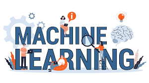

```{r setup, include=FALSE}
knitr::opts_chunk$set(
 echo = TRUE,
 warning = FALSE, 
 message = FALSE
 )

library(lubridate)
```

# BIENVENIDA {-}

## Objetivo {-}

Brindar al participante los elementos teóricos y prácticos básicos alrededor de la programación para el análisis de datos. Aprenderá a distinguir las diferentes soluciones a problemas que pueden resolverse con algoritmos de machine learning y aprenderá a usar el conjunto de librerías en **R** más novedosas, estructuradas y ampliamente usadas para la manipulación, transformación y visualización de datos: *"TIDYVERSE"*. 

```{r echo=FALSE, fig.align='center', out.height='350pt', out.width='600pt'}

```

## Instructores {-} 

**ACT. ARTURO BRINGAS** 

**LinkedIn:** [arturo-bringas](https://www.linkedin.com/in/arturo-bringas/)
**Email:** act.arturo.b@ciencias.unam.mx

Actuario egresado de la Facultad de Ciencias con maestría en Ciencia de Datos por el ITAM. 

Se especializa en modelos predictivos y de clasificación de *machine learning* aplicado a seguros, banca, marketing, deportes, e-commerce y movilidad. Ha sido consultor *Senior Data Scientist* para empresas y organizaciones como GNP, El Universal, UNAM, la Organización de las Naciones Unidas Contra la Droga y el Delito (UNODC), Comisión Nacional de los Derechos Humanos (CNDH), Sinia, Geek-end, Invesmark, entre otros. 

Ha contribuido en más de 30 proyectos de impacto nacional con diferentes institutos de investigación de la UNAM como el Instituto de Investigaciones Sociales, Instituto de Geografía, Instituto de Investigaciones Jurídicas, Programa Universitario de Estudios sobre la Ciudad, Fundación UNAM y Rectoría.

Actualmente es *Data Scientist Expert* en la fábrica de inteligencia artifical en BBVA (AI Factory), es profesor de *Ciencia de datos y Machine Learning* en AMAT, y consultor estadístico de encuestas nacionales de investigación social realizadas por la UNAM.

Adicionalmente, participa en el Laboratorio Nacional de Observación de la Tierra (LANOT) en la detección en tiempo real de contaminación del mar por sargazo a través de algoritmos de IA y percepción remota aplicados a los datos proveidos por el satélite Landsat9.

```{r echo=FALSE,fig.align='center',  out.width='250pt'}
knitr::include_graphics("img/00-presentacion/arturo.png")
```

**ACT. KARINA LIZETTE GAMBOA** 

**LinkedIn:** [KaLizzyGam ](https://www.linkedin.com/in/kalizzygam/)
**Email:**  lizzygamboa@ciencias.unam.mx

Actuaria egresada de la Facultad de Ciencias y candidata a Maestra en Ciencia de Datos por el ITAM, con una amplia experiencia en áreas de analítica predictiva e inteligencia empresarial. Ha ocupado roles de Manager y Senior Data Scientist en consultoría, trabajando en diversos sectores como tecnología, seguros, finanzas y banca.

Su especialidad radica en comprender las necesidades del negocio para implementar algoritmos de análisis de datos de manera efectiva, abarcando desde la ingeniería y arquitectura de datos hasta Business Intelligence y modelos de Machine Learning.

Cuenta con basta experiencia liderando equipos tecnológicos, incluyendo su papel más reciente como Data Analytics Manager para México, Chile y Colombia en Merama, una startup mexicana clasificada como uno de los nuevos unicornios de Latinoamérica. Actualmente, ocupa el cargo de Senior Manager Data Scientist en BBVA, centrado en banca corporativa.

Además, participa en proyectos de consultoría como Senior Data Scientist, es profesora del diplomado de Metodología de la Investigación Social por la UNAM y ejerce como instructora de cursos de Ciencia de Datos en AMAT.

Entre sus experiencias anteriores se encuentran empresas como GNP, Actinver Banco y Casa de Bolsa, PlayCity Casinos, RakenDataGroup Consulting, Closter, Merama, entre otras.


```{r echo=FALSE,fig.align='center',  out.width='250pt'}
knitr::include_graphics("img/00-presentacion/lizzy.png")
```


## Alcances del curso {-}

Al finalizar este curso, el participante será capaz de consumir, manipular y visualizar información para resolver problemas de propósito general asociados a los datos. Apenderá a implementar diferentes algoritmos de machine learning y mejorar su desempeño predictivo en problemas de clasificación, regresión y segmentación.

Requisitos: 

- Computadora con al menos 8Gb Ram 
- Instalar la versión más reciente de R
- Instalar la versión más reciente de RStudio

### Temario: {-}

**1.	Introducción a Ciencia de Datos**

*	Machine Learning, Bigdata, BI, AI y CD
*	Objetivo de ciencia de datos
*	Requisitos y aplicaciones
*	Tipos de algoritmos
*	Ciclo de vida de un proyecto

**2.	Manipulación  de datos con Tidyverse**

*	Importación de tablas (readr)
*	Consultas	(dplyr)
*	Transformación de estructuras	(tidyr)


**3.	Concepto de Machine Learning**

*	Machine learning
*	Análisis supervisado
*	Análisis no supervisado
*	Sesgo y varianza
*	Partición de datos
*	Preprocesamiento e ingeniería de datos

**4.	Algoritmos de Machine Learning**

*	Clustering: Kmeans, kmedoids, agnes
*	Regresión Lineal
*	Métricas de error
*	Regresión logística
*	Métricas de error
*	KNN
*	Árbol de decisión
*	Random Forest
*	Comparación de modelos


## Duración y evaluación del curso {-}

* El programa tiene una duración de 42 hrs.

* Las clases serán impartidas los días sábado, de 9:00 am a 12:00 pm 

* Serán asignados ejercicios que el participante deberá resolver entre una semana y otra.

* Al final del curso se solicitará un proyecto final, el cual deberá ser entregado para ser acreedor a la constancia de participación.


## Recursos y dinámica de clase {-}

En esta clase estaremos usando: 

* R [da click aquí si aún no lo descargas](https://cran.r-project.org/)
* Python [da click aquí si aún no lo descargas](https://www.python.org/downloads/)
* Positron [da click aquí si quieres descargar](https://positron.posit.co/)
* VSCode [da click aquí si quieres descargar](https://code.visualstudio.com/download)
* [Google Drive](https://drive.google.com/drive/u/0/folders/1Rse6rBgNHe2veyD-xArGLOgRnT6-NLEe)
* Notas de clase [Revisame si quieres aprender](https://acturio.github.io/intro2_ds_ml_r/) 

## Asesorías {-}

Los profesores se encuentran en la mejor disposición de asistir las dudas de clase de todos los alumnos. El grupo de whatsapp ha sido creado para compartir información relevante al curso y exponer dudas y soluciones que puedan ser de interés de todo el grupo. 

Los alumnos podrán hacer uso del canal de comunicación para externar sus dudas de clase durante el tiempo que dure el curso. Los profesores se comprometen a responder en el transcurso del día las preguntas realizadas que sean relevantes con la clase. Las respuestas se realizarán de lunes a viernes en un horario de 10:00am a 8:00pm. 

::: {.infobox .important data-latex="{important}"}
**¡¡ AVISO !!**

* No se atenderán dudas que tengan que ver con otros proyectos o asignaciones laborales de los estudiantes en sus respectivos ambientes de trabajo.

* Se invita a los estudiantes a que las dudas realizadas en clase sean relevantes a la clase y los ejemplos a resolver sean de interés para todo el alumnado.
:::

**Nota:** En caso de requerir consultoría especializada o particular a un tema de interés, se deberá contactar al área administrativa para solicitar la cotización por el servicio correspondiente.
https://es.r4ds.hadley.nz/
## Bibliografía {-}

<table>
  <tr>
    <td style="width:150px; vertical-align:top;">
      <a href="https://www.clc.hcmus.edu.vn/wp-content/uploads/2017/11/Hands_On_Machine_Learning_with_Scikit_Learn_and_TensorFlow.pdf" target="_blank">
        
      </a>
    </td>
    <td style="vertical-align:top; padding-left:15px;">
      **Hands On Machine Learning with Scikit-Learn, Keras and TensorFlow**  
      Autor: Aurélien Géron  
      Editorial: O´REILLY  
      Año: 2019  
      ISBN: 978-1-492-03264-9
    </td>
  </tr>
  
  <tr>
    <td style="width:150px; vertical-align:top;">
      <a href="https://www.statlearning.com/" target="_blank">
        
      </a>
    </td>
    <td style="vertical-align:top; padding-left:15px;">
      **An Introduction to Statistical Learning**  
      Autor: Gareth James, Daniela Witten, Trevor Hastie, Robert Tibshirani, Jonathan Taylor  
      Editorial: Springer  
      Año: 2023  

    </td>
  </tr>

  <tr>
    <td style="width:150px; vertical-align:top;">
      <a href="https://www.sas.upenn.edu/~fdiebold/NoHesitations/BookAdvanced.pdf" target="_blank">
        
      </a>
    </td>
    <td style="vertical-align:top; padding-left:15px;">
      **The Elements of Statistical Learning**  
      Autor: Trevor Hastie, Robert Tibshirani, Jerome Friedman  
      Editorial: Springer  
      Año: 2008  
      ISBN: 978-0-387-84857-0
    </td>
  </tr>

  <tr>
    <td style="width:150px; vertical-align:top;">
      <a href="https://www.google.com.mx/books/edition/Mastering_Machine_Learning_Algorithms/M0vODwAAQBAJ?hl=en&gbpv=1&pg=PP2&printsec=frontcover" target="_blank">
        
      </a>
    </td>
    <td style="vertical-align:top; padding-left:15px;">
      **Mastering Machine Learning Algorithms**  
      Autor: Trevor Hastie, Robert Tibshirani, Jerome Friedman  
      Editorial: Packt  
      Año: 2018  
      ISBN: 978-1-83882-029-9
    </td>
  </tr>

  <tr>
    <td style="width:150px; vertical-align:top;">
      <a href="http://bobzhang.dscloud.me/Calibre%20Library/Foster%20Provost/Data%20Science%20for%20Business%20%28282%29/Data%20Science%20for%20Business%20-%20Foster%20Provost.pdf" target="_blank">
        
      </a>
    </td>
    <td style="vertical-align:top; padding-left:15px;">
      **Data Science for Business**  
      Autor: Foster Provost, Tom Fawcett  
      Editorial: O´REILLY  
      Año: 2013  
      ISBN: 978-1-449-36132-7
    </td>
  </tr>

  <tr>
    <td style="width:150px; vertical-align:top;">
      <a href="http://103.203.175.90:81/fdScript/RootOfEBooks/E%20Book%20collection%20-%202024%20-%20B/CSE%20%20IT%20AIDS%20ML/Estad%C3%ADstica%20Pr%C3%A1ctica%20para%20Ciencia%20de%20Datos%20con%20R%20y%20Python.pdf" target="_blank">
        
      </a>
    </td>
    <td style="vertical-align:top; padding-left:15px;">
      **Estadística práctica para ciencia de datos con R y Python**  
      Autor: Peter Bruce, Andrew Bruce y Peter Gedeck  
      Editorial: O´REILLY  
      Año: 2022  
      ISBN: 978-84-267-3443-3
   </td>
  </tr>  
  
  <tr>
    <td style="width:150px; vertical-align:top;">
      <a href="https://es.r4ds.hadley.nz/" target="_blank">
        
      </a>
    </td>
    <td style="vertical-align:top; padding-left:15px;">
      **R para Ciencia de Datos**  
      Autor: Hadley Wickham & Garrett Grolemound  
      Editorial: O´REILLY  
      Año: 2023  
   </td>
  </tr>  
  
  <tr>
    <td style="width:150px; vertical-align:top;">
      <a href="https://www.google.com.mx/books/edition/Practical_Nonparametric_Statistics/n_39DwAAQBAJ?hl=en&gbpv=1&printsec=frontcover" target="_blank">
        
      </a>
    </td>
    <td style="vertical-align:top; padding-left:15px;">
      **Practical NonParametric Statistics**  
      Autor: W. J. Conover  
      Editorial: Wiley  
      Año: 1999  
      ISBN: 978-0-471-16068-7
   </td>
  </tr>  

  <tr>
    <td style="width:150px; vertical-align:top;">
      <a href="https://www.kwcsangli.in/uploads/3--Introduction_to_Linear_Regression_Analysis__5th_ed._Douglas_C._Montgomery__Elizabeth_A._Peck__and_G._.pdf" target="_blank">
        
      </a>
    </td>
    <td style="vertical-align:top; padding-left:15px;">
      **Introduction to Linear Regression Analysis**  
      Autor: Douglas C. Montgomery, Elizabeth A. Peck, G. Geoffrey Vining  
      Editorial: Wiley  
      Año: 2012  
      ISBN: 978-0-470-54281-1
   </td>
  </tr>  
  
  <tr>
    <td style="width:150px; vertical-align:top;">
      <a href="https://D2L.ai" target="_blank">
        
      </a>
    </td>
    <td style="vertical-align:top; padding-left:15px;">
      **Dive into Deep Learning**  
      Autor: Zhang, Aston and Lipton, Zachary C. and Li, Mu and Smola, Alexander J. 
      Editorial: Cambridge University Press  
      Año: 2023  
   </td>
  </tr>  
  
  <tr>
    <td style="width:150px; vertical-align:top;">
      <a href="https://www.andrew.cmu.edu/course/10-703/textbook/BartoSutton.pdf" target="_blank">
        
      </a>
    </td>
    <td style="vertical-align:top; padding-left:15px;">
      **Reinforcement Learning**  
      Autor: Richard S. Sutton, Andrew G. Barto  
      Editorial: The MIT Press  
      Año: 2018  
      ISBN: 978-0-262-19398-6
   </td>
  </tr>  

  <tr>
    <td style="width:150px; vertical-align:top;">
      <a href="https://www.google.com.mx/books/edition/Learning_Python/4pgQfXQvekcC?hl=en&gbpv=1&printsec=frontcover" target="_blank">
        
      </a>
    </td>
    <td style="vertical-align:top; padding-left:15px;">
      **Learning Python**  
      Autor: Mark Lutz  
      Editorial: O´REILLY  
      Año: 2013  
      ISBN: 978-1-449-35573-9
   </td>
  </tr>  
</table>


<div class="watermark"></div>

